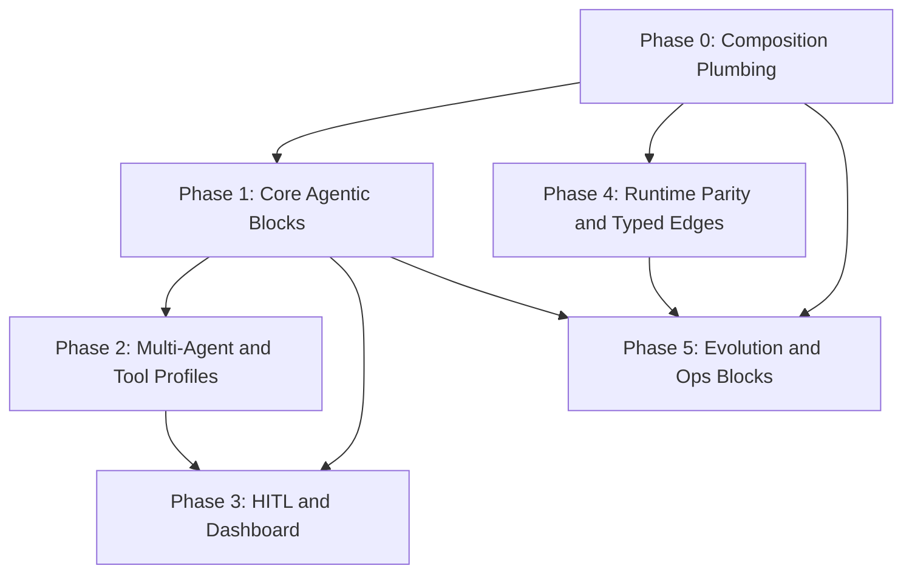

# Agentic Behavior Tree Building Blocks — Master Implementation Roadmap

> **For Hermes / Cloud Agents:** Use `executing-plans` or `subagent-driven-development` to implement phase-by-phase. Do not start Phase 2 until Phase 0 acceptance criteria pass.
> **Date:** 2026-06-04
> **Branch context:** `cursor/reusable-tree-blocks-c122` (blocks package, HITL, reliability, observability partial)
> **Related plans:** [Phase 0 — Composition Plumbing](./2026-06-04-agentic-blocks-phase-0-plumbing.md) · [Phase 1 — Core Agentic Blocks](./2026-06-04-agentic-blocks-phase-1-core-blocks.md) · [Phase 2 — Multi-Agent & Tool Profiles](./2026-06-04-agentic-blocks-phase-2-multi-agent.md) · [Phase 3 — HITL & Dashboard](./2026-06-04-agentic-blocks-phase-3-hitl-dashboard.md) · [Phase 4 — Runtime Parity & Typed Edges](./2026-06-04-agentic-blocks-phase-4-runtime-edges.md) · [Phase 5 — Evolution & Ops Blocks](./2026-06-04-agentic-blocks-phase-5-evolution-ops.md)

**Goal:** Turn the BT Agent Platform from “5 composable blocks + 41 hand-authored trees” into a **complete agentic composition kit**: reusable blocks for plan → perceive → clarify → approve → act → validate → remember → delegate → recover, with correct SubTreeRef execution, runtime parity for declared node types, and evolution-safe mutations.

**Non-goals (this roadmap):** Replacing all 41 domain trees with composed blocks (optional migration track). Rewriting the evaluation suite (see `2026-05-30-eval-suite-improvement.md`).

---

## Current state (baseline)

| Area | Status |
|------|--------|
| Registered blocks | 5: `core:pre_gate`, `core:tool_execution`, `core:error_handling`, `core:human_gate`, `core:reflect_only` |
| `blocks.Expand()` | Implemented in `internal/blocks/expand.go`; **not called** from `engine.BuildAndValidate` or `cmd/bt-agent` tree load paths |
| `SubTreeRef` | In `KnownNodeTypes`; `buildNode` has **no case** → falls through to no-op success |
| HITL | `HumanApprovalGate`, `internal/hitl`, MCP `bt_hitl_*` (pre-execution gate) |
| Reliability | `WrapReliable` on built-ins; decorators in `internal/engine/reliability_*` |
| Observability | Per-node spans/metrics via `observeNode`; block compose/expand metrics |
| Typed edges | JSON schema + `ValidateEdge`; **not executed** at tick time |
| Dead node types | `Parallel`, `Budget`, `RateLimit`, `QualityGate`, `Monitor`, etc. in `KnownNodeTypes` but not in `buildNode` |

---

## Target agentic stack (end state)

Recommended default composed pipeline (`composed:task:agentic`):

```
core:pre_gate
→ core:plan
→ core:rag_gate          (optional, policy flag)
→ core:clarify_gate      (optional, if ambiguous)
→ core:human_gate        (policy / side_effect_class)
→ core:tool_execution    (or core:tools_* profile)
→ core:quality_gate
→ core:error_handling
→ core:memory_write
```

Supporting blocks (on demand): `core:delegate`, `core:a2a_handoff`, `core:parallel_fanout`, `core:merge_results`, `core:post_human_review`, `core:budget_gate`, `core:trace_checkpoint`.

---

## Phase overview & dependencies



| Phase | Focus | Outcome | Plan doc |
|-------|--------|---------|----------|
| **0** | Expand-at-build, SubTreeRef safety, compose invariants | Composed trees actually run block content | [phase-0](./2026-06-04-agentic-blocks-phase-0-plumbing.md) |
| **1** | plan, rag, clarify, quality blocks | Agent loop completeness without new node types | [phase-1](./2026-06-04-agentic-blocks-phase-1-core-blocks.md) |
| **2** | delegate, fanout, tool profile blocks | Multi-agent + swappable tooling | [phase-2](./2026-06-04-agentic-blocks-phase-2-multi-agent.md) |
| **3** | post-HITL, dashboard API/UI, workflow wiring | Humans can approve from UI and MCP | [phase-3](./2026-06-04-agentic-blocks-phase-3-hitl-dashboard.md) |
| **4** | QualityGate, Parallel, Budget, RateLimit, typed edges | Schema matches runtime | [phase-4](./2026-06-04-agentic-blocks-phase-4-runtime-edges.md) |
| **5** | evolve blocks, block fitness, observability blocks | Evolver can safely compose/promote blocks | [phase-5](./2026-06-04-agentic-blocks-phase-5-evolution-ops.md) |

**Parallelization:** Phase 4 can start after Phase 0 (independent of Phase 1 blocks). Phase 3 depends on HITL store (done) + dashboard work. Phase 5 depends on stable block IDs from Phases 0–1.

---

## Full gap → phase mapping

| Finding | Phase | Deliverable |
|---------|-------|-------------|
| `Expand` not wired to build | 0 | `BuildAndValidate` expands SubTreeRef; integration test |
| SubTreeRef no-op at runtime | 0 | Same as above |
| Missing `core:plan` | 1 | Block + `DefaultTaskBlocks` variant |
| Missing `core:rag_gate` | 1 | KG/cache gate block |
| Missing `core:clarify_gate` | 1 | Port telegram clarify pattern to block |
| Missing `core:quality_gate` | 1 + 4 | Block in Phase 1; BT `QualityGate` node in Phase 4 |
| Missing tool profile blocks | 2 | `core:tools_dev`, `_research`, etc. |
| Missing `core:delegate` / A2A | 2 | Blocks wrapping existing actions |
| Missing memory blocks | 2 | `core:memory_load`, `core:memory_write` |
| Post-execution HITL | 3 | `core:human_review` |
| Dashboard HITL UI | 3 | REST + Tasks tab |
| `bt_workflow_approve` stub for non-hitl ids | 3 | Document + optional task-id mapping |
| Dead node types (Parallel, Budget, …) | 4 | `buildNode` cases or remove from KnownNodeTypes |
| Typed edges not executed | 4 | Guard/quality_gate interpreter |
| Tiered HITL by side_effect_class | 3 + 1 | Metadata-driven gate variants |
| Block-level evolution fitness | 5 | Gardener metrics + frozen promotion |
| Observability checkpoint blocks | 5 | `core:trace_checkpoint` |
| Expert archetype mismatch (QualityGate) | 1 + 5 | Align `referenceArchetypes` with block IDs |

---

## Cross-cutting standards (all phases)

### Block authoring conventions

- **ID:** `core:<snake_name>` or `domain:<name>` for domain-specific exports.
- **Version:** Bump `Block.Version` on breaking subtree changes; registry persists JSON under `{base}/blocks/`.
- **Reliability:** Apply `WrapReliable` via `ReliabilitySpec` in `internal/blocks/reliability.go`; document timeout/retry/CB per block kind.
- **Metadata:** Use `side_effect_class`, `prompt`, `hitl_prompt`, `auto_approve` consistently for verifier + HITL.
- **Tests:** Each block → `TestBlockExpand_<id>` + smoke `BuildAndValidate` + one tick test where LLM is mocked.

### API surfaces to update per phase

| Surface | Path |
|---------|------|
| Builtin registry | `internal/blocks/builtin.go` |
| Compose defaults | `internal/blocks/compose.go`, `hitl.go` |
| Tree resolution | `cmd/bt-agent/main.go` `resolveTree()` |
| MCP tools | `cmd/bt-agent/blocks_tools.go`, `hitl_tools.go` |
| Engine build | `internal/engine/tree.go` |
| Verifier | `internal/engine/verifier.go` |
| Evolution mutations | `internal/blocks/mutations.go`, `internal/evolution/block_hooks.go` |
| Docs | `docs/API_REFERENCE.md`, `README.md` (tool counts) |

### Acceptance gates (release checklist)

- [ ] `go build ./...`
- [ ] `go test ./internal/blocks/... ./internal/engine/... ./internal/hitl/... -short -count=1`
- [ ] `composed:task` end-to-end: MCP `bt_run_task` executes real PreGate + agent + error handling (mock LLM)
- [ ] No `SubTreeRef` left at runtime after build (assert in test helper)
- [ ] Expert archetype `MustHave` elements map to block IDs or documented equivalents

---

## Optional track: Domain tree migration

Not required for platform completeness; run after Phase 1.

1. Inventory domain trees in `internal/domains/`, `finance/`, `research/`, `startup/`.
2. Extract repeated `PreGate` / `StrategyRouter` / `OutcomeSelector` prefixes into block composition.
3. Replace duplicates with `composed:<blocks>` IDs in agent YAML templates.
4. Measure fitness regression via `bt-evolver` / gardener before/after.

---

## Risk register

| Risk | Mitigation |
|------|------------|
| Expand cycles / deep inlining | Existing `stack[id] > 4` guard in `expand.go`; add test |
| Double-expand idempotency | `Expand` on already-inlined tree should no-op |
| LLM test flakiness | Use `engine` mock LLM; `-short` flags |
| Import cycle evolution ↔ blocks | Keep `block_hooks.go` registration pattern |
| Block mutation breaks production trees | `Mutable: false` on core blocks; evolution only on `CategoryCustom` |
| HITL deadlock | Timeout → `StatusExpired`; document `BT_HITL_AUTO_APPROVE` for CI |

---

## Document index

1. [Phase 0 — Composition Plumbing](./2026-06-04-agentic-blocks-phase-0-plumbing.md)
2. [Phase 1 — Core Agentic Blocks](./2026-06-04-agentic-blocks-phase-1-core-blocks.md)
3. [Phase 2 — Multi-Agent & Tool Profiles](./2026-06-04-agentic-blocks-phase-2-multi-agent.md)
4. [Phase 3 — HITL & Dashboard](./2026-06-04-agentic-blocks-phase-3-hitl-dashboard.md)
5. [Phase 4 — Runtime Parity & Typed Edges](./2026-06-04-agentic-blocks-phase-4-runtime-edges.md)
6. [Phase 5 — Evolution & Ops Blocks](./2026-06-04-agentic-blocks-phase-5-evolution-ops.md)
