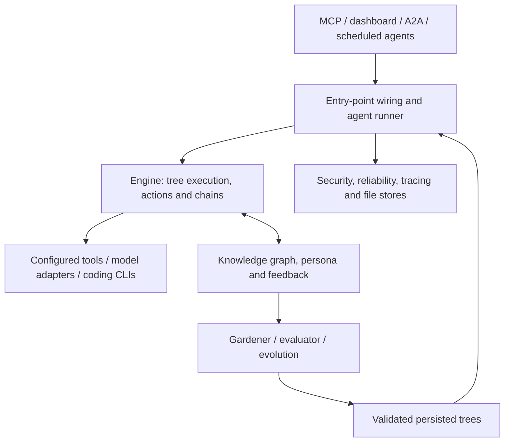

# BT Agent Platform

**Behavior-tree-driven AI agent framework** with scheduled agents, MCP and
HTTP interfaces, generated personal workflows, and evidence-gated evolution.

[](go.mod)
[](https://github.com/greenTeeProduction/bt-agent-platform)
[](#license)

## What is this?

A Go framework for building, executing and evolving behavior-tree-based AI
agents. YAML definitions, registries and persisted trees connect scheduled
or interactive requests to the engine:

```text
Agent definition → Registry / scoped resolver → Runner → Build / validate → RunTask → Blackboard
```

The separate GOAP fusion workflow researches and implements code changes
through Codex under the default and deployed Codex-only policy, with isolated
worktrees and verification artifacts. Quotas, model availability, repository preconditions and failed
checks can stop a run from delivering code.

## Quickstart

```bash
# Prerequisites: Go 1.26.5+; Ollama is optional for LLM-backed agents.
git clone https://github.com/greenTeeProduction/bt-agent-platform.git
cd bt-agent-platform

# Fast suite without live LLM integration tests.
go test -short -count=1 ./...

# Configure BT_API_KEY or config api_key for privileged HTTP routes.
# Start the dashboard (loopback by default), then sign in with that key.
go run ./cmd/bt-dashboard/
# Open http://localhost:9800 in a browser.

# In a separate terminal/host configuration, start the MCP server.
go run ./cmd/bt-agent/           # JSON-RPC over attached stdin/stdout
```

HTTP launch settings: [authentication and agent storage](docs/security-batch-2026-09-05.md).
Coding provider settings: [delegation runbook](docs/coding-delegation.md).

## Architecture

The [arc42 architecture index](docs/arc42/README.md) is the current
specification. It distinguishes implemented behavior, test evidence,
deployment observations and unmeasured targets.



This is a responsibility map, not an enforced package-import hierarchy.
[Building blocks](docs/arc42/05-building-blocks.md) inventory every top-level
package and command; [runtime scenarios](docs/arc42/06-runtime-view.md)
explain their interactions.

## Key Features

- **Serializable behavior trees:** built-in domain catalogs, reusable blocks,
  generated personal trees, validation and scoped resolution.
- **Declarative chains:** model, retrieval, fusion, structured-output and
  tool/agent workflows; [current kinds](docs/arc42/05-building-blocks.md#55-chain-types).
- **MCP servers:** `bt-agent`, `bt-evaluator` and `bt-langagent`; each
  server's `tools/list` is its authoritative tool inventory.
- **Evolution:** scored structural mutations, MCTS augmentation, populations,
  quality-diversity archives and local refinement, with path-specific gates.
- **YAML-defined agents:** templates, schedules, execution history, circuit
  breakers and dead-letter replay.
- **Dashboard:** task/sprint execution, trees, evolution, agents, research
  views, workflows, scalability and DoorMate, with browser sessions.
- **Personalization:** persona profiles, habit-derived goals, GOAP plan
  compilation, tracked automation approval and user feedback.
- **Coding delegation:** Codex-only implementation and read-only review, with
  durable quota cooldowns and separate permission policies.
- **Observability:** structured logs, metrics, tracing, run artifacts and
  build identity.

## Project Structure

| Location | Responsibility |
|---|---|
| `cmd/` | MCP servers, daemons, dashboard and operator/probe commands |
| `internal/engine/` | Tree runtime, actions/chains, MCP transport and coding workflow |
| `internal/agent/`, `internal/agentexec/` | Scheduling, state, outcomes and execution wiring |
| `internal/gardener/`, `evolution/`, `evaluator/` | Tree improvement, algorithms and scoring |
| `internal/knowledge/`, `goap/`, `persona/` | Discovery/feedback, planning and personal workflows |
| `internal/dashboard/`, `cmd/bt-dashboard/static/` | Dashboard services and browser application |
| `internal/security/`, `reliability/`, `tracing/` | Shared infrastructure |
| `agents/` | Agent definitions, templates and workflows |
| `docs/arc42/` | Twelve architecture views, quality scenarios, risks and decision log |
| `scripts/` | Build, verification, documentation and operational helpers |

Rows group related packages; the complete path/interface inventory is in
[§5](docs/arc42/05-building-blocks.md). MCP transport lives in
`internal/engine`; metrics are implemented by their owning services.

## MCP Tools

| Server | Example capabilities |
|---|---|
| **bt-agent** | Execute tasks; manage agents, trees, goals, approvals and feedback; discover capabilities and evolve trees |
| **bt-evaluator** | Evaluate trees, order mutations, deepen search and inspect/persist evaluation cache |
| **bt-langagent** | Run, score and evolve language-agent workflows |

Use `tools/list` against the running binary for exact names and schemas.
[Technical context](docs/arc42/03-context-scope.md#32-technical-context)
describes transport and authentication.

## Agent Categories

Domain, finance, research, startup/company, thinktank, evolution and core
workflows coexist with generated user trees. Registry/resolver source and
the authenticated dashboard catalog establish which trees are available;
category names do not imply fixed counts.

## Tree Execution Flow

Many trees use the PreGate → StrategyRouter → OutcomeSelector scaffold.
It is a reusable pattern, not a required shape for every valid tree.
[Task execution](docs/arc42/06-runtime-view.md#61-task-execution-scenario)
covers validation, tick/cancellation budgets, approvals and terminal outcomes.

## Evolution Pipeline

```text
collect evidence → propose / score → path-specific gates → persist accepted tree or retain baseline
```

Ordinary mutations, deep search and island adoption do not have identical
acceptance/rollback coverage. Persisting a tree is also distinct from landing
a source-code commit. See [evolution contracts](docs/arc42/08-crosscutting-concepts.md#85-evolution-pipeline)
and [remaining risks](docs/arc42/11-risks-debt.md).

## Documentation

- [arc42 architecture index](docs/arc42/README.md)
- [Architecture decision log](docs/arc42/09-decisions.md)
- [Quality requirements and evidence](docs/arc42/10-quality.md)
- [Risks and technical debt](docs/arc42/11-risks-debt.md)
- [Getting started](docs/GETTING_STARTED.md)
- [BT Agents operator guide](docs/agents.md)
- [API reference](docs/API_REFERENCE.md)
- [Tutorial](docs/TUTORIAL.md)
- [Troubleshooting](docs/TROUBLESHOOTING.md)

## Reliability

| Concern | Mechanism and boundary |
|---|---|
| Panic recovery | SafeGo and local recovery wrappers where wired; callers own retry/DLQ behavior |
| Transient failures | Classified, configured retry/backoff; budgets vary by execution owner |
| Cascading failures | Per-agent circuit breakers; breaker health is not proof of code delivery |
| Exhausted retries | Persistent DLQ and explicit replay handling |
| Provider availability | Configured fallback, independent quota cooldowns and explicit failure/defer states |
| Output quality | Context-specific validation and quality gates |
| Deployment/recovery | Build identity, optional drift adoption, controlled restart and operator-owned backups |

See [deployment](docs/arc42/07-deployment.md) for current defaults versus
host observations, and [quality scenarios](docs/arc42/10-quality.md) for
tested contracts versus operational targets.

## License

MIT.
