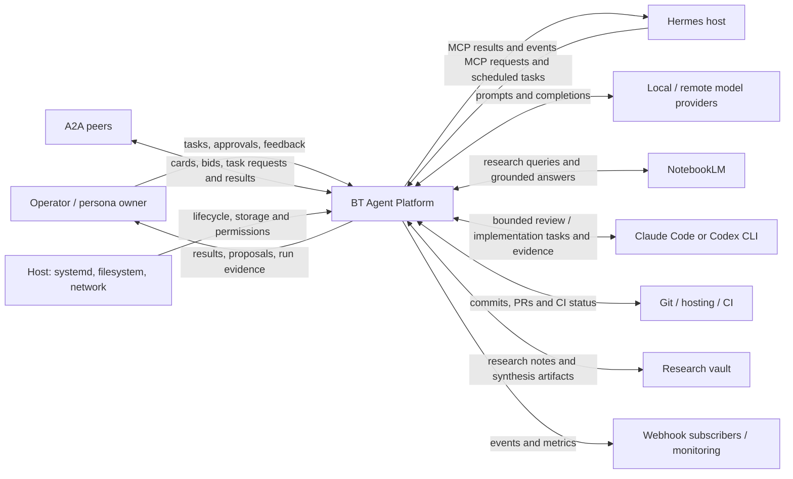

# 3. Context and Scope

## 3.1 Business Context

The system boundary includes the repository's Go binaries, embedded dashboard,
behavior trees and platform state stores. Hermes, model services, Git hosting,
the research vault, host supervision and human operators remain external.

| Partner | Inputs to platform | Outputs from platform / purpose |
|---|---|---|
| Operator / persona owner | Tasks, credentials, approval decisions, corrections | Results, proposed automations, feedback history and status. A persona ID does not itself establish an authenticated user. |
| Hermes host | MCP tool calls; integration-managed triggers | Tool results and lifecycle/outcome events; host controls MCP process lifecycle. |
| A2A peers | Cards, bids, task submissions/results | Discovery, delegated work and task status; peer trust must be configured. |
| Local / remote model services | Completions or service errors | Prompts for node reasoning, evaluation and synthesis. Availability and latency vary by backend/model. |
| NotebookLM | Grounded research and auth/quota errors | Queries and source imports; account/session health is an external prerequisite. |
| Coding CLIs | Proposed edits, review results, diagnostics and quota signals | Phase-specific prompts executed through a provider-selecting runner. |
| Git / hosting / CI | Remote history, PR and check status | Versioned tree/code changes, isolated worktrees and autonomous landing requests. |
| Research vault / host filesystem | Research context and persisted state | Analysis, plans, run artifacts and coordinated state writes. |
| systemd / monitoring / subscribers | Start/stop/restart and operational probes | Logs, build/run metrics and configured webhook events. |

## 3.2 Technical Context

| Interface | Channel / endpoint | Contract and source of truth |
|---|---|---|
| MCP servers | JSON-RPC over stdio: `bt-agent`, `bt-evaluator`, `bt-langagent` | `tools/list` is the runtime inventory. Entrypoints in [§5](05-building-blocks.md); OS/host access is the transport boundary, not HTTP bearer middleware. |
| Dashboard | HTTP, default port 9800; optional direct TLS | [Dashboard mux](../../cmd/bt-dashboard/main.go) and [OpenAPI route definitions](../../internal/api/openapi.go). Protected routes require `X-API-Key` or a session; cookie mutations use CSRF protection. |
| A2A | HTTP, default port 8686 | [Server](../../internal/a2a/server.go): discovery/card surface and credential-gated task operations. Card HMAC and HTTP request authentication serve different purposes. |
| Ollama / configured remote LLM | Local HTTP, commonly `127.0.0.1:11434`; remote HTTPS | [LLM adapters](../../internal/llm/provider.go) and [configuration](../../internal/config/config.go). Ollama native `/api/generate` and `/api/chat` are distinct from its OpenAI-compatible API. |
| Claude Code / Codex | Validated local executable → provider service | [Delegation contract](../coding-delegation.md); selected provider/model, permissions, time budgets, stdout diagnostics and a final response. Availability is account-dependent. |
| NotebookLM | `nlm` subprocess / configured authentication helpers → Google service | [NotebookLM auth](../../internal/notebooklmauth) and research quota/cache mechanisms in [§8.9](08-crosscutting-concepts.md#89-research-memory-and-quota-economy). |
| Git and hosting | `git` / `gh` subprocesses; SSH/HTTPS according to remote | Repo, worktree, landing and PR/CI state. GitHub is an external service when that remote is configured. |
| Observability / notifications | HTTP `/api/metrics`, JSON APIs, journal, configured webhook URLs | Metrics are process-local unless explicitly read from shared state. Notification destinations and any Telegram bridge are integration configuration. |
| Persistence | Local files, advisory sidecar locks, atomic rename | [§8.4](08-crosscutting-concepts.md#84-file-based-persistence); cross-process coordination only among cooperating writers. |

**Scope limits.** The implemented deployment is a supervised collection of
processes on one host, with optional remote A2A peers. It is not a proven
high-availability cluster or a multi-tenant SaaS identity system. Local-first
inference does not mean all prompts remain local: remote models, NotebookLM,
coding CLIs and configured webhooks can transmit data off-host.

Network exposure is a deployment property, not an intrinsic Tailscale
guarantee. Defaults and the observed host configuration are distinguished in
[§7](07-deployment.md); security boundaries and residual risks are in
[§8.18](08-crosscutting-concepts.md#818-security-and-trust-boundaries) and
[§11](11-risks-debt.md).

---

*Generated by bt-agent arc42 pipeline — section3ContextScope tree*
