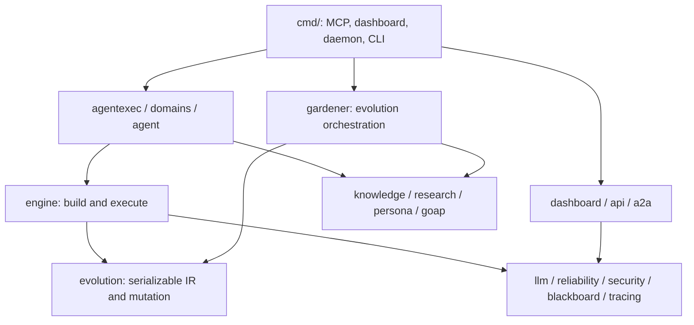
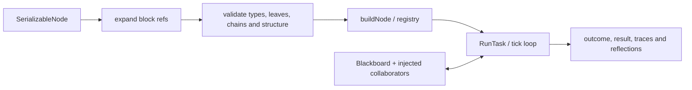
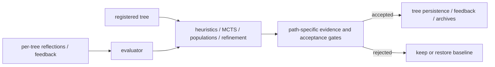
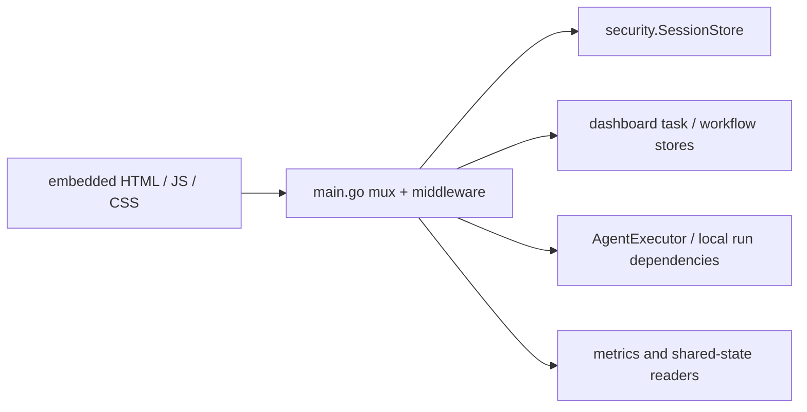

# 5. Building Block View

This view describes current responsibilities and interfaces. Source links
identify the owner of a concept; the [ADR log](09-decisions.md) preserves its
history. Package counts and registry sizes are deliberately not copied here.

## 5.0 Composable Blocks

[`internal/blocks`](../../internal/blocks) owns reusable `core:*` blocks,
composition presets and `SubTreeRef` expansion. The engine accepts an
expander through [`tree_expand.go`](../../internal/engine/tree_expand.go).
This seam permits reuse without making the engine import the complete
application wiring. Composition and activation are distinct: saving or
replacing the active tree requires validation and successful persistence
([§8.15](08-crosscutting-concepts.md#815-validation-gated-composition-activation), ADR-131).

## 5.1 Whitebox Overall System

The platform separates interfaces, execution, learning and supporting
services so each can be inspected and tested. The diagram shows principal
collaboration, not an enforced one-direction Go import hierarchy.

### Contained Blackboxes

The following inventory covers every current top-level `internal/` package.
It is checked by `scripts/check-arc42.py`; responsibilities remain a review
obligation.

| Package | Responsibility | Principal interface / consumers |
|---|---|---|
| `internal/a2a` | Peer discovery, task transport, bidding/award and card trust | `Server`, `BTAgentClient.SendTask`, `AuctionDelegateWithContext`; agent/dashboard wiring |
| `internal/agent` | Agent registry, scheduler, history, memory, events, breaker persistence and deploy drift | `RunDeps.RunOnce`, `Scheduler` (durable admission/recovery holds), `AgentCircuitBreakerStore`; entrypoints |
| `internal/agentexec` | Assemble run dependencies and scoped generated-tree resolution | `NewRunDeps`, `ResolveGeneratedTreeForUser`, `AutomationBlocked` |
| `internal/api` | Dashboard route/schema descriptions and validation support | `DashboardRoutes`; OpenAPI and HTTP middleware |
| `internal/audit` | Append-only task audit records | JSONL audit writer; agent execution |
| `internal/benchmark` | Tree suites and measured acceptance evidence | `SuiteForTreeNamed`, `QuickValidate`; evolution and verification |
| `internal/blackboard` | Scoped key/value state and persistence | `Manager`, scopes; agent/run/session state |
| `internal/blocks` | Reusable subtrees and composition | Block registry, `Expand`, presets; MCP and domain trees |
| `internal/cicd` | CI/workflow diagnostics | CI-doctor checks and reporting |
| `internal/config` | Load, default and validate platform settings | Shared configuration used by binaries |
| `internal/dashboard` | HTTP-facing task/workflow services, execution adapters and metrics | Task stores, workflow objects, `AgentExecutor`; dashboard main |
| `internal/domains` | Built-in domain trees, descriptions and resolver hooks | `AllDomainTrees`, `ResolveTreeIDForUser`, `DescriptionFor` |
| `internal/doormate` | DoorMate-specific intent/profile features | HTTP handlers and persona integration |
| `internal/engine` | Build/tick trees, registered actions/conditions, chains, MCP transport and implementation workflow | `BuildAndValidate`, `RunTask`, `Server`, action registry |
| `internal/evaluator` | Score trees and order/search mutations | `EvaluateTree`, `OrderMutations`, transposition table |
| `internal/evolution` | Serializable tree model, mutation/search algorithms, fitness and archives | `SerializableNode`, populations, gates, reflection/snapshot stores |
| `internal/factory` | Compile skill specifications into trees | Skill-to-tree generator; distinct from `knowledge.Factory` |
| `internal/fusion` | Multi-model panel, judging and synthesis | Fusion execution used by chain nodes |
| `internal/gardener` | Observe and evolve registered/global/personal trees | `RunCycleV2`, registry, per-tree gates and snapshots |
| `internal/goap` | World state, goals, canonical A* planning and plan compilation | `Planner`, `GoalQueue`, `CompilePlanToTree` |
| `internal/hitl` | Approval request storage and decisions | Approval requests/gates; MCP and dashboard |
| `internal/knowledge` | Tree capabilities, discovery, feedback, breeding and impact graph | `KnowledgeGraph`, `Factory`; runners and gardener |
| `internal/llm` | Configurable model adapters, fallback and health | LLM interface; chains, fusion and evaluation |
| `internal/notebooklmauth` | NotebookLM authentication diagnosis/recovery and browser integration | Auth helper used by `bt-notebooklm-auth` and research actions |
| `internal/persona` | User profiles, interactions, habits and tracked automations | `Store`, automation finalization, feedback escalation |
| `internal/reliability` | Panic/retry primitives, locks, DLQ, queues, routing and shared execution dispositions | Shared reliability APIs; optional adapters are not necessarily deployed |
| `internal/research` | Deduplicated knowledge, goals/programs and quota-related state | `KnowledgeStore`, `ProgramStore`, `UpdatePrograms` |
| `internal/security` | HTTP/session/auth primitives, rate limits, CSRF, input/path checks and probes | Shared middleware and `SessionStore`; entrypoints choose wiring |
| `internal/startup` | Company/sprint simulation and shared company state | `CompanyOrchestrator`, `CompanyState`; dashboard |
| `internal/thinktank` | Multi-role analysis and recommendations | Analysis workflow used by dashboard/company flows |
| `internal/tracing` | Run/tool tracing and OpenTelemetry integration | Spans and tracing wrappers |
| `internal/util` | Small shared utilities | Reused formatting and data helpers |

### Entrypoints

| Binary | Interface / purpose |
|---|---|
| `bt-agent` | MCP server; `--no-mcp` daemon hosts scheduler/A2A and background coordination |
| `bt-evaluator` | Evaluation/mutation-search MCP server |
| `bt-langagent` | Langchain-agent MCP server |
| `bt-dashboard` | HTTP APIs and embedded browser application |
| `bt-gardener` | Evolution daemon and its configured tool-driven cycles |
| `bt-agent-cli` | Operator agent, history, schedule, blackboard and impact commands |
| `bt-assistant` | Assistant CLI |
| `bt-docgen` | Documentation generation utility |
| `bt-ci-doctor` | Workflow maturity/CI diagnostics |
| `bt-notebooklm-auth` | NotebookLM authentication inspection/recovery |
| `bt-scalability-probe` | Scalability/routing probe |
| `bt-security-probe` | Dashboard security probe |
| `bt-tree-integration` | Tree integration verification |
| `benchcmp` | Benchmark comparison |

### Catalog and MCP interfaces

Built-in domain inventories are derived from
[`domains/trees.go`](../../internal/domains/trees.go) and
[`tree_resolver.go`](../../internal/domains/tree_resolver.go). Curated,
kanban/Hermes and resolver-only trees have distinct registries;
`DescriptionFor` is the shared description lookup. Its `domain:<name>` IDs
use the canonical description only for entries in `AllDomainTrees`,
including qualified names such as `domain:arc42:section1`.
Finance/research/core trees and generated user trees also participate through
their respective registrations. The dashboard overlays persisted runtime
metadata on this catalog; it is not a separate hardcoded list.

**Tested contract:** the [domain catalog coverage test](../../internal/domains/domains_test.go)
checks tree construction, canonical description parity and condition/guard-edge
descriptions for every registered `domain:` ID, and rejects description lookup
for unregistered names in that namespace.

MCP `tools/list` reflects each server's actual registrations. The agent
surface includes execution, trees, agents, blocks, scoped blackboards, HITL,
goals/personas/feedback, knowledge/impact queries and evolution. Tool families
are defined in [`cmd/bt-agent`](../../cmd/bt-agent); avoid treating an old
numeric inventory as a compatibility contract.

Restart ownership uses the lower-layer
[reliability admission gate](../../internal/reliability/restart_admission.go)
for callback lifetime and sealing. The
[agent restart coordinator](../../internal/agent/restart_control.go) owns
local authenticated request framing, target artifact identity and handoff.
Dashboard/gardener mains bind their initialized owners; bt-agent's two sibling
paths request that ownership. No engine import or injection hook is added.

## 5.2 Core Engine

The engine turns declarative structure into commands while keeping task state
on a blackboard. Its whitebox is intentionally independent of any particular
dashboard or agent definition:

| Block | Responsibility / interface |
|---|---|
| [`tree.go`](../../internal/engine/tree.go) | `Blackboard`, building and `RunTask`; configurable cooperative timeout, tick budget, terminal outcome handling |
| [`registry.go`](../../internal/engine/registry.go) | Named actions and conditions available to authored/generated trees |
| [`validate.go`](../../internal/engine/validate.go) | Authoring/build validation; invalid definitions must not activate silently |
| [`chains.go`](../../internal/engine/chains.go) | Declarative model/tool interactions (§5.5) |
| [`mcp_server.go`](../../internal/engine/mcp_server.go) | Stdio JSON-RPC dispatch, configured security, rate limits and shared-blackboard serialization |
| [`superpowers_provider.go`](../../internal/engine/superpowers_provider.go) | One coding-provider seam shared by implementation and review paths |

The familiar PreGate → StrategyRouter → OutcomeSelector scaffold is a common
tree pattern, not a mandatory shape of every valid tree.

## 5.3 Evolution Engine

The gardener orchestrates evidence collection and adoption; `evaluator`
scores; `evolution` owns candidate algorithms, IR and durable artifacts.
`evaluator.MutationCandidate` aliases `evolution.ScoredMutation`; accepted
experience preserves its proposal attribution and MCTS replay settings.

Capabilities include heuristic/Stockfish-style ordering, MCTS structural
search, Pareto/NSGA-II selection, MAP-Elites, island migration, Q-learning,
expert priors and local parameter refinement. **Availability in a package,
an MCP tool, and the daemon's default cycle are different claims.** Wiring
in [`cmd/bt-gardener/config.go`](../../cmd/bt-gardener/config.go) and
[`evolve_v2.go`](../../internal/gardener/evolve_v2.go) determines live use.

Per-tree evidence and archive state must not be conflated with global
runtime success. The ordinary mutation competition, deep search, local
refinement and island adoption retain path-specific evidence. Island adoption
now includes quick benchmark/meta-validation and a configured predecessor
snapshot, persisting before updating live state.
[§8.5](08-crosscutting-concepts.md#85-evolution-pipeline) states the
contracts; R20–R24 in [§11](11-risks-debt.md) retain the unresolved differences.

## 5.4 Dashboard

[`cmd/bt-dashboard/main.go`](../../cmd/bt-dashboard/main.go) owns route
registration, startup wiring and middleware; [`internal/dashboard`](../../internal/dashboard)
owns task/workflow services. The browser
[`app.js`](../../cmd/bt-dashboard/static/js/app.js) handles session discovery,
sign-in, logout and expired-session transitions. Its
[`api.js`](../../cmd/bt-dashboard/static/js/lib/api.js) retains HTTP status,
adds CSRF headers and limits retries. No platform key is stored in browser
local storage by this login flow.

Sprint execution dispatches approved tasks through the in-process executor;
MCP is not an obligatory network hop. Workflow and task-store approvals have
separate records, with explicit synchronization in the handlers.
The YAML pipeline Runner shares sequential control across top-level, loop and
subworkflow bodies. Parallel containers retain child results; every container
preserves typed waiting/approval and completed-prefix stop evidence. The HTTP
status adapter and browser expose that evidence without claiming resumed work
(ADR-270). Blackboard Manager owns staged mutation/commit/cache publication
and context-aware write admission. Runner reports input/output mirror failures
without replaying admitted work (ADR-271). Pipeline selection/listing reuse the
shared rooted file reader after basename validation. The API package owns
standard protected-route error schemas and status-specific response matching
(ADR-272). The API catalog keeps property documentation separate from required
field names, with recursive declaration checks. Security audit handlers preserve
actual event counts/optional attributes and normalize empty event lists to [];
authenticated audit/live-metric payload regressions cover enforced responses.

## 5.5 Chain Types

[`knownChainKinds`](../../internal/engine/chains.go) is the canonical
inventory. Current kinds are `llm_call`, `rag_query`, `tool_call`,
`conversation`, `structured_output`, `retrieval_qa`, `map_reduce`,
`refine`, `fusion`, `agent` and `tool_action`.

Chain configuration selects a model/tool interaction and prompt/metadata;
`tool_action` directly invokes a tool, while `agent` can run an iterative
tool-use loop. Validation checks recognized kinds before execution. Concrete
template variables and parameter interpretation belong to the parser and
executor, not a second independently maintained schema.

## 5.6 Personalization and Generated Trees

ADR-133's core is implemented, with later isolation/approval hardening:

```mermaid
flowchart LR
    Persona["persona profile / interactions / habits"] --> Goal["goap GoalFactory + GoalQueue"]
    Goal --> Plan["canonical A* planner"]
    Plan --> Compile["CompilePlanToTree + validation"]
    Compile --> Store["user tree / KG registration"]
    Store --> Approval["tracked automation approval"]
    Approval --> Resolve["user-scoped resolver / execution"]
    Resolve --> Feedback["feedback + reflections"]
    Feedback --> Garden["per-user gardener / experience"]
    Garden --> Store
```

| Owner | Current interface / boundary |
|---|---|
| [`persona`](../../internal/persona) | Profiles, habits, tracked automation status and shared MCP/dashboard finalization |
| [`goap/goalfactory.go`](../../internal/goap/goalfactory.go), [`compile.go`](../../internal/goap/compile.go) | Intent/pattern → goal; plan → serializable tree |
| [`agentexec/wiring.go`](../../internal/agentexec/wiring.go) | Resolve user-scoped generated trees and refuse blocked tracked automations |
| [`knowledge/factory.go`](../../internal/knowledge/factory.go) | Breed from real parent structures when available; distinct from skill compilation |
| [`gardener/user_trees.go`](../../internal/gardener/user_trees.go) | Discover personal trees and associate user-specific evidence/experience |
| [`cmd/bt-agent/feedback_tools.go`](../../cmd/bt-agent/feedback_tools.go) | Explicit feedback, satisfaction evidence and flagged-automation escalation |

A manually compiled tree without an automation record is not the same thing
as a pending tracked automation. Caller-supplied user IDs must be bound to
trusted integration identity before claiming tenant isolation (§8.18).

## 5.7 Research and Code Improvement

`internal/research` owns knowledge and program state.
`internal/engine/actions_goap_fusion.go` selects work;
`actions_superpowers_prod.go` and the task executor run the implementation
lifecycle. Coding providers, verification commands, Git operations and arc42
sync are distinct collaborators. `internal/agentexec` wires the scheduled
domain tree to these engine actions. Runtime phases and evidence locations
are in [§6.4](06-runtime-view.md#64-self-improvement-cycle-goap-fusion-loop).

### Tree inspection ownership

[`domains.LookupTreeID`](../../internal/domains/tree_resolver.go) shares builtin
construction branches with execution resolution, but disables execution's
legacy default/synthesis substitutions. Historical bare catalog aliases retain
catalog priority; qualified IDs preserve their complete names. The injected
unscoped generated-tree owner is consulted once on a static miss. Dashboard
serializes the actual definition instead of duplicating constructors or creating
metadata-only placeholder trees. The [mind map](../../cmd/bt-dashboard/static/js/tabs/mindmap.js)
uses structural paths for branch selection, so repeated names cannot redirect
collapse/detail actions. Source labels/errors are escaped as text (ADR-273).

### Blackboard owner admission and promotion

`blackboard.NewPersistentManager` returns an owner only after persistence
initialization succeeds. `agentexec.NewRunDeps` initializes it from the loaded
home (or configured startup paths) before returning dependencies; bt-agent
checks its owner before starting scheduler/A2A/MCP work. RunDeps.BoardManager
returns manager/error and synchronizes one default owner or initialization error
for that runner's lifetime. An explicitly injected manager retains its chosen
policy; dependencies are configured before use.

Agent and pipeline admission, HTTP reads and MCP tools handle initialization
errors. HTTP pipeline startup returns 503 before reserving a run; its callback
captures the same runner/manager rather than a later global value. Successful
run promotion uses SetEntriesWithContext for one related metadata transaction.
History retains a failed promotion diagnostic alongside the actual healthy
output; ExecutionPersistenceError prevents retry of completed work (ADR-274).

### Sprint result acknowledgement

[`TaskStore.CommitExecution`](../../internal/dashboard/tasks.go) owns one
transaction for the status, output, outcome, run ID and execution diagnostic of
an in-progress task. It rejects unclaimed/conflicting decisions and unhealthy
completion. [`sprint_execution.go`](../../cmd/bt-dashboard/sprint_execution.go)
owns asynchronous batch observation and metadata-only repair, captures the task
owner, and advances workflow mirrors only after acknowledged task commits.
Sprint status/browser presentation distinguishes finished processing from failed
records and observed execution uncertainty (ADR-275).

### Sprint admission owner

[`sprint_admission.go`](../../cmd/bt-dashboard/sprint_admission.go) serializes
new sprint admission with caller-bounded waiting, captures shared pool/limiter,
and reserves capacity before task claims. A decision handoff prevents the queued
callback from executing rejected claims. Accepted batches retain one reservation
through execution and record cleanup. TaskStore context variants bound mutex and
sidecar contention; CommitExecutionBatchWithContext returns proven unstarted
claims atomically after the batch budget expires (ADR-276).

---

*Generated by bt-agent arc42 pipeline — section5BuildingBlocks tree*
