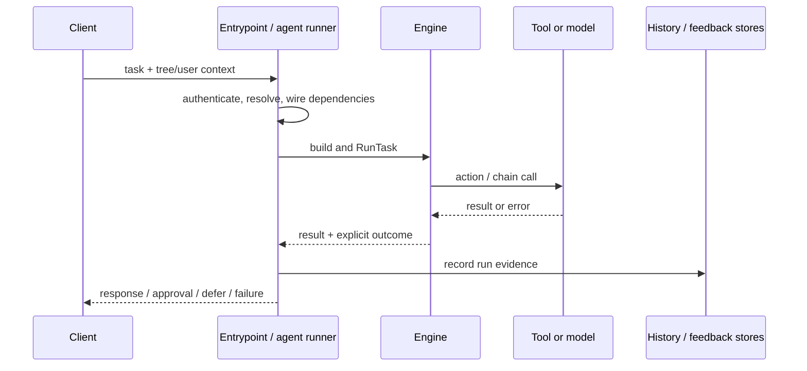
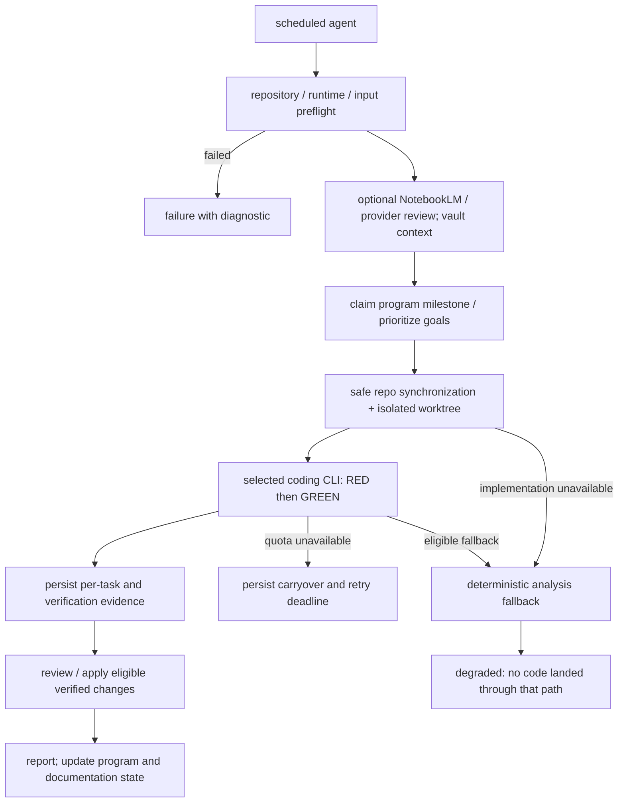

# 6. Runtime View

Scenarios use the building blocks from [§5](05-building-blocks.md).
Durations are budgets or targets where stated, not measured service-level
guarantees. Code evidence and acceptance criteria are in [§10](10-quality.md).

## 6.1 Task Execution Scenario

**Trigger:** MCP/CLI/A2A/dashboard submits a task or the scheduler selects a
due agent.

1. The entrypoint validates its request and applicable credentials, resolves
   a registered or user-scoped tree, and constructs run dependencies.
2. The engine expands references and validates/builds the definition.
   `RunTask` initializes chain state and the run context.
3. The tree executes actions/chains. Running nodes are reticked within the
   tick budget; `pending_approval` stops that loop so an external decision
   can arrive without busy waiting.
4. The engine records result/outcome and applies output-quality rules.
   The runner records history, reflections and feedback as configured.
5. The calling adapter translates the outcome into its API/transport
   response. Scheduled execution additionally applies retry/breaker/DLQ policy.



**Bounds:** [`RunTask`](../../internal/engine/tree.go) defaults to a
120-second context timeout, overrideable by `Blackboard.TreeTimeoutMs`,
and at most 1,000 ticks. This is cooperative cancellation: an action must
observe its context. Longer implementation actions have their own budgets
(§6.4), so “every task returns within 120 seconds” is not a valid platform
guarantee.

## 6.2 Evolution Cycle

**Trigger:** a gardener cycle or a supported evolution tool is invoked.

1. Resolve tree ownership and load that tree's reflection/feedback evidence.
2. Check eligibility, evidence and enabled feature gates.
3. Generate candidates and score against the target tree's records.
   MCTS candidates join the ordinary scored mutation competition when
   affinity/configuration selects them.
4. Apply the acceptance checks for that path. Ordinary mutations use
   benchmark/quality/meta-validation checks; retain the pre-mutation
   baseline and durable snapshots.
5. Persist accepted trees and associated feedback/archives; reject or
   restore after failed gates, and record cycle metrics.

The island winner pass runs before the ordinary per-tree mutation loop.
Its remaining missing benchmark/meta-validation/snapshot checks are R23;
the diagram in §5.3 must not be interpreted as proof of identical gating.
Per-user trees use per-user evidence and experience banks. See
[`evolve_v2.go`](../../internal/gardener/evolve_v2.go) and
[§8.5](08-crosscutting-concepts.md#85-evolution-pipeline).

## 6.3 Sprint Execution

**Trigger:** an authenticated operator approves tasks and submits
`POST /api/sprint/execute`.

1. Dashboard handlers select approved tasks and expose running status.
2. The dashboard dispatches tasks through `AgentExecutor`, subject to its
   worker/concurrency and per-agent breaker checks.
3. Execution uses in-process dependencies; the executor has a Hermes CLI
   fallback. It does not always send a `bt_run_task` MCP request.
4. Completed tasks, genuine failures and deferred work have distinct
   dispositions. A provider quota carryover returns a task to approved
   work rather than treating it as completed.
5. The browser polls `GET /api/sprint/status`.

`POST /api/workflow/run-full-pipeline` and `POST /api/pipelines/run` are
separate interfaces; `/api/sprint` and `/api/pipeline/*` are not aliases
for these routes. [The mux](../../cmd/bt-dashboard/main.go) is authoritative.

Company-state locks cover snapshot/apply windows around long-running tree
calls. Holding that shared lock across model calls would block unrelated
page loads (QS18/QS21, ADR-239).

## 6.4 Self-Improvement Cycle (goap-fusion loop)

**Triggers:** deployed `goap-fusion-loop-runner` uses `0,30 * * * *`;
`goap-fusion-runner` uses `47 * * * *` (host observation, 2026-09-16).
Persisted scheduler configuration is authoritative. A due time is not a
promise to launch overlapping work while the same job remains in flight.



The loop preflight refuses tracked files differing from HEAD. Safe
synchronization also refuses divergent branches it cannot fast-forward;
a clean checkout alone is insufficient. Runtime preflight validates the
configured provider's executable, not its account's model entitlement.
An unsupported model is an implementation error, not a rate limit.

The coding runner is selected through `BT_SUPERPOWERS_PROVIDER`.
Read-only review and write-capable implementation retain different
permission policies. Opt-in failover may try the alternate provider once
for a rate limit; it does not switch on authentication/model errors.
See [coding delegation](../coding-delegation.md) and
[§8.19](08-crosscutting-concepts.md#819-coding-provider-policy).

**Implemented excerpt: resuming after a quota pause.**

1. On an existing-plan run, `internal/engine` calls
   `delegationPreflightBackoff` before creating a worktree or starting the
   coding-attempt budget. With `BT_SUPERPOWERS_RATE_LIMIT_FAILOVER=true`,
   preflight checks both the configured provider and its alternate.
2. For each provider whose latest valid deadline is at or before now,
   preflight clears its shared JSON file, legacy agent-scoped blackboard
   key and run-local `ChainState` entry. It checks both providers before
   returning inactive, preserving any still-active provider window.
3. If either provider is eligible, execution proceeds to the coding runner,
   which skips providers still in backoff and permits an eligible attempt
   (half-open recovery). Cancellation or deadline expiry stops failover.
   If both windows remain active, the engine returns
   `goap_fusion_rate_limited`, preserves the plan and reports the earlier
   deadline for a later cycle.

**Source evidence:** [runtime caller](../../internal/engine/actions_superpowers_prod.go),
[failover preflight/runner](../../internal/engine/superpowers_failover.go),
[backoff state cleanup](../../internal/engine/goap_claude_backoff.go).
**Tested contract:** `TestRunSuperpowersRuntime_ExpiredBackoffExecutes` and
`TestDelegationPreflightBackoff_ClearsExpiredState` in the
[runtime tests](../../internal/engine/actions_superpowers_prod_test.go) cover
resumed provider invocation and cleanup of all three state locations for
both provider orders, including equality at the deadline and preservation
of active windows.

**Budget and evidence:** the existing-plan Superpowers runtime has a
90-minute attempt budget; scheduled jobs have their own configured timeout.
Phase actions have additional command budgets. Persisted `run.json`,
per-task RED/GREEN output and verification artifacts live under
`docs/superpowers/runs/<id>/`. Partial verified landings and plan carryover
are explicit runtime states; do not infer implementation success from an
analysis file or from an executable being present.

| Outcome | Meaning | Operational interpretation |
|---|---|---|
| `success` | Successful terminal execution according to the selected tree/adapter | For a code-change objective, also inspect apply/commit evidence. |
| `no_change` | Healthy completion without a new implementation | No new code should be claimed. |
| `degraded` | Analysis/fallback completed after implementation could not proceed | Breaker health does not mean the requested code was implemented. |
| `goap_fusion_rate_limited` | Expected quota pause with carryover | Preserve plan/deadline; avoid charging a normal failure budget. |
| `failure` / `partial` | Failed or incomplete execution | Inspect phase evidence, error and scheduler retry/DLQ handling. |
| `pending_approval` | An external approval is still needed | Do not report completion or spin the tick loop. |

The scheduler's canonical classifications are in
[`agent/runner.go`](../../internal/agent/runner.go) and
[`agent/scheduler.go`](../../internal/agent/scheduler.go).
A closed breaker is therefore a reliability signal, not an implementation
success metric.

## 6.5 Error Recovery

1. A local wrapper may recover a panic into an error or log it.
   `SafeGo` alone does not enqueue work, open a breaker or restart the
   failed goroutine.
2. For scheduled runs, the callback passed to `globalSched.Start` in
   [`cmd/bt-agent/main.go`](../../cmd/bt-agent/main.go) wires
   `schedulerRetryPolicy` through `ExecuteContext` and enqueues failures
   in the DLQ when that policy terminates with an error. GOAP cycles get
   one attempt per scheduled slot; other agents use configured retries.
3. `internal/agent` records genuine failures in the per-agent breaker.
   Quota carryovers and healthy no-code outcomes terminate the callback
   without retry or DLQ insertion.
4. An operator can request DLQ replay. The daemon reloads shared on-disk
   replay state before scanning so dashboard/MCP requests are visible.
5. The execution owner retries the queued item and records its new outcome.

**Evidence:** [reliability primitives](../../internal/reliability/reliability.go),
[panic handling](../../internal/reliability/panic_handler.go),
[scheduler](../../internal/agent/scheduler.go). Recovery from process/host
loss also requires the deployment and backup procedures in §7.

## 6.6 Browser Authentication and Session Expiry

```mermaid
sequenceDiagram
    participant Browser
    participant Dashboard
    participant Sessions as In-memory SessionStore
    Browser->>Dashboard: GET /api/session
    Dashboard-->>Browser: 401 if no valid session
    Browser->>Browser: show sign-in form
    Browser->>Dashboard: POST /api/login (key + CSRF token)
    Dashboard->>Sessions: validate configured key; create bounded session
    Dashboard-->>Browser: HttpOnly bt_session cookie
    Browser->>Dashboard: protected API request with cookie
    Dashboard->>Sessions: validate token and expiry
    alt valid
        Dashboard-->>Browser: requested data
    else expired / service restarted
        Dashboard-->>Browser: 401
        Browser->>Browser: clear private view; show sign-in
    end
```

`POST /api/logout` destroys the session and clears its cookie. API clients
can instead use `X-API-Key`; a valid key takes the key-authenticated CSRF
exception. Invalid-key login is not automatically retried by the browser.
Sessions are process-local, so dashboard restart requires sign-in again
(QS27–QS28).

## 6.7 Personal Automation and Feedback

Intent or recurring-pattern evidence creates a goal. The canonical planner
produces a plan, the compiler validates a tree and persists it in the user's
workspace, and the automation flow creates a tracked approval request.
Approval finalization activates/schedules the tracked automation; rejection
keeps it unavailable. Negative feedback can flag and pause an approved
automation until review finalization.

MCP and dashboard use shared persona finalization functions. User-scoped
resolution and `AutomationBlocked` prevent falling through to a default
tree for pending/rejected/flagged tracked automations. Trusted operator
settings can permit auto-approval; the default HITL policy is not an
unconditional guarantee that every installation requires a human click.
See [automation finalization](../../internal/persona/automation_finalize.go),
[autopilot tests](../../cmd/bt-agent/autopilot_test.go), and QS9–QS13.

---

*Generated by bt-agent arc42 pipeline — section6RuntimeView tree*
