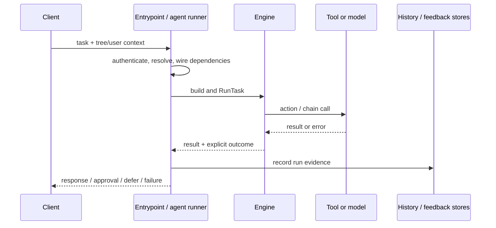
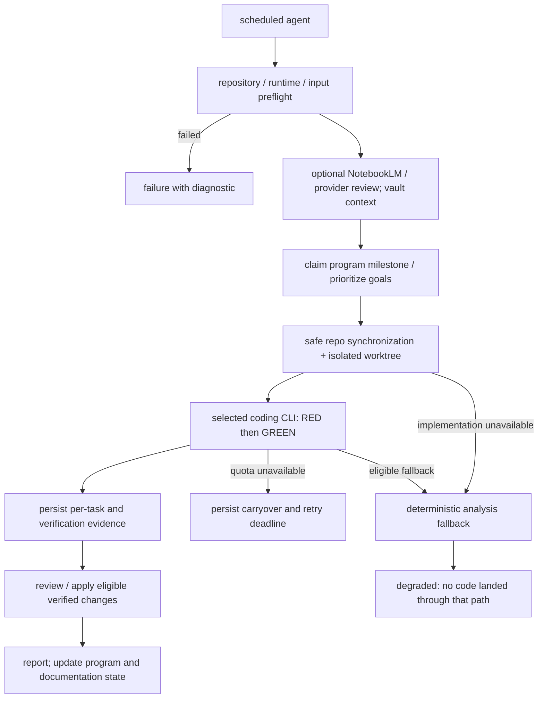

# 6. Runtime View

Under the [Sol policy](../sol-model-policy.md), ordinary LLM calls spawn a caller-bounded Codex process. NotebookLM generation/research and legacy scripts remain enabled. NotebookLM command deadlines include backoff; only passive reads may retry, successful JSON remains complete, and an open circuit returns immediately. Session renewal validates account and RPC before saving. Successful keepalive is throttled for 15 minutes; transient renewal failure does not invalidate a separately checked working login.

Scenarios use the building blocks from [§5](05-building-blocks.md).
Durations are budgets or targets where stated, not measured service-level
guarantees. Code evidence and acceptance criteria are in [§10](10-quality.md).

## 6.1 Task Execution Scenario

**Trigger:** MCP/CLI/A2A/dashboard submits a task or the scheduler selects a
due agent.

1. The entrypoint validates its request and applicable credentials, resolves
   a registered or user-scoped tree, and constructs run dependencies.
2. The engine expands references and validates/builds the definition.
   `RunTask` initializes chain state and the run context.
3. The tree executes actions/chains. Running nodes are reticked within the
   tick budget; `pending_approval` stops that loop so an external decision
   can arrive without busy waiting.
4. The engine records result/outcome and applies output-quality rules.
   The runner records history, reflections and feedback as configured. History
   write failure returns the actual execution result plus an error; scheduled
   execution logs that failure without claiming a persisted history record.
5. The calling adapter translates the outcome into its API/transport
   response. Scheduled execution additionally applies retry/breaker/DLQ policy.



**Bounds:** [`RunTask`](../../internal/engine/tree.go) defaults to a
120-second context timeout, overrideable by `Blackboard.TreeTimeoutMs`,
and at most 1,000 ticks. This is cooperative cancellation: an action must
observe its context. Longer implementation actions have their own budgets
(§6.4), so “every task returns within 120 seconds” is not a valid platform
guarantee.

For `POST /api/agents/execute` and `POST /api/agents/run`, one admission owner
uses the request context and the executor's five-minute default timeout for
limiter waiting, queue submission and execution. A closed pool returns 503;
cancellation/expiry while waiting for admission or completion returns 408
when the HTTP connection still permits a response. An admitted task retains
its concurrency slot until executor cleanup finishes, even if its HTTP caller
disconnects. Canceled queued tasks skip execution when drained. Pool shutdown
wakes blocked submitters and drains accepted work; it cannot force a synchronous
action that ignores cancellation to terminate.

A 408 or lost connection does not prove the task never started. Inspect run
history before retrying side effects. The runner preserves a healthy completed
result/history if cancellation races after the operation. The Hermes fallback
inherits the caller's budget, preserves partial output and command errors,
and terminates its owned process group on cancellation (ADR-266). Remote dispatch preserves typed record errors through `error_kind`. A lost,
expired or malformed remote response is terminal uncertainty: router and retry
policy stop instead of trying another execution owner. Known rejection can fall
back only with explicit non-admission evidence. See ADR-267; remote-call
idempotency and fleet-wide bounded termination remain open.

A2A card resolution, message dispatch and task polling share the caller budget.
Only explicit same-origin non-admission allows SendMessage retry; lost responses
are uncertain. Submitted/working tasks use GetTask with the existing ID, never a
new message. Paused states return to the caller. The SDK owns asynchronous tasks
independently of an HTTP request; explicit CancelTask cancels cooperative tree
work. A polling timeout requires reconciliation and does not claim cancellation.

BT status events preserve actual state/output and optional `bt_execution`
metadata when history writes fail. Auction keeps the award, output and typed
diagnostic, without replay or local fallback; only a genuinely completed winner
is healthy. A nested completed-child persistence stop aborts its surrounding
workflow. The engine shares a typed stop across parallel blackboards, blocks
subsequent built-node admission/reticks and returns the diagnostic through
RunOnce. The surrounding outcome is `aborted` or `uncertain`, not whole-task
success. Already admitted parallel work may still finish. See ADR-268.

Known non-completed A2A states also cross the integer BT interface as typed
`ExecutionStoppedError`. They stop tree retries, selector fallback and outer
retry without depending on words such as “timeout” in status text. Canonical
waits are deferred in SLO accounting and do not open execution breakers; their
diagnostic remains in history and completion events. Failed/canceled/rejected
work remains unsuccessful. When a paused group contains an admitted failed or
panicked sibling, that fault outranks the wait. Blocked admission, nested
stop-converted success and normal conditional skips are not invented failures.
These tests cover typed dispositions (ADR-269). Local workflow approval/control
paths are covered by ADR-270; durable resumption remains separate R30 work.

## 6.2 Evolution Cycle

**Trigger:** a gardener cycle or a supported evolution tool is invoked.

1. Resolve tree ownership and load that tree's reflection/feedback evidence.
2. Check eligibility, evidence and enabled feature gates.
3. Generate candidates and score against the target tree's records.
   MCTS candidates join the ordinary scored mutation competition when
   affinity/configuration selects them.
4. Apply the acceptance checks for that path. Ordinary mutations use
   benchmark/quality/meta-validation checks; retain the pre-mutation
   baseline and durable snapshots.
5. Persist accepted trees and associated feedback/archives; reject or
   restore after failed gates, and record cycle metrics.

Ordinary and optional passes stage detached candidates; failed configured
snapshots, validation or tree writes preserve the live predecessor and do not
publish mutation experience. Deep search replays the entire ordered winner,
re-scores it against current reflections and commits before live/learning
publication (ADR-262). Cached search scoring is scoped to reflection evidence.

The island winner pass runs before the ordinary per-tree mutation loop.
It validates the whole-tree candidate and snapshots the predecessor before
committing it to disk, then updates the live tree. Failed snapshot/write
leaves the live tree unchanged (R23 regression contracts);
the diagram in §5.3 must not be interpreted as proof of identical gating.
Per-user trees use per-user evidence and experience banks. See
[`evolve_v2.go`](../../internal/gardener/evolve_v2.go) and
[§8.5](08-crosscutting-concepts.md#85-evolution-pipeline).

## 6.3 Sprint Execution

**Trigger:** an authenticated operator approves tasks and submits
`POST /api/sprint/execute`.

1. Serialize sprint admission with the HTTP caller's context and a 30-second
   default. Reserve the shared concurrency limiter and worker queue before
   durably claiming tasks. Closed admission returns 503; canceled/expired
   admission returns 408, with explicit non-dispatch evidence and unchanged
   claims. Matching idempotency keys observe their existing job.
2. Dispatch claimed tasks sequentially through a captured `AgentExecutor`,
   task store and breaker owner. Accepted work has its own five-minute batch
   deadline, including queue time, detached from HTTP disconnect. Per-task
   contexts inherit the remaining batch budget. The shared reservation stays
   owned until actual execution/metadata cleanup returns, even after expiry.
3. Execution uses in-process dependencies; the executor has a Hermes CLI
   fallback. It does not always send a `bt_run_task` MCP request.
4. Commit each task's disposition, output, outcome, optional run ID and execution
   diagnostic together. Only then advance its workflow mirror. A healthy run
   with a record error stays completed work with a diagnostic. Genuine stops
   stay failed; ordinary quota carryover and pre-execution breaker skips return
   to approved. Approval/input waits do not establish completion.
5. Retain task-commit errors and their observed results in sprint diagnostics;
   continue other claimed tasks once each, without replaying completed work.
   Expiry stops further dispatch. Proven unstarted claims return to approved
   work together with outcome `not_started`, within a separate 30-second cleanup
   record budget; failed cleanup retains their observed metadata for repair.
   Started work preserves its actual result and is never automatically requeued
   merely because a deadline elapsed. Terminal errors produce progress `failed`.
   A batch panic reports uncertainty
   and leaves interrupted/unattempted claims explicit for operator inspection.
6. The browser polls `GET /api/sprint/status`, shows terminal diagnostics, and
   stops on completion or authentication/authorization rejection.

Status exposes tracked progress (idle/dispatching/running/done/failed), latest job
and task, elapsed seconds, initialized ISO 8601 start time and optional
deadline_at for the owned batch budget. Before admission,
progress is idle, elapsed is zero and started_at is absent. tasks_completed and
tasks_total are task-store-wide observations, not current-sprint percentages.
Optional error/error_kind and per-task diagnostics retain observed output/outcome,
agent/tree/run attribution and task_committed/commit_error. `done` means batch
processing ended without unexpected diagnostics; it does not claim code delivery
or that every task completed (quota/breaker deferrals can remain).

After repairing the task-store path, a new authenticated sprint request retries
retained task metadata before claiming any new approved tasks. Matching old
idempotency keys only return their old job. Repair never invokes the executor;
changed owners/operator decisions and unresolved execution uncertainty return
503 rather than overwriting evidence or inventing a replay decision. Diagnostics
are process-local until a new batch or restart; copy them and inspect history
before restarting. Restart-safe reconciliation remains R30. See
[ADR-275](09-decisions.md#adr-275), [commit/repair HTTP regressions](../../cmd/bt-dashboard/sprint_persistence_regression_test.go)
and [status snapshots](../../cmd/bt-dashboard/sprint_schema_regression_test.go).
[Capacity/context regressions](../../cmd/bt-dashboard/sprint_admission_regression_test.go)
cover actual rejected admission, readable status during waits, HTTP detachment,
retained capacity after cooperative expiry and unstarted-task cleanup (ADR-276).
These are cooperative budgets, not guaranteed wall-clock termination of arbitrary
filesystem operations or synchronous actions ignoring cancellation.

`POST /api/workflow/run-full-pipeline` and `POST /api/pipelines/run` are
separate interfaces; `/api/sprint` and `/api/pipeline/*` are not aliases
for these routes. [The mux](../../cmd/bt-dashboard/main.go) is authoritative.

Company-state locks cover snapshot/apply windows around long-running tree
calls. Holding that shared lock across model calls would block unrelated
page loads (QS18/QS21, ADR-239).

YAML pipelines use a common sequential runner for top-level, loop and nested
subworkflow bodies. Loops execute every declared body step. An unconfigured
approval waiter returns a typed pending state; rejected/escalated/failed or
expired approval decisions stop rather than being skipped or requested again.
Raw agent waits are normalized to typed stops. Child contexts inherit container
budgets; HITL creation and polling use the same shorter caller/policy deadline.
Completed healthy child work followed by an ordinary failure produces a typed
partial stop, preventing container or outer retries from repeating the prefix.
Normal eligible single-step failure retry and explicit ordinary skip remain
available. Already admitted parallel siblings may finish.

Container results retain nested child evidence, including approval task/request
IDs. HTTP pipeline status reports `waiting` for a proven wait, `failed` for an
unsuccessful result even when the callback returned no error, and `complete` for
healthy completion. Optional `error_kind` retains the terminal diagnostic.
The browser renders nested IDs as escaped text and stops polling a settled
waiting invocation. It does not automatically resume a paused run or claim its
in-memory status survives restart (ADR-270).

A configured blackboard must accept the initial input before an agent starts.
Step output and previous-output mirrors report every attempted write failure.
Healthy completed output remains in the result with a persistence diagnostic;
the workflow aborts before retry/skip/downstream work. A failed agent whose
output mirror also fails retains its original error and a typed failure stop.
An acknowledged first mirror is not rolled back when the second fails. Scope
and sidecar lock waits inherit the shorter caller/default budget. Ordinary
filesystem I/O remains cooperative (ADR-271).

Pipeline loading accepts a basename with optional .yaml suffix. Directory,
absolute, traversal, backslash and NUL names are rejected before file selection
or run admission. Both listing and execution use rooted reads: relative symlinks
inside the configured directory work; escaping/absolute file symlinks do not.
Operators may relocate the configured directory through a symlink. Missing
inventory directories return an empty list; other directory failures return
503. Invalid/unreadable YAML entries are omitted from the inventory. A selected
unavailable file returns 404 without internal filesystem error details.
Protected-route 401/403 responses retain their error schemas even under
enforced validation; only an explicit default can cover an otherwise
undocumented response status (ADR-272).

## 6.4 Self-Improvement Cycle (goap-fusion loop)

**Triggers:** deployed `goap-fusion-loop-runner` uses `0,30 * * * *`;
`goap-fusion-runner` uses `47 * * * *` (host observation, 2026-09-16).
Persisted scheduler configuration is authoritative. A due time is not a
promise to launch overlapping work while the same job remains in flight.



The loop preflight refuses tracked files differing from HEAD. Safe
synchronization also refuses divergent branches it cannot fast-forward;
a clean checkout alone is insufficient. Runtime preflight validates the
configured provider's executable, not its account's model entitlement.
An unsupported model is an implementation error, not a rate limit.

The coding runner is selected through `BT_SUPERPOWERS_PROVIDER`.
Read-only review and write-capable implementation retain different
permission policies. The default and deployed Codex-only policy disables alternate-provider failover.
Only explicit legacy compatibility with that policy disabled may try an alternate
once for a rate limit; it does not switch on authentication/model errors.
See [coding delegation](../coding-delegation.md) and
[§8.19](08-crosscutting-concepts.md#819-coding-provider-policy).

**Implemented excerpt: resuming after a quota pause.**

1. On an existing-plan run, `internal/engine` calls
   `delegationPreflightBackoff` before creating a worktree or starting the
   coding-attempt budget. Only with Codex-only policy explicitly disabled and
   `BT_SUPERPOWERS_RATE_LIMIT_FAILOVER=true` does preflight check both the
   configured provider and its alternate; the deployed policy checks Codex.
2. For each provider whose latest valid deadline is at or before now,
   preflight clears its shared JSON file, legacy agent-scoped blackboard
   key and run-local `ChainState` entry. It checks both providers before
   returning inactive, preserving any still-active provider window.
3. If either provider is eligible, execution proceeds to the coding runner,
   which skips providers still in backoff and permits an eligible attempt
   (half-open recovery). Cancellation or deadline expiry stops failover.
   If both windows remain active, the engine returns
   `goap_fusion_rate_limited`, preserves the plan and reports the earlier
   deadline for a later cycle.

**Source evidence:** [runtime caller](../../internal/engine/actions_superpowers_prod.go),
[failover preflight/runner](../../internal/engine/superpowers_failover.go),
[backoff state cleanup](../../internal/engine/goap_claude_backoff.go).
**Tested contract:** `TestRunSuperpowersRuntime_ExpiredBackoffExecutes` and
`TestDelegationPreflightBackoff_ClearsExpiredState` in the
[runtime tests](../../internal/engine/actions_superpowers_prod_test.go) cover
resumed provider invocation and cleanup of all three state locations for
both provider orders, including equality at the deadline and preservation
of active windows.

**Budget and evidence:** the existing-plan Superpowers runtime has a
90-minute attempt budget; scheduled jobs have their own configured timeout.
Phase actions have additional command budgets. Persisted `run.json`,
per-task RED/GREEN output and verification artifacts live under
`docs/superpowers/runs/<id>/`. Partial verified landings and plan carryover
are explicit runtime states; do not infer implementation success from an
analysis file or from an executable being present.

| Outcome | Meaning | Operational interpretation |
|---|---|---|
| `success` | Successful terminal execution according to the selected tree/adapter | For a code-change objective, also inspect apply/commit evidence. |
| `no_change` | Healthy completion without a new implementation | No new code should be claimed. |
| `degraded` | Analysis/fallback completed after implementation could not proceed | Breaker health does not mean the requested code was implemented. |
| `goap_fusion_rate_limited` | Expected quota pause with carryover | Preserve plan/deadline; avoid charging a normal failure budget. |
| `failure` / `partial` | Failed or incomplete execution | Inspect phase evidence, error and scheduler retry/DLQ handling. |
| `pending_approval` | An external approval is still needed | Do not report completion or spin the tick loop. |

The scheduler's canonical classifications are in
[`agent/runner.go`](../../internal/agent/runner.go) and
[`agent/scheduler.go`](../../internal/agent/scheduler.go).
A closed breaker is therefore a reliability signal, not an implementation
success metric.

## 6.5 Error Recovery

1. A local wrapper may recover a panic into an error or log it.
   `SafeGo` alone does not enqueue work, open a breaker or restart the
   failed goroutine.
2. For scheduled runs, the callback passed to `globalSched.Start` in
   [`cmd/bt-agent/main.go`](../../cmd/bt-agent/main.go) wires
   `schedulerRetryPolicy` through `ExecuteContext` and enqueues failures
   in the DLQ when that policy terminates with an error. GOAP cycles get
   one attempt per scheduled slot; other agents use configured retries.
3. `internal/agent` records genuine failures in the per-agent breaker.
   Quota carryovers and healthy no-code outcomes terminate the callback
   without retry or DLQ insertion.
4. An operator can request DLQ replay. The daemon reloads shared on-disk
   replay state before scanning so dashboard/MCP requests are visible.
5. The execution owner commits a unique durable claim before dispatch. Healthy
   completion removes the entry only after recording succeeds. Ordinary proven
   failure records its outcome and releases the claim; terminal/uncertain
   execution retains recovery authority. Failed terminal recording or immediate
   process exit leaves the claim held through restart (ADR-280).

Independent-process [DLQ restart fixtures](../../internal/reliability/dlq_restart_safety_test.go)
append and sync a real local action counter, fail result recording or exit
immediately, then start two fresh consumers against unchanged queue bytes.
Scanner selection, ordinary requeue and direct replay execute no second action.
Admission write failure executes nothing. Sibling deltas, purge and capacity
cannot erase the fence. Malformed state remains in place and closes admission;
quarantining it as an empty queue could discard unknown work. Exact-claim
`ResolveReplayRecovery` commits a trusted completed/provably-unstarted decision
without dispatch. Its caller must establish quiescence and outcome independently;
this is not a production-verified recovery workflow.

Process restart is a separate recovery boundary (ADR-277). A scheduled or
manual scheduler execution with a persistent JobStore must commit an in-flight
claim before dispatch. Unreadable job state closes admission. Interrupted
claims become inactive `recovery_required` jobs; registry synchronization,
ordinary scheduling, deletion and manual execution do not release them.
Failed history/result recording and typed uncertain/terminal execution also
hold the agent. `Scheduler.ResolveRecovery` records a trusted operator's
completed/abandoned disposition and advances to a future recurring slot without
dispatching the interrupted work. It is a Go API, not an authenticated HTTP/MCP
reconciliation endpoint. In-memory-only schedulers have no restart guarantee.

Sprint task claims remain `in_progress` if their result commit fails or the
process exits after the action. Separate-process HTTP fixtures prove that
restarting loses transient diagnostics but cannot make these claims approved;
ordinary approval is rejected. Operators must recover evidence and reconcile
metadata explicitly. This does not promise recovery of output that never
reached durable storage, cross-store ACID or safety after losing the state volume.

**Evidence:** [reliability primitives](../../internal/reliability/reliability.go),
[panic handling](../../internal/reliability/panic_handler.go),
[scheduler](../../internal/agent/scheduler.go). Recovery from process/host
loss also requires the deployment and backup procedures in §7.

Dashboard self-adoption has a separate process-local ownership contract
(ADR-278). HTTP requests, capacity waits and detached agent/sprint/pipeline
callbacks own leases until actual evidence/cleanup and panic handling finish.
An idle restart seals the same admission mutex before requesting systemd
restart. Rejected handoff reopens admission; accepted asynchronous handoff
keeps it sealed until process exit. Sealed requests return JSON 503,
`Retry-After: 1` and `X-BT-Execution-Admitted: false`. Persisted waiting records
are not live workers. Sibling restarts and other daemon admission remain outside
this local contract; automatic fleet adoption is not qualified.

Sibling drift adoption now requests the target owner instead of invoking
systemd directly (ADR-279). Dashboard and gardener control listeners authenticate
same-UID peers, attest the configured systemd MainPID, validate a bounded
revision request, and respect the target's
auto-restart policy. A live already-current owner avoids a second restart.
Otherwise the owner seals admission while idle, verifies its configured
artifact's exact unit/revision/clean version output and requests its own restart.
Busy, disabled, missing or mismatched owners defer without direct fallback.
Lost replies and post-start systemd acknowledgement failures remain uncertain;
the target keeps its admission seal. Only proven rejection reopens admission.

Gardener RunCycleV2 owns cycle admission through evidence and cleanup. Its
periodic iteration additionally owns registry rescan, analysis/tools and final
metadata, including nested cycles. The watcher starts after owner/analysis
initialization. The bt-agent self path still has only scheduler snapshots;
daemon-wide scheduler/A2A/DLQ admission remains separate C09 acceptance.

Checkpoint recovery retains the original attempt's typed state snapshot through
`Running` ticks and keeps one bounded retry budget for the run. A missing/string-
mismatched fact fails verification; a completed file write followed by a failed
checkpoint stops as uncertain instead of treating state restoration as undo.
The standalone GOAP agent publishes returned observations before callbacks and
rejects unestablished effects; dynamic GOAP without an executor cannot advance.
Compiled and dynamic steps now require fresh observations (ADR-289). Each step
checks preconditions, retains one observation scope across `Running` ticks, and
updates state only from fields that satisfy its effect oracle. A failed observation
after a committed file write stops as uncertain; terminal steps do not replay.
Setup applies declared capabilities/goals/prompts when selected and preserves
observed facts. The dynamic memory sequence retains its plan across ticks; a
failed replan clears the previous plan. The full declared goal must hold before
completion. Legacy `ApplyGoapEffects` fails with a regeneration diagnostic.

## 6.6 Browser Authentication and Session Expiry

```mermaid
sequenceDiagram
    participant Browser
    participant Dashboard
    participant Sessions as In-memory SessionStore
    Browser->>Dashboard: GET /api/session
    Dashboard-->>Browser: 401 if no valid session
    Browser->>Browser: show sign-in form
    Browser->>Dashboard: POST /api/login (key + CSRF token)
    Dashboard->>Sessions: validate configured key; create bounded session
    Dashboard-->>Browser: HttpOnly bt_session cookie
    Browser->>Dashboard: protected API request with cookie
    Dashboard->>Sessions: validate token and expiry
    alt valid
        Dashboard-->>Browser: requested data
    else expired / service restarted
        Dashboard-->>Browser: 401
        Browser->>Browser: clear private view; show sign-in
    end
```

`POST /api/logout` destroys the session and clears its cookie. API clients
can instead use `X-API-Key`; a valid key takes the key-authenticated CSRF
exception. Invalid-key login is not automatically retried by the browser.
Sessions are process-local, so dashboard restart requires sign-in again
(QS27–QS28).

## 6.7 Personal Automation and Feedback

Personal automation reuses a governed owned task tree. Exact successful interaction
records carry source tree versions; template selection resolves the adopted runtime
version before consulting legacy storage. Keyword similarity alone cannot supply a task
implementation. `bt_automation_schedule` offers the same proposal path directly for
an existing owned response/file task and a validated five-field cron expression.
Missing templates require an explicit task contract rather than a prose-only
administrative GOAP plan. Approval schedules the copied task; rejection keeps it
unavailable. Negative feedback can pause it for review.

The proposal path reserves a pending record before publishing its tree. Reservation
serializes duplicate checks and the per-user cap across instances; pending and
flagged proposals consume slots. Approval compares the request, tree, agent,
schedule and exact task with the reservation, creates or verifies the same agent
definition, then commits approval. A failed commit is reported and leaves the
previous admission state; retrying matches the existing definition. Scheduled
agents receive the original task text as their description. Unreadable ledgers
and contradictory records deny admission. Personal task descriptions are not
registered in the shared knowledge graph (ADR-284).

New proposals bind consent to the exact tree version as well as owner/task/schedule.
Changed definitions and missing ledgers cannot resolve tracked trees; a registered
agent with an unavailable tree cannot fall through to an unrelated alias/default.
Legacy unversioned autopilot definitions require explicit reconciliation. Failed
preparation can leave a pending reservation requiring repair (ADR-285).

`FileTask` snapshots a declared input beneath an owner-isolated artifact root,
runs the factory's bounded response/gateway children, validates JSON before writing,
checks input freshness, atomically writes the declared destination and independently
reads it back. Exact bytes and the result contract must agree. Run records and runner
results retain input/output digests and committed/verified disposition. Failed gates
leave the prior output intact; uncertain post-write verification stops replay. Paths
are declared before consent and cannot be chosen by model output.

The retained real Ollama trial used `Scheduler.RunNow` and the production runner:
an expenses file totaling 25 across three entries produced a verified report; an
inconsistent expected total failed without replacing it. This qualifies that file
fixture, not cron wall-clock dispatch, other integrations or general assistant
performance. Ordinary operations still use Sol 6.1. The compiled and dynamic GOAP
paths also have a live dependent file fixture: expense total 25 is saved, read by
the next step, and doubled to 50. Independent readback and scoped terminal receipts
establish both effects. Built-in research/DevOps declarations still need concrete
capability observers; their prose cannot establish task completion (ADR-289).

Explicit-feedback totals and review thresholds are scoped to the exact
tree/user pair. Another user's same-ID tree and unowned legacy feedback do
not contribute. Compile-seed identifiers include both owner and tree, so
recompilation cannot overwrite another user's seed. Compilation remains
synthetic evidence, not proof that the requested task was completed.

Task approval first persists a reconciliation marker, then resolves the HITL
audit and clears the marker. Failure is reported and the task remains excluded
from dispatch until a retry completes synchronization. Nested tree gates bind
requests to their own node/phase/task/agent identity and retain outer approval
while inner review remains pending. Post-review begins only after child
completion; completed child work is not replayed while approval is pending.
Storage failure stops the gate before a pre-approval child runs (ADR-263).

MCP and dashboard use shared persona finalization functions. User-scoped
resolution and `AutomationBlocked` prevent falling through to a default
tree for pending/rejected/flagged tracked automations. Trusted operator
settings can permit auto-approval; the default HITL policy is not an
unconditional guarantee that every installation requires a human click.
See [automation finalization](../../internal/persona/automation_finalize.go),
[autopilot tests](../../cmd/bt-agent/autopilot_test.go), and QS9–QS13.

### On-demand governed task creation

`bt_factory_create` and the compatibility name `bt_kg_auto_create` require
`task` and `result_contract`. Optional steps each declare their own instruction
and contract. `file_task` adds declared relative input/output artifact paths for
an owned file workflow. The response factory retains the full task and uses bounded
primary/recovery calls behind every step's quality gate. Expected values remain
inside the verifier; only required field names are sent to the worker.

The handler validates the draft, persists a fresh collision-resistant
`factory:` ID and returns its definition hash. Only a successful shared write
is indexed. Personal trees require the owner workspace and stay outside shared
discovery. Creation returns `qualified: false`: it neither executes the task
nor establishes fitness. Parent references record lineage; this response path
does not splice unrelated parent actions into the requested work.

Factory IDs resolve only to their saved definition. Missing or inaccessible
IDs cannot execute DefaultTree. Owner-scoped execution reloads the definition
and records its actual result, owner, version and gate verdicts. These are
response workflows; file-task fixtures add real read/write effects (ADR-285).
Other external integrations and measured file-task evolution/promotion
remain separate work. See [factory handler](../../cmd/bt-agent/task_factory.go)
and [real-model execution test](../../cmd/bt-agent/task_factory_test.go).

## 6.8 Inspect a Tree Definition

An authenticated operator requests an exact tree ID. Lookup rejects path-shaped
identifiers, checks existing catalog aliases and shared compiled construction,
then consults the injected unscoped generated-tree resolver on a miss. The
explicit default ID resolves its compiled definition; unknown IDs never receive
execution's legacy fallback. Missing parameters return 400; unavailable actual
definitions return 404. Catalog metadata alone does not establish availability.

HTTP returns the bare SerializableNode, preserving nested children and metadata.
The browser encodes the requested ID, escapes labels/details/errors and binds
collapse/detail events to structural paths. Repeated names and IDs remain
independent branches. This read does not execute a tree or coding provider.
Enforced schema checks cover the root and immediate child shape; nested schema
validation and tenant-bound inspection remain separate work (ADR-273).

## 6.9 Admit a Blackboard Owner and Promote Completed Evidence

A platform runner first initializes its persistent blackboard namespace. A
failed default initialization returns no memory substitute: agent work stops
before a run handle/tree tick, pipelines stop before step admission, HTTP startup
returns 503 before publishing/enqueuing a run, and MCP returns an error. A runner
keeps its initialized owner/error; after a failed setup the operator repairs the
root and constructs a new runner. Successful initialization fixes the default
owner despite subsequent environment/configuration removal. Injected managers
are trusted dependencies configured before use.

After healthy agent execution, promotion stages output, task, run/session IDs
and timestamp under one scoped gate/file transaction. Invalid entries, a group
that cannot fit without evicting itself, cancellation or commit failure publish
none of that group. Entry metadata is detached from writer/read/list callers.
Failure preserves the actual healthy result and records its diagnostic in
history; typed persistence evidence stops automatic replay. Promotion write
admission respects the shorter caller/default scope budget. Startup filesystem
I/O and arbitrary synchronous I/O remain cooperative (ADR-274, R30).


### Terminal execution evidence

`BuildAndValidate` binds the command to the source and expanded definitions.
`RunTask` starts an independent evidence identity, executes the tree, resolves
its terminal outcome and records the result once. `ReflectOnOutcome` requests
reflection at finalization. `RunOnce` defers the write until its own output and
quality checks complete, preserving a later rejection instead of publishing an
earlier success. Live mutations append executed versions. Storage errors remain
separate from the task outcome to prevent replay of completed effects.
[Runtime regressions](../../internal/engine/run_evidence_test.go) and
[agent regressions](../../internal/agent/run_evidence_test.go) cover this path.
Compilation seeds cannot unlock the execution-evidence gate; feedback affects
satisfaction independently of measured task success.


### Measured factory evolution and runtime adoption

The response-factory regression now exercises creation, a controlled failing
worker, gardener mutation, three paired real-model trials, atomic publication,
actual agent adoption, registry reload and rollback. The quality gateway checks
the recovery output as well as the primary output. The added recovery worker
recomputes the original task without copying a failed value or receiving the
expected answer. Terminal records identify the version actually executed.
This is one controlled response task, not deployed fleet or external-tool
acceptance (ADR-281; [live regression](../../cmd/bt-agent/runtime_promotion_test.go)).

### Manual and genetic evolution publication

`bt_evolve` reads the requested owner/tree's active definition and requires three
actual failures with matching source and executed hashes. Another task tree,
owner, older version or compilation record cannot trigger it. The genetic-family
and selector-ordering tools retain proposed definitions outside runtime discovery;
a fresh paired comparison alone can activate a version under the original ID.
Shared discovery receives governance coverage only after that commit. A candidate
starts with zero attributed runtime tasks until it actually executes.
`bt_get_tree` and `bt_get_fitness` read this active definition/evidence rather than
an obsolete legacy file or pooled history. Manual publication supports explicit
personal ownership; the genetic-family entrypoints remain shared-tree tools.
See [entrypoint regressions](../../cmd/bt-agent/runtime_publication_test.go) and ADR-282.

---

### Recovery of collapsed persisted trees

With all writers stopped, inspect exact registered filenames and validate each
authored replacement. Refuse changed plans, changed original bytes, personal
ownership in shared files or managed-version conflicts. Copy originals and save
a prepared manifest before any overwrite. Restore each tree atomically and
acknowledge its status; partial failure retains completed work and backups.
Quarantine the explicitly retired `domain:arc42:assemble` skeleton rather than
reviving its removed actions. Reload the production registry and compare exact
definition versions. This is an operator repair; its counts do not enter fitness
or promotion evidence (ADR-283).

### Research delivery and attribution recovery

NotebookLM/grill/provider-review goals record answer digests before implementation.
A committed apply is inspected against Git and the completed task's file scope;
its delivery receipt binds only research already observed when the run began.
Repeated research-goal RED passes hold the goal for review without delivery credit.
Pending attribution is journaled before apply. On a later cycle, preflight repairs
receipts from committed run artifacts before planning; an unresolved repair holds
new planning without repeating code. `bt_research_status` exposes the current
owner's evidence (ADR-287). Terminal records now retain the running binary's native
VCS metadata, start time, exact resolved publication and the executed result
contract (ADR-288). Status joins clean builds containing unchanged delivered files
to the owner's exact executions, then recomputes value contracts over final output.
Historical publication trials remain inspectable after rollback. Observed code
presence and checked results do not establish causal research impact; the report
states that limitation explicitly. Missing metadata yields no adoption credit,
and corrupt records fail reporting instead of silently reducing the sample.

Repeated program RED passes now create `needs_review`, with no completion timestamp
or delivery credit. Selection and batching stop before dependent milestones behind
a review hold. A changed goal cannot inherit an old precheck result. An unreadable
or unwritable program transaction stops planning. Explicit revision requires the
exact current goal plus changed requirements, preserves review history and reopens
pending work; it grants no implementation credit.

New Superpowers runs capture program/index/goal references before implementation.
After actual Git landing, completed task scope must intersect the captured goal's
file anchors (or exact normalized objective when anchorless). The delivery receipt
is saved before the pending journal clears. A failed metadata write is reconciled
without repeating implementation. These checks establish attributed code delivery,
not broad semantic goal fulfillment or causal research benefit (ADR-290).

### Deployed bounded cron acceptance

On 2026-10-02 the native `b615595b` daemon dispatched a factory-created scoped
file task at its configured wall-clock cron. Sol 6.1 produced the independently
expected service-count/revision report. The terminal record retained exact
owner/tree/version, clean native build, two passed result checks and one verified
file receipt. Existing host policy auto-approved activation; afterward the agent
returned to on-demand. [Evidence](../verification/2026-10-02-runtime-release/README.md)
qualifies this one scheduled workflow, not broad personal assistant behavior or
causal research impact. Earlier local-only statements retain their dated scope.

---

*Generated by bt-agent arc42 pipeline — section6RuntimeView tree*
