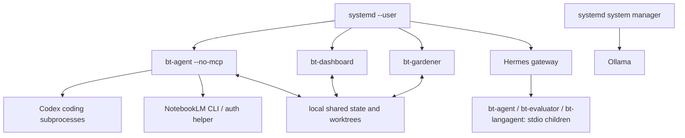

# 7. Deployment View

2026-10-02: all three BT units are active and enabled on clean native release `b615595b`, with effective Sol-only ordinary inference and disabled alternate fallbacks. Automatic rebuild/restart remain disabled pending daemon-wide restart admission. The dated observations below retain their original scope; see the current release evidence at the end of this section. NotebookLM MCP uses `bin/bt-notebooklm-auth --mcp`; a separate user timer renews its existing profile every 15 minutes without starting BT services. The upgraded 0.14.0 integration recovered the existing account headlessly and listed 29 notebooks. See [policy](../sol-model-policy.md) and [auth operations](../../internal/notebooklmauth/README.md).

The reference deployment is a supervised, single-host installation.
Configuration observations below were checked on **2026-09-16**; source
defaults are separately identified. Hardware capacity and a VPN address do
not establish isolation, availability or a service-level commitment.

## 7.1 Infrastructure Level 1

| Element | Role / observed properties | Limitation |
|---|---|---|
| Jetson Linux ARM64 host | Platform binaries, local state and model inference; kernel `5.10.120-tegra` observed | One host/storage/power failure can interrupt the installation. |
| SSD mounted at `/mnt/ssd` | Source checkout, worktrees and operator-managed runtime storage | Backups and restore testing are separate from atomic file writes. |
| systemd user manager | Supervises `bt-agent`, `bt-dashboard`, `bt-gardener` and the external Hermes integration | Restarting a process does not resume every in-memory operation. A2A SDK task
IDs/state are process-local; restart can destroy polling/reconciliation evidence.
Retain run output/history before choosing another attempt (ADR-268). |
| Ollama | Local model service, observed on `127.0.0.1:11434` | Model memory, availability and latency depend on installed models. |
| External providers / Git hosting | HTTPS/SSH according to provider/remote configuration | Credentials, account entitlements, quotas and network connectivity are required. |

### Process and software mapping

| Binary / process | Placement and lifecycle | Interface |
|---|---|---|
| `bin/bt-agent --no-mcp` | `bt-agent.service`; scheduler/A2A daemon | HTTP :8686, shared state and subprocess workflows |
| `bin/bt-dashboard -addr :9800` | `bt-dashboard.service` | Dashboard HTTP APIs and embedded assets |
| `bin/bt-gardener` | `bt-gardener.service` | Evolution cycles, tree/evidence stores |
| `bt-agent`, `bt-evaluator`, `bt-langagent` in MCP mode | Spawned/kept attached by the MCP host | JSON-RPC over stdio |
| Remaining [entrypoints](05-building-blocks.md#entrypoints) | Operator shell, tests, hooks or CI | Short-lived commands |
| Hermes gateway / webhook bridge | External integration, independently supervised | MCP host and configured event delivery |
| Ollama | System service | Local HTTP inference |

MCP mode needs live stdin/stdout; this restriction does not apply to
`bt-agent --no-mcp`. Updating a binary on disk does not replace an existing
MCP child: the host must respawn it. Gateway reload/restart behavior belongs
to that integration's runbook, not the MCP transport contract.

## 7.2 Infrastructure Level 2

### 7.2.1 Process topology

### 7.2.2 Storage and configuration

| Location | Ownership / content | Recovery significance |
|---|---|---|
| `/home/nico/go-bt-evolve` → `/mnt/ssd/go-bt-evolve` | **Non-bare checked-out repository** on the reviewed host; `bin/` holds deployed services | Keep tracked files at committed HEAD. Bare-repository compatibility in code is not the current topology. |
| `/mnt/ssd/worktrees` on this host | Superpowers implementation worktrees via `BT_WORKTREE_BASE`; source default is `/tmp/worktrees` | Keep failed-run evidence until diagnosed; protect active worktrees from cleanup. |
| `docs/superpowers/runs/<id>/` | Run metadata, task output, verification and finish artifacts | Diagnose the actual failing phase here when summaries are truncated. |
| `~/.go-bt-evolve/agents/`, `jobs/scheduler-jobs.json` | Agent definitions and scheduling state | Restore together with compatible tree/program state. |
| `history/*.jsonl`, `audit/`, `logs/` | Run history, audit and diagnostics | Append logs are not multi-file transactional snapshots. |
| `blackboard/`, `memory/`, `research/` | Scoped context, knowledge, programs, quota/cache state | Program claims, attempts and carryovers influence the next run. |
| `circuit_breakers.json`, `dead_letter_queue.json` | Failure admission and retry/replay state | Do not erase these to make a dashboard appear healthy; repair the cause. |
| `claude_backoff.json`, `codex_backoff.json` | Independent provider cooldowns | Restore/preserve meaningful deadlines; one provider does not own the other's quota. |
| `users/<user>/` | Persona profiles, interactions, goals, trees, reflections, experience and automation records | User IDs scope data; preserve approval/quarantine state with trees. |
| `~/.go-bt-reflections/` | Shared reflections/tree store used by run-dependency wiring | This is distinct from per-user trees and the gardener metrics directory. |
| `~/.go-bt-gardener/` | Cycle metrics, snapshots and configured evolution state | Verify snapshot restore against the matching tree registry. |
| `~/.go-bt-evolve/*_archive-*.json`, `experience/`, `feedback.json` | Learning/fitness/archive state | Losing these resets learning evidence even if source code is intact. |
| `/mnt/ssd/clawd/wiki/bt-research/` | Research vault, syntheses and plans | Separate from Git source and run-state stores. |
| Operator environment files outside Git | Platform and provider settings/credentials, loaded by systemd | Back up with restricted permissions; never publish values in docs or logs. |
| Dashboard session store | **Memory only** in one dashboard process | Restart invalidates sessions; sign in again. |

Dashboard task, queue, DLQ, HITL and DoorMate stores now follow
`agent.HomeDir()` (`BT_AGENT_HOME`, then legacy overrides) alongside shared
agent/user/feedback state. Before initializing owners, the five engine-logging
entrypoints validate loaded JSON/.env/environment configuration and publish its
startup paths (ADR-265). `util.PlatformHome` owns root precedence; a configured
agent-definition directory supplies the fallback parent. Definitions, history
and logs honor their explicit independent directory settings; otherwise logs
follow the shared root. Shared daemon/MCP and runner reflection/tree/block
stores honor explicit `BT_REFLECTIONS_DIR` or loaded reflection configuration;
without it they retain the independent `~/.go-bt-reflections` default. Invalid
configuration stops these entrypoints before state initialization; version fast
paths remain independent of configuration and state. Hot reload does not move
open owners or migrate legacy data. Management CLIs also load startup paths;
required daemon history initialization failures stop startup. Generated-tree
lookup retains the startup reflection root if configuration files change.
Gardener roots remain separately
configured. `BIN_DIR` environment or make-command overrides select build output;
use an out-of-place directory for release preparation.
State path helpers can be configured/overridden; consult
[`agent/paths.go`](../../internal/agent/paths.go) and owning stores before
assuming every path follows one environment variable.

### 7.2.3 Network and effective configuration

| Surface | Source default | Observed host setting / implication (2026-09-16) |
|---|---|---|
| Dashboard bind | Loopback through `security.ListenerAddress` | `BT_DASHBOARD_BIND=0.0.0.0`; listening on :9800 beyond loopback |
| A2A bind | Loopback; non-loopback requires a configured platform key | `BT_A2A_BIND=0.0.0.0`; listening on :8686 beyond loopback |
| Hermes bridge | External integration configuration | Listener on `0.0.0.0:8644` observed; its access controls require independent verification |
| Ollama | Provider URL configured by deployment | `127.0.0.1:11434` observed |
| Coding provider | `codex` when unset; Codex-only policy enabled | `BT_SUPERPOWERS_PROVIDER=codex` in all three services |
| Codex model | Source default pins `gpt-5.3-codex-spark` | `BT_SUPERPOWERS_CODEX_MODEL=auto`; use the CLI/account configuration, whose availability was probed |
| Rate-limit failover | Disabled unless explicitly enabled | `BT_SUPERPOWERS_RATE_LIMIT_FAILOVER=true` |
| Automatic rebuild / restart | Opt-in | Both `BT_AUTO_REBUILD_ON_DRIFT=0` and `BT_AUTO_RESTART_ON_DRIFT=0` on all three services |

**Exposure remains an operational verification item.** Binding all interfaces
does not prove public reachability, and the presence of Tailscale does not
prove VPN-only access. Firewall, reverse-proxy/TLS and network policy were
not established by this documentation review (R25). Direct dashboard TLS uses
`BT_TLS_CERT` and `BT_TLS_KEY`; cookie `Secure` follows that resolved
configuration. A reverse proxy must be assessed separately.

systemd `EnvironmentFile` values can override `Environment=` declarations.
Changing an environment file does not hot-reload an already-running process.
[Delegation settings](../coding-delegation.md) and the effective process
configuration must be checked after restart without printing secrets.

**Observed launch update, 2026-10-01:** all three BT user units now have a final
Sol-only drop-in/environment file: provider `codex`, policies `true`, quota
failover `false`, model `gpt-6.1-sol`. The shared Hermes launch environment matches.
Unit definitions were reloaded; BT units were inactive at inspection. This
records configuration, not running-binary identity or a completed delivery
cycle. See the [current policy](../sol-model-policy.md#host-deployment).

## 7.3 Release, Recovery and Operational Checks

**Release acceptance:**

1. Keep development in a separate worktree. Verify the intended source
   revision, a clean deployed checkout and safe remote ancestry before
   scheduled implementation.
2. Run checks appropriate to the change ([§10](10-quality.md)); build from
   committed source with the module's toolchain requirements. The installed
   pre-commit hook should match the tracked hook and clear inherited
   `GIT_*` variables before subprocess tests.
3. Build out of place, preserve the previous binary, then atomically replace
   the target matching the unit's `ExecStart`. The automatic implementation
   is [`agent/rebuild.go`](../../internal/agent/rebuild.go).
4. Coordinate with in-flight work, restart the owning units and respawn
   affected MCP children. Dashboard self-adoption owns HTTP requests and
   detached agent/sprint/pipeline work through cleanup, then atomically seals
   admission through asynchronous restart handoff (ADR-278/279). Sibling
   requests now require dashboard/gardener target ownership; missing owners
   defer with no systemd fallback. Gardener owns cycles and periodic analysis/
   metadata. The bt-agent self path still samples scheduler state. Qualify
   daemon-wide ownership and bounded real handoff before enabling automatic
   restart (ADR-228, R13).
5. Confirm service activity, actual executable revision, a meaningful
   authenticated smoke test and the next relevant workflow outcome.

**Coordinated rollout (ADR-279):** upgrade controllers and both target owners
with automatic restart disabled. Older controllers retain direct sibling
restart behavior, so mixed versions do not establish safety. A target requires
its own `BT_AUTO_RESTART_ON_DRIFT=1` before accepting requests; a controller's
flag does not override that policy. The private Linux control namespace requires
the same UID and configured platform home; the owner/default restart also
require the canonical unit MainPID to match this process. Identity queries
and client/framing deadlines are five
seconds, artifact probes twenty seconds and systemd commands fifteen seconds;
a lost client reply does not cancel an accepted owner operation. Accepted or
uncertain handoff stays sealed until process exit/operator restart. This is
bounded fixture behavior, not deployed restart acceptance. Unknown version,
dirty or wrong-revision artifacts are not accepted by the owner.

**Evidence levels:** `/api/health` proves HTTP process liveness, not model
readiness or successful GOAP implementation. Use `bt_build_info`/startup
build identity and executable metadata for revision checks. The health
payload now derives its Go-version string from the running runtime (D7);
older binaries retain the historical hardcoded value. Read full phase output
for provider errors. A closed breaker can coexist with `degraded` runs.

**Rollback:** retain the known-good executable and corresponding configuration,
replace out of place, restart its owner, and repeat the smoke checks.
Automatic drift adoption includes smoke/rollback logic when enabled; that
is not evidence that a manual deployment or every sibling process has
already adopted the same revision.

**State recovery requirement (open operational acceptance, R26):** the owner
must define backup retention and RPO/RTO, take a consistent backup of the
source/state/vault/secret sets, restore into a separate location, and prove
agent registration, tree resolution, approval state, pending work and
snapshot recovery before production use. Atomic writes provide single-file
integrity; they are not backups or cross-store transactions. This review
does not claim full host-loss or complete production restore qualification; the bounded 2026-10-01 evidence below covers actual-state hashes and dashboard reads.

**Process recovery contract, 2026-10-01 (ADR-277):** persisted scheduled/manual
admissions interrupted before final recording remain inactive and require
operator reconciliation. Failed result saves after successful/uncertain
actions, failed history recording and immediate process exit are tested with
separate execution/restart processes and durable action counts. Sprint HTTP
restart fixtures preserve `in_progress` claims and reject ordinary reapproval.
These tests use local actions, not Codex or deployed services. Preserve claim
files during restore; deleting them is not evidence that work never ran. The
Go reconciliation API requires trusted completed/abandoned evidence; authenticated
transport integration and recovery of uncommitted output remain open.

**Isolated review evidence, 2026-10-01:** all thirteen binaries build into a
separate output directory with revision `db2c116f` and dirty-worktree identity.
A loopback dashboard smoke verifies protected-route 401/200 behavior, runtime
Go 1.26.5, JSON/.env-configured state/definition/history/log roots without a
BT_AGENT_HOME override, HITL storage-error 503, and `--version`
with corrupt task state. A pending fixture task survives restart and a backup/
restore into a distinct temporary root while its sole writer is stopped.
Actual agent-cli/assistant list operations follow those JSON/.env definitions;
agent/dashboard/gardener version checks tolerate broken config without writing
state. No coding CLI or host BT service was started. This proves bounded fixture
recovery and build behavior; it does not qualify production registration/
snapshot recovery, provider delivery, RPO/RTO or network isolation. Evidence and
remaining work are in the [cleanup plan](../plans/2026-09-30-arc42-cleanup.md).

### Retained sprint diagnostics

A sprint can finish executing work while a task record remains in_progress.
Inspect authenticated sprint status diagnostics and copy output/run attribution
before restarting the dashboard. Repair the task-store path, then use a new
sprint request to retry only retained metadata before admission. Reusing an old
idempotency key observes its original job. Execution uncertainty and changed
owners/operator decisions require inspection; do not reapprove a completed task
to repair its record. Process restart loses this asynchronous diagnostic owner
and does not resume its batch (ADR-275, R30).

### Sprint budget observation

Accepted sprint status includes deadline_at for its five-minute batch budget.
HTTP disconnect does not cancel accepted work. Expiry leaves the reservation
owned until the action and record cleanup return; an uncooperative action can
outlive that deadline. Inspect not_started task diagnostics separately from
completed or failed started work before another sprint. These local source/tests
establish ownership behavior, not production termination or capacity targets
(ADR-276, R30).

Benchmark qualification on 2026-10-01 installed `gemma3:270m`, `qwen2.5:0.5b`, `qwen3:0.6b` and `qwen2.5:1.5b` in the host Ollama store. Later repeated trials invalidated the initial 0.5B selection; 1.5B is now the benchmark default, the fastest candidate to pass the six-task/three-repetition corpus among the three Qwen models tested (18/18 at median 1.18 seconds). This is a benchmark-only exception to ordinary Sol inference. Source changes and live qualification are isolated in `codex/runtime-impact-20261001`; they do not establish adoption by the deployed BT services. See [benchmark policy](../sol-model-policy.md).
### Bounded operational qualification — 2026-10-01

The [durable checkpoint](../verification/2026-10-01-checkpoint/README.md)
qualifies a clean f60dcf42 dashboard artifact briefly served by the canonical
user unit, plus service reads from an isolated restore of actual offline state.
Executable hash, version and build_info agree; tasks and definition names
match their persisted contents; unauthenticated task reads return 401. The
unit needed a temporary supported generic-provider EnvironmentFile because
host BT_LLM_PROVIDER=codex is unsupported by this committed snapshot. Global
settings were preserved and the three BT units returned to their initial
inactive state. This is read/identity acceptance, not as-is deployment readiness.

A controlled actual host Codex adapter execution with private gpt-5.5 produced
the expected artifact; that account rejected gpt-6.1-sol. Backup/restoration
matched every file/link in evolve/reflections/gardener roots, with no escaping
restored links. Existing work was not dispatched. Full deployed coding or
evolution, provider authentication restore, external vault/worktrees, power-loss,
retention and numeric RPO/RTO remain open. Implemented restart holds and their
separate-process fault fixtures do not establish those operational guarantees.

**DLQ rollout and recovery (ADR-280):** stop and drain every writer/consumer
before adopting the new replay protocol. Older complete-snapshot writers can
erase unknown claim fields; mixed versions and rollback to those writers are
unsafe. Preserve the state file and backup before restart. Do not purge,
quarantine, expire or reapprove held work to make it runnable. Establish owner
quiescence and action evidence, then record an exact-claim decision through the
trusted Go seam. If outcome cannot be proved, retain the hold. Claims do not
recover lost output or protect against deleting/replacing the state volume.
Automatic rebuild/restart flags remain disabled pending daemon-wide ownership
and real handoff qualification. The current DLQ code is fixture-tested, not
qualified in a deployed service; prior operational evidence remains scoped to
[the f60dcf42 checkpoint](../verification/2026-10-01-checkpoint/README.md).

Rollback reads a `.previous` image within the configured binary directory and
uses rooted unique atomic replacement with executable owner/group mode 0750.
An outward backup symlink is unavailable; replacing a live symlink replaces
the directory entry rather than writing its external target. Failed replacement
preserves the live image ([rollback regressions](../../internal/agent/rollback_root_regression_test.go)).
This is local filesystem fixture evidence, not deployed handoff or rollback
qualification. No host permissions or service settings are changed by checks.

---

### Observed offline tree recovery, 2026-10-01

All three BT services were inactive/disabled, with no matching daemon processes,
when the recovery command repaired the host shared reflection directory. It
restored 51 current authored trees and quarantined one retired assembly tree.
The prior 54-file backup and the repair manifest retain all 52 damaged originals;
the other two files were unchanged. Fresh registry loading verified all 51
replacement hashes, and repeat inspection found zero known collapsed trees.
[Retained evidence](../verification/2026-10-01-tree-recovery/manifest.json) identifies
the exact files and binary fingerprint. No service restart or task execution was
part of this recovery; feature deployment and broader task acceptance remain open.

Research delivery ledgers (ADR-287) are private JSON beside the configured
knowledge index, with SHA-256 owner suffixes. Back up ledgers and Superpowers run
artifacts together. A successful receipt demonstrates a local Git landing; even
`committed_pr_opened` does not establish remote merge, deployed build adoption or
service health. Legacy labels are retained but are not automatically migrated into
verified delivery. On upgrade, review historical attribution separately.

### Observed backlog correction, 2026-10-02

The compiled MCP reconciliation tool was first qualified against a copy of the
145-program, 473-milestone host backlog, then applied with all three BT services
inactive/disabled. It moved 60 unsupported RED-pass `done` labels to `needs_review`.
The remaining 369 historical `done` labels and 44 blocked milestones were unchanged;
none was upgraded to verified delivery. A SHA-256-named backup preserves the exact
original bytes; repeating reconciliation changed no bytes. This repairs metadata,
not the underlying 60 goals. [Evidence](../verification/2026-10-02-program-review/README.md).

Ordered systemd environment-file overrides were checked in isolated transient
processes for agent, dashboard and gardener. All three effectively select Codex,
`BT_LLM_SOL_ONLY=true`, `gpt-6.1-sol` and the current Codex binary; older inline
DeepSeek/auto settings are overridden. No configuration change or service start
was needed. PR83 head `af780cdb` was fetched and is already in the review branch.
This increment does not deploy that branch or qualify production task outcomes.

### Verified native host release and bounded scheduled task

The 2026-10-02 manual release installed fourteen clean native `b615595b`
executables after preserving prior binaries/configuration and the resolved state
directories with all three services stopped. Actual PID executable hashes and
native Go metadata establish that agent, dashboard and gardener adopted that
revision; effective process settings enforce ordinary Sol 6.1. All three units
are active and enabled. Public health and protected 401/200 checks passed.

The actual scheduler then executed one factory-created personal file task using
Sol, retained its exact tree/version/build and verified output receipt, and
returned the diagnostic automation to on-demand. This closes the bounded
wall-clock dispatch check, not general assistant or causal research acceptance.
Local master now contains the reviewed framework so the coding loop's master
checkout does not revert it; the old CLI is backed up and its root path aliases
`bin/bt-agent-cli`. See [retained release evidence](../verification/2026-10-02-runtime-release/README.md).

Automatic rebuild source now uses a captured commit in a private ordinary local
clone and rejects executables without matching clean native identity before
replacement (ADR-291). Real native tests cover ordinary, bare and linked source
repositories. That correction is not a deployed automatic handoff claim. Both
automatic flags remain zero until bt-agent owns all in-flight admission; never
restart a scheduled implementation merely because a wait timed out.

---

*Generated by bt-agent arc42 pipeline — section7Deployment tree*
