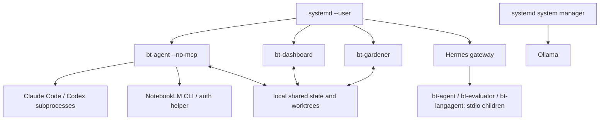

# 7. Deployment View

The reference deployment is a supervised, single-host installation.
Configuration observations below were checked on **2026-09-16**; source
defaults are separately identified. Hardware capacity and a VPN address do
not establish isolation, availability or a service-level commitment.

## 7.1 Infrastructure Level 1

| Element | Role / observed properties | Limitation |
|---|---|---|
| Jetson Linux ARM64 host | Platform binaries, local state and model inference; kernel `5.10.120-tegra` observed | One host/storage/power failure can interrupt the installation. |
| SSD mounted at `/mnt/ssd` | Source checkout, worktrees and operator-managed runtime storage | Backups and restore testing are separate from atomic file writes. |
| systemd user manager | Supervises `bt-agent`, `bt-dashboard`, `bt-gardener` and the external Hermes integration | Restarting a process does not resume every in-memory operation. |
| Ollama | Local model service, observed on `127.0.0.1:11434` | Model memory, availability and latency depend on installed models. |
| External providers / Git hosting | HTTPS/SSH according to provider/remote configuration | Credentials, account entitlements, quotas and network connectivity are required. |

### Process and software mapping

| Binary / process | Placement and lifecycle | Interface |
|---|---|---|
| `bin/bt-agent --no-mcp` | `bt-agent.service`; scheduler/A2A daemon | HTTP :8686, shared state and subprocess workflows |
| `bin/bt-dashboard -addr :9800` | `bt-dashboard.service` | Dashboard HTTP APIs and embedded assets |
| `bin/bt-gardener` | `bt-gardener.service` | Evolution cycles, tree/evidence stores |
| `bt-agent`, `bt-evaluator`, `bt-langagent` in MCP mode | Spawned/kept attached by the MCP host | JSON-RPC over stdio |
| Remaining [entrypoints](05-building-blocks.md#entrypoints) | Operator shell, tests, hooks or CI | Short-lived commands |
| Hermes gateway / webhook bridge | External integration, independently supervised | MCP host and configured event delivery |
| Ollama | System service | Local HTTP inference |

MCP mode needs live stdin/stdout; this restriction does not apply to
`bt-agent --no-mcp`. Updating a binary on disk does not replace an existing
MCP child: the host must respawn it. Gateway reload/restart behavior belongs
to that integration's runbook, not the MCP transport contract.

## 7.2 Infrastructure Level 2

### 7.2.1 Process topology

### 7.2.2 Storage and configuration

| Location | Ownership / content | Recovery significance |
|---|---|---|
| `/home/nico/go-bt-evolve` → `/mnt/ssd/go-bt-evolve` | **Non-bare checked-out repository** on the reviewed host; `bin/` holds deployed services | Keep tracked files at committed HEAD. Bare-repository compatibility in code is not the current topology. |
| `/mnt/ssd/worktrees` on this host | Superpowers implementation worktrees via `BT_WORKTREE_BASE`; source default is `/tmp/worktrees` | Keep failed-run evidence until diagnosed; protect active worktrees from cleanup. |
| `docs/superpowers/runs/<id>/` | Run metadata, task output, verification and finish artifacts | Diagnose the actual failing phase here when summaries are truncated. |
| `~/.go-bt-evolve/agents/`, `jobs/scheduler-jobs.json` | Agent definitions and scheduling state | Restore together with compatible tree/program state. |
| `history/*.jsonl`, `audit/`, `logs/` | Run history, audit and diagnostics | Append logs are not multi-file transactional snapshots. |
| `blackboard/`, `memory/`, `research/` | Scoped context, knowledge, programs, quota/cache state | Program claims, attempts and carryovers influence the next run. |
| `circuit_breakers.json`, `dead_letter_queue.json` | Failure admission and retry/replay state | Do not erase these to make a dashboard appear healthy; repair the cause. |
| `claude_backoff.json`, `codex_backoff.json` | Independent provider cooldowns | Restore/preserve meaningful deadlines; one provider does not own the other's quota. |
| `users/<user>/` | Persona profiles, interactions, goals, trees, reflections, experience and automation records | User IDs scope data; preserve approval/quarantine state with trees. |
| `~/.go-bt-reflections/` | Shared reflections/tree store used by run-dependency wiring | This is distinct from per-user trees and the gardener metrics directory. |
| `~/.go-bt-gardener/` | Cycle metrics, snapshots and configured evolution state | Verify snapshot restore against the matching tree registry. |
| `~/.go-bt-evolve/*_archive-*.json`, `experience/`, `feedback.json` | Learning/fitness/archive state | Losing these resets learning evidence even if source code is intact. |
| `/mnt/ssd/clawd/wiki/bt-research/` | Research vault, syntheses and plans | Separate from Git source and run-state stores. |
| Operator environment files outside Git | Platform and provider settings/credentials, loaded by systemd | Back up with restricted permissions; never publish values in docs or logs. |
| Dashboard session store | **Memory only** in one dashboard process | Restart invalidates sessions; sign in again. |

State path helpers can be configured/overridden; consult
[`agent/paths.go`](../../internal/agent/paths.go) and owning stores before
assuming every path follows one environment variable.

### 7.2.3 Network and effective configuration

| Surface | Source default | Observed host setting / implication (2026-09-16) |
|---|---|---|
| Dashboard bind | Loopback through `security.ListenerAddress` | `BT_DASHBOARD_BIND=0.0.0.0`; listening on :9800 beyond loopback |
| A2A bind | Loopback; non-loopback requires a configured platform key | `BT_A2A_BIND=0.0.0.0`; listening on :8686 beyond loopback |
| Hermes bridge | External integration configuration | Listener on `0.0.0.0:8644` observed; its access controls require independent verification |
| Ollama | Provider URL configured by deployment | `127.0.0.1:11434` observed |
| Coding provider | `claude` when unset | `BT_SUPERPOWERS_PROVIDER=codex` in all three services |
| Codex model | Source default pins `gpt-5.3-codex-spark` | `BT_SUPERPOWERS_CODEX_MODEL=auto`; use the CLI/account configuration, whose availability was probed |
| Rate-limit failover | Disabled unless explicitly enabled | `BT_SUPERPOWERS_RATE_LIMIT_FAILOVER=true` |
| Automatic rebuild / restart | Opt-in | Both `BT_AUTO_REBUILD_ON_DRIFT=0` and `BT_AUTO_RESTART_ON_DRIFT=0` on all three services |

**Exposure remains an operational verification item.** Binding all interfaces
does not prove public reachability, and the presence of Tailscale does not
prove VPN-only access. Firewall, reverse-proxy/TLS and network policy were
not established by this documentation review (R25). Direct dashboard TLS uses
`BT_TLS_CERT` and `BT_TLS_KEY`; cookie `Secure` follows that resolved
configuration. A reverse proxy must be assessed separately.

systemd `EnvironmentFile` values can override `Environment=` declarations.
Changing an environment file does not hot-reload an already-running process.
[Delegation settings](../coding-delegation.md) and the effective process
configuration must be checked after restart without printing secrets.

## 7.3 Release, Recovery and Operational Checks

**Release acceptance:**

1. Keep development in a separate worktree. Verify the intended source
   revision, a clean deployed checkout and safe remote ancestry before
   scheduled implementation.
2. Run checks appropriate to the change ([§10](10-quality.md)); build from
   committed source with the module's toolchain requirements. The installed
   pre-commit hook should match the tracked hook and clear inherited
   `GIT_*` variables before subprocess tests.
3. Build out of place, preserve the previous binary, then atomically replace
   the target matching the unit's `ExecStart`. The automatic implementation
   is [`agent/rebuild.go`](../../internal/agent/rebuild.go).
4. Coordinate with in-flight work, restart the owning units and respawn
   affected MCP children. All three daemon mains now supply in-flight
   guards to drift adoption; the earlier missing-guard limitation was
   closed by ADR-228.
5. Confirm service activity, actual executable revision, a meaningful
   authenticated smoke test and the next relevant workflow outcome.

**Evidence levels:** `/api/health` proves HTTP process liveness, not model
readiness or successful GOAP implementation. Use `bt_build_info`/startup
build identity and executable metadata for revision checks. The health
payload now derives its Go-version string from the running runtime (D7);
older binaries retain the historical hardcoded value. Read full phase output
for provider errors. A closed breaker can coexist with `degraded` runs.

**Rollback:** retain the known-good executable and corresponding configuration,
replace out of place, restart its owner, and repeat the smoke checks.
Automatic drift adoption includes smoke/rollback logic when enabled; that
is not evidence that a manual deployment or every sibling process has
already adopted the same revision.

**State recovery requirement (open operational acceptance, R26):** the owner
must define backup retention and RPO/RTO, take a consistent backup of the
source/state/vault/secret sets, restore into a separate location, and prove
agent registration, tree resolution, approval state, pending work and
snapshot recovery before production use. Atomic writes provide single-file
integrity; they are not backups or cross-store transactions. This review
does not claim that a restore drill has passed.

---

*Generated by bt-agent arc42 pipeline — section7Deployment tree*
