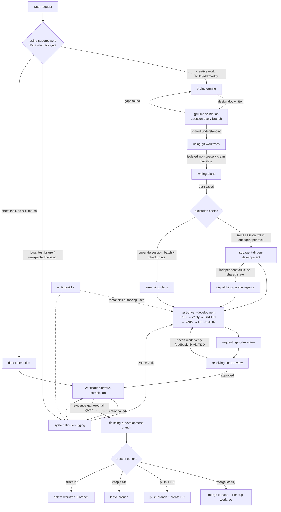
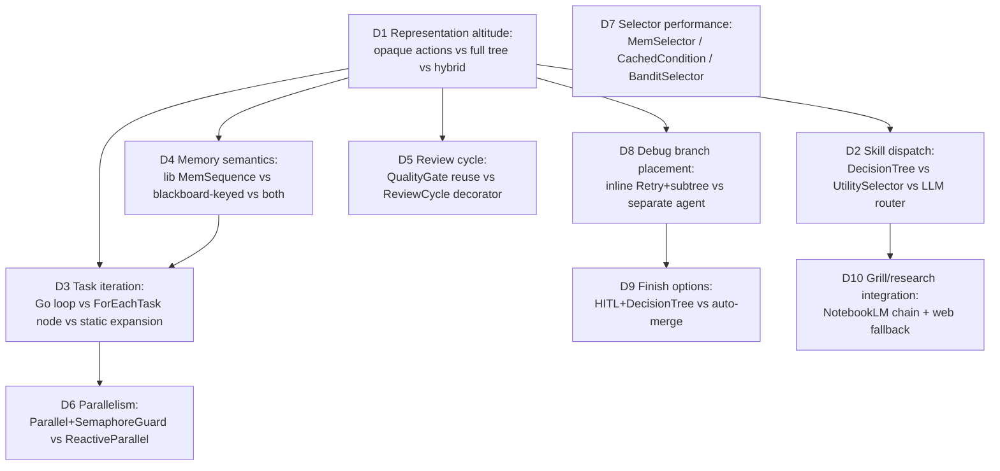

# Superpowers Workflow BT — Node/Selector Extension Implementation Plan

> **For agentic workers:** REQUIRED SUB-SKILL: Use superpowers:subagent-driven-development (recommended) or superpowers:executing-plans to implement this plan task-by-task. Steps use checkbox (`- [ ]`) syntax for tracking.

**Goal:** Make the complete obra/superpowers workflow tree-visible in the BT platform — skill dispatch, TDD inner loop, review cycles, debugging branch, finish options — and add the memory/caching/concurrency node types needed to run it efficiently.

**Architecture:** Keep Claude invocations as leaf actions (one Claude call = one leaf), but lift all control flow (phase routing, per-task iteration, RED→GREEN→review, failure→debug, finish choice) out of opaque Go loops into first-class tree nodes. Add memory composites so re-ticks while `HumanApprovalGate` is `RUNNING` don't re-execute completed phases, and persistence-backed cursors so runs resume across process restarts (ADR-003).

**Tech Stack:** Go 1.26 (`/usr/local/go/bin/go` — NOT on non-interactive PATH), `github.com/rvitorper/go-bt v0.1.0`, existing `internal/engine` node factory (`buildNode` in `internal/engine/tree.go:127`), `internal/domains` tree definitions, JSON persistence under `~/.go-bt-evolve/` (ADR-003, atomic tmp+rename).

## Global Constraints

- Go binary: prefix every go command with `PATH=/usr/local/go/bin:$PATH` (pre-commit hook needs it too).
- All new node types must be added to the `buildNode` switch in `internal/engine/tree.go` and produce a failing action (not a panic) on malformed config — matching the existing `default:` behavior at `tree.go:233`.
- Blackboard `ChainState` is `map[string]any` and round-trips through JSON persistence — **numbers come back as `float64`**. Every cursor read must accept both `int` and `float64` (helper `chainStateInt`, Task 1).
- Persistence writes use atomic tmp+rename (ADR-003). No new persistence formats.
- Existing tree `domain:superpowers_pipeline` must keep working unchanged; the new workflow ships as a separate tree `domain:superpowers_workflow` (agents opt in by YAML edit).
- Known flake: `TestCMAESOptimizer_Convergence` (stochastic, unseeded) — a full-package test run failing only on that test is not a regression.
- Commit convention: `feat(engine): ...` / `test(engine): ...`, frequent commits, one task per commit.

---

# Part A — Complete Superpowers Workflow Graph

Derived from the actual skill files at `~/.claude/plugins/cache/claude-plugins-official/superpowers/6.1.0/skills/` (cross-references extracted 2026-07-02). Nodes are skills; solid edges are mandatory transitions; dashed edges are conditional or meta interactions.



Interaction contracts (from skill text):

| Edge | Contract |
|---|---|
| using-superpowers → brainstorming | MUST fire before any creative work or plan mode; clarifying questions come *after* skill invocation |
| brainstorming → writing-plans | Design doc committed before planning; worktree created first via using-git-worktrees |
| writing-plans → SDD/EP | Plan header names the required sub-skill; plan is bite-sized tasks with full code |
| SDD per task | fresh implementer subagent → spec review → code review (two-stage) before next task |
| receiving-code-review | verify feedback technically before implementing; push back with evidence when reviewer is wrong |
| TDD Iron Law | no implementation code before a failing test; watch it fail, watch it pass |
| verification-before-completion Iron Law | run the verification command and read output before any success claim |
| systematic-debugging | 4 phases: root-cause investigation → pattern analysis → hypothesis+test → implementation (via TDD) |
| finishing-a-development-branch | verify tests first, then present exactly the 4 options; cleanup only on merge/discard |

# Part B — The Same Graph as a Behavior Tree

Target tree `domain:superpowers_workflow` (new file `internal/domains/superpowers_workflow.go`, Task 10). Node types marked **NEW** are added by this plan.

```
PersistentMemSequence "SuperpowersWorkflow_Main"          ← NEW (Task 3): resume-safe root
├── Action InitSuperpowersRun
├── Action LoadSuperpowersSkills
├── Action ClassifyTaskKind                               ← NEW action (Task 8): sets ChainState["task_kind"]
├── DecisionTree "SkillRouter" (key=task_kind)            ← existing DecisionTree node
│   ├── [match=creative] MemSequence "BrainstormBranch"   ← MemSequence exposed (Task 1)
│   │   ├── Action GenerateDesignArtifact
│   │   ├── Action ValidateDesignArtifact
│   │   ├── Action GrillDesignArtifact                    ← NEW action (Task 9): NotebookLM Q&A w/ web fallback
│   │   └── HumanApprovalGate "ApproveDesign"
│   ├── [match=bug] SubTreeRef → "SystematicDebugging" (see below)
│   └── [default]  AlwaysSucceed                          (direct path: no design phase)
├── MemSequence "WorkspacePhase"
│   ├── Action PrepareSuperpowersWorktree
│   └── Action VerifySuperpowersBaseline
├── MemSequence "PlanPhase"
│   ├── Action GenerateImplementationPlan
│   └── Action ValidateImplementationPlanStrict
├── HumanApprovalGate "ApproveSuperpowersPlan" (side_effect_class=local_reversible)
│   └── Selector "ExecutionRouter"
│       ├── Sequence "ParallelPath"
│       │   ├── Condition PlanHasIndependentTasks         ← NEW condition (Task 6)
│       │   └── Parallel "DispatchParallelAgents"
│       │       └── SemaphoreGuard (sem=claude, permits=2) ← NEW (Task 5)
│       │           └── ForEachTask "TaskLoop" …          (same template as below)
│       └── ForEachTask "TaskLoop"                        ← NEW (Task 6): index-based, cursor-persistent
│           └── ReviewCycle (max_iterations=3)            ← NEW (Task 7): two-stage review loop
│               └── MemSequence "TDDTask"
│                   ├── Action SuperpowersTaskRed         ← NEW actions (Task 6): phase-split of ExecuteTask
│                   ├── Action SuperpowersTaskVerifyRed
│                   ├── Action SuperpowersTaskGreen
│                   ├── Action SuperpowersTaskVerifyGreen
│                   └── Action SuperpowersTaskCommit
├── Selector "VerifyOrDebug"
│   ├── Sequence ── Action VerifySuperpowersRun ── Condition WasSuccessful
│   └── Retry (max_retries=2)
│       └── MemSequence "SystematicDebugging"             (maps the 4 debugging phases)
│           ├── Action DebugRootCauseInvestigation        ← NEW actions (Task 11)
│           ├── Action DebugPatternAnalysis
│           ├── Action DebugHypothesisTest
│           ├── SubTreeRef → "TDDTask" (fix via TDD)
│           └── Action RerunVerification                  (existing, actions_superpowers.go)
├── Action WriteSuperpowersFinishReport
├── HumanApprovalGate "ChooseFinishOption" (hitl_prompt lists merge/PR/keep/discard)
│   └── DecisionTree "FinishRouter" (key=finish_choice)
│       ├── [match=merge]   Action ApplySuperpowersRunToMainRepo
│       ├── [match=pr]      Action PushBranchAndCreatePR  ← NEW action (Task 11)
│       ├── [match=keep]    AlwaysSucceed
│       └── [default=discard] Action DiscardSuperpowersWorktree ← NEW action (Task 11)
└── Action ReportPipelineComplete
```

Skill → BT construct mapping:

| Superpowers skill | BT construct | Status |
|---|---|---|
| using-superpowers (1% rule) | `ClassifyTaskKind` + `DecisionTree "SkillRouter"` | NEW action; node exists |
| brainstorming | `MemSequence "BrainstormBranch"` + design HITL | actions exist; grill NEW |
| grill-me (user skill) | `GrillDesignArtifact` action | NEW |
| using-git-worktrees | `WorkspacePhase` | exists (`superpowers_worktree.go`) |
| writing-plans | `PlanPhase` | exists (`superpowers_plan_parser.go`) |
| subagent-driven-development | `ForEachTask` + `ReviewCycle` | NEW nodes |
| dispatching-parallel-agents | `Parallel` + `SemaphoreGuard` + `PlanHasIndependentTasks` | Parallel exists; guard NEW |
| test-driven-development | `MemSequence "TDDTask"` with phase-split actions | NEW actions (prompts exist: `buildSuperpowersRedPrompt`, `superpowers_task_executor.go:226`) |
| requesting/receiving-code-review | `ReviewCycle` decorator | NEW |
| verification-before-completion | `VerifySuperpowersRun` + `CheckpointVerifier` postconditions | exists |
| systematic-debugging | `MemSequence "SystematicDebugging"` under `Retry` | NEW actions |
| finishing-a-development-branch | finish HITL + `DecisionTree "FinishRouter"` | partial (`superpowers_apply.go` = merge path only) |

# Part C — Design Decision Tree

Each decision is a branch; arrows are dependencies (a child decision is only meaningful after its parent is resolved). Resolutions in Part D.



Resolved decisions (walked in dependency order — D1 first, leaves last):

| # | Decision | Resolution | Depends on |
|---|---|---|---|
| D1 | Altitude | **Hybrid**: control flow in tree, one Claude call per leaf. Full tree-per-prompt-token would explode node count; opaque actions (status quo) hide TDD/review from observability, evolution engine, and Grafana (`monitoring/grafana/dashboards/bt-agent-runs.json`). | — |
| D2 | Skill dispatch | **DecisionTree** keyed on `task_kind` set by a heuristic-first classifier action (LLM fallback via existing `ExecLLMCall`). UtilitySelector is for scoring alternatives with continuous tradeoffs; skill dispatch is categorical. | D1 |
| D3 | Task iteration | **ForEachTask composite** with a persisted cursor. Static expansion breaks on plans regenerated mid-run; the Go loop (`superpowers_task_executor.go:98-110`) stays as the engine behind per-phase actions but no longer owns iteration. | D1, D4 |
| D4 | Memory | **Both**: expose library `MemSequence` (in-process, cheap) for intra-run phases; add `PersistentMemSequence` (blackboard-keyed cursor) at the root for HITL/restart resume. Library `MemSequenceState` is keyed by node pointer (`go-bt/composite/mem_sequence.go:14`) — not serializable, so it cannot survive restarts. | D1 |
| D5 | Review | **New ReviewCycle decorator**. QualityGate gates on metrics; review needs verdict parsing + feedback loop + bounded iterations + push-back path (receiving-code-review). | D1 |
| D6 | Parallelism | **Parallel + SemaphoreGuard(permits=2)**. ReactiveParallel is for abort-on-event monitoring, not throughput. Semaphore bounds concurrent Claude processes (Jetson: memory-bound). | D3 |
| D7 | Selector perf | **MemSelector + CachedCondition now; BanditSelector flag-gated.** UCB1 needs per-branch history that only accumulates after the workflow runs; ship the stats recorder with the selector but default `bandit.enabled=false`. | — |
| D8 | Debug branch | **Inline** `Retry(MemSequence)` fed by `VerificationFailed` condition (exists, `conditions_superpowers.go`). A separate debug agent would lose worktree + run context. | D1 |
| D9 | Finish | **HITL gate + DecisionTree on `finish_choice`**, defaulting to `discard`-safe behavior (never auto-merge). Matches finishing-a-development-branch's "present options" contract; merge path reuses `applySuperpowersRunToMainRepo` (`superpowers_apply.go:11`). | D8 |
| D10 | Grill/research | **GrillDesignArtifact action**: generate questions from design.md (Claude), answer via NotebookLM chain (`actions_notebooklm.go` — `CheckNotebookLMAuthAndRefresh` first), fall back to web research chain when auth is down (observed 2026-07-02: NotebookLM session expired, login requires interactive browser). Unresolved critical questions fail the node → design loops back. | D2 |

# Part D — Grill-Me Record (gap analysis, branch by branch)

Method note: per the grill-me skill, questions answerable from the codebase were answered by exploring it. NotebookLM chat was requested as the answer engine but its Google session is expired and `notebooklm login` requires an interactive browser + ENTER on a machine with a display (this Jetson has none, no Xvfb). Answers below cite code evidence and web research (ReAcTree/BT literature) instead; re-validation via the "BT Platform Research" notebook (463ca402, 334 sources) is queued as a follow-up once re-authenticated.

**D1 — "Why isn't the current flat Sequence good enough?"**
`HumanApprovalGate` returns `0` (RUNNING) while pending (`hitl_gate.go:205-206`). Its parent `Sequence` re-runs *all* prior children on every tick (`go-bt/composite/sequence.go:14-24` — no memory). Today that re-executes Init→Validate on each tick during approval waits; actions are written idempotent-ish but each re-tick costs file I/O, validation, and risks re-invoking Claude in `GenerateDesignArtifact` if artifact-reuse detection ever misses. MemSequence removes the class of bug instead of relying on every action being defensively idempotent.

**D1 — "Does making TDD phases tree-visible actually buy anything?"**
Yes, three consumers: (1) Grafana per-node metrics (`metrics_hooks.go`) get RED/GREEN/review timings instead of one opaque `ExecuteSuperpowersTaskBatch` span; (2) the evolution engine (ADR-005) can only mutate what's in the tree; (3) HITL/abort (`AbortOnEvent`) can interrupt between phases instead of only between whole batches.

**D2 — "Heuristic classifier will misroute; why not LLM-first?"**
Misroute cost is low (creative path adds a design doc to a bug fix; debug path adds investigation before a feature — both recover), LLM cost is per-run. Heuristic keyword pass first (`fix|bug|error|fail|regression` → bug; `build|add|implement|create|feature` → creative), LLM tiebreak only when no keyword hits. Cached in `ChainState["task_kind"]` so re-ticks never re-classify (MemSequence also protects it).

**D3 — "What happens when a mid-loop task fails — fail-fast or continue?"**
Fail-fast, cursor stays on the failing task (matches subagent-driven-development: don't proceed past a failing task). The persisted cursor means a later re-run resumes at the failed task, not task 0. Explicit test: Task 6 step 5.

**D3 — "ChainState survives JSON persistence — do cursors?"**
Only if reads tolerate `float64`: `map[string]any` round-trips `3` as `3.0`. Global constraint + `chainStateInt` helper (Task 1) enforce this everywhere. This was the highest-risk silent bug found in the grill pass.

**D4 — "Why not persist the library's MemSequenceState?"**
It's `map[*MemSequence]int` keyed by node pointer (`mem_sequence.go:14`); pointers change every rebuild. Blackboard-keyed cursors (`memseq/<node-name>`) are stable across rebuilds — which is also why every `PersistentMemSequence`/`MemSelector`/`ForEachTask` node **must have a unique non-empty Name**; the validator addition in Task 3 step 6 enforces it.

**D5 — "How does ReviewCycle avoid infinite loops and rubber-stamping?"**
Bounded by `max_iterations` (default 3, then FAIL — surfacing to VerifyOrDebug). Reviewer runs as a *separate* Claude call with a reviewer-only prompt (no access to implementer conversation), matching subagent-driven-development's two-stage review. Verdict protocol: reviewer output must contain `VERDICT: approved` or `VERDICT: needs_work` + feedback; unparseable verdict counts as `needs_work` (safe default).

**D6 — "Parallel Claude workers on one worktree = write conflicts?"**
Yes — that's why `PlanHasIndependentTasks` requires *disjoint file sets* declared in plan tasks (parser already captures per-task files) AND the parallel path dispatches each task in its own worktree clone, mirroring dispatching-parallel-agents' isolation rule. `SemaphoreGuard(permits=2)` caps memory (two Claude processes ≈ Jetson limit). Sequential path remains the default whenever file sets intersect.

**D7 — "MemSelector changes Selector semantics — reactive fallback is lost?"**
Correct and intentional; that's the documented memory/reactivity tradeoff (Colledanchise & Ögren; non-reactive = memory-only trees). MemSelector is opt-in per node for expensive-branch selectors (LLM-call branches); reactive `Selector` stays default. Same rationale as BehaviorTree.CPP shipping both `Fallback` and reactive variants.

**D7 — "CachedCondition staleness?"**
TTL in metadata (`ttl_ms`, default 30000), cache key includes node name, cache stored in ChainState so a run reset clears it. Conditions guarding HITL or safety (RuleGate, budget) must NOT be wrapped — documented in node godoc; validator warns if a `CachedCondition` wraps a condition whose name starts with `Is*Approved`/`HITL`.

**D7 — "BanditSelector cold start / flake sensitivity?"**
UCB1 explores each arm once before exploiting; with `bandit.enabled=false` default it only records stats. Flaky-success noise is damped by window (last 50 outcomes). Ship recorder + selector, enable after data accumulates.

**D8 — "Retry(2) around debugging — what if root cause is environmental?"**
`DebugRootCauseInvestigation` writes evidence to the run artifact dir; after Retry exhaustion the tree FAILS and finish report includes the debug evidence — matching systematic-debugging's "when process reveals no root cause" escape hatch (question the architecture, don't loop forever).

**D9 — "Auto-apply on merge choice contradicts 'no scheduled automatic apply'?"**
No: merge only executes *inside* `ChooseFinishOption` HITL approval, and `applySuperpowersRunToMainRepo` already re-verifies on main repo before commit (`superpowers_apply.go:97`). The prod-runner contract ("No scheduled automatic apply") is preserved because the gate never auto-approves.

**D10 — "NotebookLM is down right now — is the grill node useful?"**
The action's fallback chain is the point: `CheckNotebookLMAuthAndRefresh` → NotebookLM ask (batched, ≤5 questions/call per rate-limit budget) → on auth/rate failure, web-research chain (`actions_research.go`) → on total failure, questions are appended to design.md as OPEN and the node returns FAILURE only if any question is tagged `critical`. Degradation is graded, never silent.

---

# Part E — Implementation Tasks

### Task 1: `chainStateInt` helper + expose `MemSequence` node type

**Files:**
- Create: `internal/engine/chain_state_util.go`
- Create: `internal/engine/chain_state_util_test.go`
- Modify: `internal/engine/tree.go:163` (insert case after `Selector`)
- Test: `internal/engine/mem_nodes_test.go` (create)

**Interfaces:**
- Produces: `chainStateInt(bb *Blackboard, key string) (int, bool)` — reads int-or-float64 from ChainState; `"MemSequence"` node type usable in any tree JSON/domain tree.
- Consumes: `Blackboard.ChainState` (`tree.go:71`), `btcomp.NewMemSequence` (go-bt v0.1.0).

- [ ] **Step 1: Write the failing tests**

```go
// internal/engine/chain_state_util_test.go
package engine

import "testing"

func TestChainStateInt_ReadsIntAndFloat64(t *testing.T) {
	bb := newTestBlackboard()
	bb.ChainState["a"] = 3
	bb.ChainState["b"] = float64(7) // JSON round-trip shape
	if v, ok := chainStateInt(bb, "a"); !ok || v != 3 {
		t.Fatalf("int read: got %v %v", v, ok)
	}
	if v, ok := chainStateInt(bb, "b"); !ok || v != 7 {
		t.Fatalf("float64 read: got %v %v", v, ok)
	}
	if _, ok := chainStateInt(bb, "missing"); ok {
		t.Fatal("missing key must return ok=false")
	}
}
```

```go
// internal/engine/mem_nodes_test.go
package engine

import (
	"context"
	"testing"

	"github.com/nico/go-bt-evolve/internal/evolution"
	btcore "github.com/rvitorper/go-bt/core"
)

// Shared test helpers for all new-node tests (Tasks 1-8).
// btcore.NewBTContext initializes MemSequenceState (go-bt core, line 37).
func newTestBlackboard() *Blackboard {
	return &Blackboard{ChainState: map[string]any{}}
}

func newTestBTContext(bb *Blackboard) *btcore.BTContext[Blackboard] {
	return btcore.NewBTContext(context.Background(), bb)
}

// countingAction returns RUNNING the first `runningTicks` calls, then SUCCESS,
// and counts invocations — used to prove MemSequence skips completed children.
func registerCountingAction(t *testing.T, name string, runningTicks int, calls *int) {
	t.Helper()
	ticks := 0
	RegisterAction(name, func(_ *btcore.BTContext[Blackboard]) int {
		*calls++
		ticks++
		if ticks <= runningTicks {
			return 0
		}
		return 1
	})
}

func TestMemSequence_DoesNotRetickCompletedChildren(t *testing.T) {
	var aCalls, bCalls int
	registerCountingAction(t, "TestMemSeqA", 0, &aCalls) // succeeds immediately
	registerCountingAction(t, "TestMemSeqB", 2, &bCalls) // RUNNING twice, then SUCCESS

	node := &evolution.SerializableNode{
		Type: "MemSequence", Name: "MemSeqUnderTest",
		Children: []evolution.SerializableNode{
			{Type: "Action", Name: "TestMemSeqA"},
			{Type: "Action", Name: "TestMemSeqB"},
		},
	}
	bb := newTestBlackboard()
	cmd := buildNode(node, bb, "")
	ctx := newTestBTContext(bb)

	if got := cmd.Run(ctx); got != 0 {
		t.Fatalf("tick1: want RUNNING, got %d", got)
	}
	if got := cmd.Run(ctx); got != 0 {
		t.Fatalf("tick2: want RUNNING, got %d", got)
	}
	if got := cmd.Run(ctx); got != 1 {
		t.Fatalf("tick3: want SUCCESS, got %d", got)
	}
	if aCalls != 1 {
		t.Fatalf("child A re-ticked: %d calls, want 1", aCalls)
	}
}
```

- [ ] **Step 2: Run tests to verify they fail**

Run: `PATH=/usr/local/go/bin:$PATH go test ./internal/engine/ -run 'TestChainStateInt|TestMemSequence' -v`
Expected: FAIL — `undefined: chainStateInt`, and `unsupported node type "MemSequence"` (the default case returns -1). The `newTestBlackboard`/`newTestBTContext` helpers are defined once at the top of `mem_nodes_test.go` (step 1); every later task's tests reuse them — do not define them a second time.

- [ ] **Step 3: Implement**

```go
// internal/engine/chain_state_util.go
package engine

// chainStateInt reads an integer cursor from ChainState, tolerating the
// float64 shape produced by JSON persistence round-trips (ADR-003/ADR-009).
func chainStateInt(bb *Blackboard, key string) (int, bool) {
	switch v := bb.ChainState[key].(type) {
	case int:
		return v, true
	case int64:
		return int(v), true
	case float64:
		return int(v), true
	default:
		return 0, false
	}
}
```

In `internal/engine/tree.go`, after the `case "Selector":` block (line 163), insert:

```go
	case "MemSequence":
		children := make([]btcore.Command[Blackboard], len(node.Children))
		for i := range node.Children {
			children[i] = buildNode(&node.Children[i], bb, node.Name)
		}
		return btcomp.NewMemSequence(children...)
```

- [ ] **Step 4: Run tests to verify they pass**

Run: `PATH=/usr/local/go/bin:$PATH go test ./internal/engine/ -run 'TestChainStateInt|TestMemSequence' -v`
Expected: PASS (both). `btcore.NewBTContext` initializes `MemSequenceState` (go-bt core line 37), which the library composite requires to be non-nil.

- [ ] **Step 5: Commit**

```bash
git add internal/engine/chain_state_util.go internal/engine/chain_state_util_test.go internal/engine/mem_nodes_test.go internal/engine/tree.go
git commit -m "feat(engine): expose MemSequence node type + float64-safe ChainState cursor helper"
```

### Task 2: `MemSelector` composite (blackboard-keyed)

**Files:**
- Create: `internal/engine/mem_selector.go`
- Modify: `internal/engine/tree.go` (case after `MemSequence`)
- Test: append to `internal/engine/mem_nodes_test.go`

**Interfaces:**
- Consumes: `chainStateInt` (Task 1), `buildNode`.
- Produces: node type `"MemSelector"`; cursor key `"memsel/" + node.Name`.

- [ ] **Step 1: Write the failing test**

```go
func TestMemSelector_ResumesAtRunningChildAndSkipsFailed(t *testing.T) {
	var failCalls, runCalls int
	RegisterAction("TestMemSelFail", func(_ *btcore.BTContext[Blackboard]) int {
		failCalls++
		return -1
	})
	ticks := 0
	RegisterAction("TestMemSelRun", func(_ *btcore.BTContext[Blackboard]) int {
		runCalls++
		ticks++
		if ticks < 2 {
			return 0
		}
		return 1
	})
	node := &evolution.SerializableNode{
		Type: "MemSelector", Name: "MemSelUnderTest",
		Children: []evolution.SerializableNode{
			{Type: "Action", Name: "TestMemSelFail"},
			{Type: "Action", Name: "TestMemSelRun"},
		},
	}
	bb := newTestBlackboard()
	cmd := buildNode(node, bb, "")
	ctx := newTestBTContext(bb)

	if got := cmd.Run(ctx); got != 0 {
		t.Fatalf("tick1: want RUNNING, got %d", got)
	}
	if got := cmd.Run(ctx); got != 1 {
		t.Fatalf("tick2: want SUCCESS, got %d", got)
	}
	if failCalls != 1 {
		t.Fatalf("failed child re-ticked while RUNNING: %d calls, want 1", failCalls)
	}
	if _, ok := bb.ChainState["memsel/MemSelUnderTest"]; ok {
		t.Fatal("cursor must be cleared on completion")
	}
}
```

- [ ] **Step 2: Run test to verify it fails**

Run: `PATH=/usr/local/go/bin:$PATH go test ./internal/engine/ -run TestMemSelector -v`
Expected: FAIL — `unsupported node type "MemSelector"` causes tick1 to return -1.

- [ ] **Step 3: Implement**

```go
// internal/engine/mem_selector.go
package engine

import (
	"github.com/nico/go-bt-evolve/internal/evolution"
	btcore "github.com/rvitorper/go-bt/core"
	btleaf "github.com/rvitorper/go-bt/leaf"
)

// BuildMemSelector is a Selector with memory: while a child is RUNNING (or
// earlier children have FAILED this pass), re-ticks resume at the remembered
// index instead of re-running failed children. Cursor lives in ChainState
// ("memsel/<name>") so it survives blackboard persistence. Reactivity is
// intentionally traded away — use plain Selector for guard-style fallbacks.
func BuildMemSelector(node *evolution.SerializableNode, bb *Blackboard) btcore.Command[Blackboard] {
	children := make([]btcore.Command[Blackboard], len(node.Children))
	for i := range node.Children {
		children[i] = buildNode(&node.Children[i], bb, node.Name)
	}
	key := "memsel/" + node.Name
	return btleaf.NewAction(func(ctx *btcore.BTContext[Blackboard]) int {
		start, _ := chainStateInt(ctx.Blackboard, key)
		for i := start; i < len(children); i++ {
			switch code := children[i].Run(ctx); {
			case code == 0:
				ctx.Blackboard.ChainState[key] = i
				return 0
			case code > 0:
				delete(ctx.Blackboard.ChainState, key)
				return 1
			default:
				ctx.Blackboard.ChainState[key] = i + 1 // don't re-tick failed child this pass
			}
		}
		delete(ctx.Blackboard.ChainState, key)
		return -1
	})
}
```

`tree.go` case:

```go
	case "MemSelector":
		return BuildMemSelector(node, bb)
```

- [ ] **Step 4: Run test to verify it passes**

Run: `PATH=/usr/local/go/bin:$PATH go test ./internal/engine/ -run TestMemSelector -v`
Expected: PASS

- [ ] **Step 5: Commit**

```bash
git add internal/engine/mem_selector.go internal/engine/mem_nodes_test.go internal/engine/tree.go
git commit -m "feat(engine): MemSelector composite with persistent blackboard cursor"
```

### Task 3: `PersistentMemSequence` composite + unique-name validation

**Files:**
- Create: `internal/engine/persistent_mem_sequence.go`
- Modify: `internal/engine/tree.go` (new case)
- Modify: `internal/engine/validate.go` (unique-name check for memory nodes)
- Test: append to `internal/engine/mem_nodes_test.go`

**Interfaces:**
- Produces: node type `"PersistentMemSequence"`; cursor key `"memseq/" + node.Name`; validator error `memory node requires unique non-empty name`.
- Consumes: `chainStateInt` (Task 1).

- [ ] **Step 1: Write the failing tests**

```go
func TestPersistentMemSequence_ResumesFromPersistedCursor(t *testing.T) {
	var aCalls int
	registerCountingAction(t, "TestPMSA", 0, &aCalls)
	done := false
	RegisterAction("TestPMSB", func(_ *btcore.BTContext[Blackboard]) int {
		if done {
			return 1
		}
		return 0
	})
	node := &evolution.SerializableNode{
		Type: "PersistentMemSequence", Name: "PMSUnderTest",
		Children: []evolution.SerializableNode{
			{Type: "Action", Name: "TestPMSA"},
			{Type: "Action", Name: "TestPMSB"},
		},
	}
	bb := newTestBlackboard()
	cmd := buildNode(node, bb, "")
	ctx := newTestBTContext(bb)
	if got := cmd.Run(ctx); got != 0 {
		t.Fatalf("tick1: want RUNNING, got %d", got)
	}

	// Simulate process restart + JSON round-trip: rebuild tree on a blackboard
	// whose cursor came back as float64.
	bb2 := newTestBlackboard()
	bb2.ChainState["memseq/PMSUnderTest"] = float64(1)
	cmd2 := buildNode(node, bb2, "")
	ctx2 := newTestBTContext(bb2)
	done = true
	if got := cmd2.Run(ctx2); got != 1 {
		t.Fatalf("resumed tick: want SUCCESS, got %d", got)
	}
	if aCalls != 1 {
		t.Fatalf("child A must not re-run after restart resume: %d calls", aCalls)
	}
}

func TestValidate_MemoryNodesRequireUniqueNames(t *testing.T) {
	root := &evolution.SerializableNode{
		Type: "Sequence", Name: "root",
		Children: []evolution.SerializableNode{
			{Type: "PersistentMemSequence", Name: "", Children: []evolution.SerializableNode{{Type: "AlwaysSucceed"}}},
		},
	}
	msgs := ValidateTree(root) // signature: func ValidateTree(*evolution.SerializableNode) []string (validate.go:7)
	if len(msgs) == 0 {
		t.Fatal("expected validation message for unnamed PersistentMemSequence")
	}
}
```

- [ ] **Step 2: Run tests to verify they fail**

Run: `PATH=/usr/local/go/bin:$PATH go test ./internal/engine/ -run 'TestPersistentMemSequence|TestValidate_MemoryNodes' -v`
Expected: FAIL — unsupported node type; `ValidateTree` returns an empty slice. `ValidateTree` returns a flat `[]string` of messages (validate.go:7) — the additions in step 3 append to that slice.

- [ ] **Step 3: Implement**

```go
// internal/engine/persistent_mem_sequence.go
package engine

import (
	"github.com/nico/go-bt-evolve/internal/evolution"
	btcore "github.com/rvitorper/go-bt/core"
	btleaf "github.com/rvitorper/go-bt/leaf"
)

// BuildPersistentMemSequence is MemSequence with its cursor in ChainState
// ("memseq/<name>") instead of the library's pointer-keyed map, so a run
// resumed after process restart (HITL waits, crashes — ADR-003 persistence)
// continues at the first incomplete child instead of re-running everything.
func BuildPersistentMemSequence(node *evolution.SerializableNode, bb *Blackboard) btcore.Command[Blackboard] {
	children := make([]btcore.Command[Blackboard], len(node.Children))
	for i := range node.Children {
		children[i] = buildNode(&node.Children[i], bb, node.Name)
	}
	key := "memseq/" + node.Name
	return btleaf.NewAction(func(ctx *btcore.BTContext[Blackboard]) int {
		start, _ := chainStateInt(ctx.Blackboard, key)
		for i := start; i < len(children); i++ {
			switch code := children[i].Run(ctx); {
			case code == 0:
				ctx.Blackboard.ChainState[key] = i
				return 0
			case code < 0:
				delete(ctx.Blackboard.ChainState, key) // failure restarts the phase sequence next run
				return -1
			default:
				ctx.Blackboard.ChainState[key] = i + 1
			}
		}
		delete(ctx.Blackboard.ChainState, key)
		return 1
	})
}
```

`tree.go` case:

```go
	case "PersistentMemSequence":
		return BuildPersistentMemSequence(node, bb)
```

`validate.go` — inside the recursive node walk, add:

```go
	case "MemSelector", "PersistentMemSequence", "ForEachTask":
		if strings.TrimSpace(node.Name) == "" {
			msgs = append(msgs,
				fmt.Sprintf("%s: memory node requires unique non-empty name", node.Type))
		}
```

(where `msgs` is the `[]string` that `ValidateTree` accumulates and returns), and after the walk, a duplicate-name check over collected memory-node names (map[string]int count → message on >1).

- [ ] **Step 4: Run tests to verify they pass**

Run: `PATH=/usr/local/go/bin:$PATH go test ./internal/engine/ -run 'TestPersistentMemSequence|TestValidate_MemoryNodes' -v`
Expected: PASS

- [ ] **Step 5: Commit**

```bash
git add internal/engine/persistent_mem_sequence.go internal/engine/mem_nodes_test.go internal/engine/tree.go internal/engine/validate.go
git commit -m "feat(engine): PersistentMemSequence with restart-safe cursor + memory-node name validation"
```

### Task 4: `CachedCondition` decorator

**Files:**
- Create: `internal/engine/cached_condition.go`
- Create: `internal/engine/cached_condition_test.go`
- Modify: `internal/engine/tree.go` (new case)

**Interfaces:**
- Produces: node type `"CachedCondition"` — metadata `ttl_ms` (default 30000); wraps its single Condition child; cache entry `ChainState["condcache/"+name]` as `map[string]any{"value": bool, "expires_unix_ms": int64}`.
- Consumes: `buildNode`, `chainStateInt` pattern (float64 tolerance for `expires_unix_ms`).

- [ ] **Step 1: Write the failing test**

```go
// internal/engine/cached_condition_test.go
package engine

import (
	"testing"
	"time"

	"github.com/nico/go-bt-evolve/internal/evolution"
)

func TestCachedCondition_CachesWithinTTLAndExpires(t *testing.T) {
	calls := 0
	RegisterCondition("TestCachedCond", func(_ *Blackboard) bool {
		calls++
		return true
	})
	node := &evolution.SerializableNode{
		Type: "CachedCondition", Name: "CCUnderTest",
		Metadata: map[string]any{"ttl_ms": 50},
		Children: []evolution.SerializableNode{{Type: "Condition", Name: "TestCachedCond"}},
	}
	bb := newTestBlackboard()
	cmd := buildNode(node, bb, "")
	ctx := newTestBTContext(bb)

	cmd.Run(ctx)
	cmd.Run(ctx)
	if calls != 1 {
		t.Fatalf("second call within TTL must hit cache: %d calls", calls)
	}
	time.Sleep(60 * time.Millisecond)
	cmd.Run(ctx)
	if calls != 2 {
		t.Fatalf("call after TTL must re-evaluate: %d calls", calls)
	}
}

func TestCachedCondition_RefusesHITLConditions(t *testing.T) {
	node := &evolution.SerializableNode{
		Type: "CachedCondition", Name: "CCGuard",
		Children: []evolution.SerializableNode{{Type: "Condition", Name: "HITLAlreadyApproved"}},
	}
	msgs := ValidateTree(&evolution.SerializableNode{Type: "Sequence", Name: "r",
		Children: []evolution.SerializableNode{*node}})
	if len(msgs) == 0 {
		t.Fatal("caching an HITL/approval condition must produce a validation message")
	}
}
```

- [ ] **Step 2: Run test to verify it fails**

Run: `PATH=/usr/local/go/bin:$PATH go test ./internal/engine/ -run TestCachedCondition -v`
Expected: FAIL — unsupported node type; `ValidateTree` returns no message for the wrapped HITL condition yet.

- [ ] **Step 3: Implement**

```go
// internal/engine/cached_condition.go
package engine

import (
	"time"

	"github.com/nico/go-bt-evolve/internal/evolution"
	btcore "github.com/rvitorper/go-bt/core"
	btleaf "github.com/rvitorper/go-bt/leaf"
)

// BuildCachedCondition memoizes its child condition's result for ttl_ms
// (default 30000). NEVER wrap approval/HITL/safety conditions — the validator
// warns on names containing "HITL" or "Approved". Cache lives in ChainState
// so run resets clear it.
func BuildCachedCondition(node *evolution.SerializableNode, bb *Blackboard) btcore.Command[Blackboard] {
	if len(node.Children) != 1 {
		return btleaf.NewAction(func(ctx *btcore.BTContext[Blackboard]) int {
			ctx.Blackboard.Outcome = "CachedCondition requires exactly one child"
			return -1
		})
	}
	child := buildNode(&node.Children[0], bb, node.Name)
	ttl := 30000
	if v, ok := node.Metadata["ttl_ms"]; ok {
		switch n := v.(type) {
		case int:
			ttl = n
		case float64:
			ttl = int(n)
		}
	}
	key := "condcache/" + node.Name
	return btleaf.NewAction(func(ctx *btcore.BTContext[Blackboard]) int {
		now := time.Now().UnixMilli()
		if entry, ok := ctx.Blackboard.ChainState[key].(map[string]any); ok {
			exp := int64(0)
			switch e := entry["expires_unix_ms"].(type) {
			case int64:
				exp = e
			case float64:
				exp = int64(e)
			}
			if now < exp {
				if v, _ := entry["value"].(bool); v {
					return 1
				}
				return -1
			}
		}
		code := child.Run(ctx)
		if code == 0 {
			return 0 // never cache RUNNING
		}
		ctx.Blackboard.ChainState[key] = map[string]any{
			"value":           code > 0,
			"expires_unix_ms": now + int64(ttl),
		}
		return code
	})
}
```

`tree.go` case: `case "CachedCondition": return BuildCachedCondition(node, bb)`.
Validator (same walk as Task 3): warn when a `CachedCondition` child name contains `"HITL"` or `"Approved"`.

- [ ] **Step 4: Run test to verify it passes**

Run: `PATH=/usr/local/go/bin:$PATH go test ./internal/engine/ -run TestCachedCondition -v`
Expected: PASS

- [ ] **Step 5: Commit**

```bash
git add internal/engine/cached_condition.go internal/engine/cached_condition_test.go internal/engine/tree.go internal/engine/validate.go
git commit -m "feat(engine): CachedCondition decorator with TTL and HITL-wrap warning"
```

### Task 5: `SemaphoreGuard` decorator

**Files:**
- Create: `internal/engine/semaphore_guard.go`
- Create: `internal/engine/semaphore_guard_test.go`
- Modify: `internal/engine/tree.go` (new case)

**Interfaces:**
- Produces: node type `"SemaphoreGuard"` — metadata `semaphore` (name, required), `permits` (int, default 1). Non-blocking: returns RUNNING (0) when no permit is free, so parent Parallel keeps other branches progressing.
- Consumes: nothing new; process-global registry `map[string]chan struct{}` guarded by `sync.Mutex`.

- [ ] **Step 1: Write the failing test**

```go
// internal/engine/semaphore_guard_test.go
package engine

import (
	"testing"

	"github.com/nico/go-bt-evolve/internal/evolution"
	btcore "github.com/rvitorper/go-bt/core"
)

func TestSemaphoreGuard_LimitsConcurrentEntry(t *testing.T) {
	inside := 0
	maxInside := 0
	release := make(chan struct{})
	RegisterAction("TestSemBody", func(_ *btcore.BTContext[Blackboard]) int {
		inside++
		if inside > maxInside {
			maxInside = inside
		}
		<-release
		inside--
		return 1
	})
	mk := func(name string) btcore.Command[Blackboard] {
		bb := newTestBlackboard()
		return buildNode(&evolution.SerializableNode{
			Type: "SemaphoreGuard", Name: "SG_" + name,
			Metadata: map[string]any{"semaphore": "test-sem", "permits": 1},
			Children: []evolution.SerializableNode{{Type: "Action", Name: "TestSemBody"}},
		}, bb, "")
	}
	c1, c2 := mk("a"), mk("b")
	done1 := make(chan int)
	go func() { done1 <- c1.Run(newTestBTContext(newTestBlackboard())) }()
	// second guard must yield RUNNING immediately while first holds the permit
	got2 := c2.Run(newTestBTContext(newTestBlackboard()))
	if got2 != 0 {
		t.Fatalf("second entrant: want RUNNING(0), got %d", got2)
	}
	close(release)
	if got1 := <-done1; got1 != 1 {
		t.Fatalf("first entrant: want SUCCESS, got %d", got1)
	}
	if maxInside != 1 {
		t.Fatalf("permits=1 violated: max concurrent inside = %d", maxInside)
	}
}
```

- [ ] **Step 2: Run test to verify it fails**

Run: `PATH=/usr/local/go/bin:$PATH go test ./internal/engine/ -run TestSemaphoreGuard -v -timeout 30s`
Expected: FAIL — unsupported node type (second entrant returns -1, not 0).

- [ ] **Step 3: Implement**

```go
// internal/engine/semaphore_guard.go
package engine

import (
	"strings"
	"sync"

	"github.com/nico/go-bt-evolve/internal/evolution"
	btcore "github.com/rvitorper/go-bt/core"
	btleaf "github.com/rvitorper/go-bt/leaf"
)

var semaphores = struct {
	mu sync.Mutex
	m  map[string]chan struct{}
}{m: map[string]chan struct{}{}}

func namedSemaphore(name string, permits int) chan struct{} {
	semaphores.mu.Lock()
	defer semaphores.mu.Unlock()
	if s, ok := semaphores.m[name]; ok {
		return s
	}
	s := make(chan struct{}, permits)
	semaphores.m[name] = s
	return s
}

// BuildSemaphoreGuard bounds concurrent execution of its child across ALL
// trees in the process (e.g. cap simultaneous Claude Code invocations on a
// memory-constrained host). Non-blocking: no free permit → RUNNING, so a
// parent Parallel keeps other branches progressing.
func BuildSemaphoreGuard(node *evolution.SerializableNode, bb *Blackboard) btcore.Command[Blackboard] {
	name, _ := node.Metadata["semaphore"].(string)
	if strings.TrimSpace(name) == "" || len(node.Children) != 1 {
		return btleaf.NewAction(func(ctx *btcore.BTContext[Blackboard]) int {
			ctx.Blackboard.Outcome = "SemaphoreGuard requires metadata.semaphore and exactly one child"
			return -1
		})
	}
	permits := 1
	switch v := node.Metadata["permits"].(type) {
	case int:
		permits = v
	case float64:
		permits = int(v)
	}
	child := buildNode(&node.Children[0], bb, node.Name)
	sem := namedSemaphore(name, permits)
	return btleaf.NewAction(func(ctx *btcore.BTContext[Blackboard]) int {
		select {
		case sem <- struct{}{}:
			defer func() { <-sem }()
			return child.Run(ctx)
		default:
			return 0 // contended: report RUNNING, retry next tick
		}
	})
}
```

`tree.go` case: `case "SemaphoreGuard": return BuildSemaphoreGuard(node, bb)`.

- [ ] **Step 4: Run test to verify it passes**

Run: `PATH=/usr/local/go/bin:$PATH go test ./internal/engine/ -run TestSemaphoreGuard -v -timeout 30s -race`
Expected: PASS, race-clean.

- [ ] **Step 5: Commit**

```bash
git add internal/engine/semaphore_guard.go internal/engine/semaphore_guard_test.go internal/engine/tree.go
git commit -m "feat(engine): SemaphoreGuard decorator bounding cross-tree concurrency"
```

### Task 6: `ForEachTask` composite + TDD phase-split actions + `PlanHasIndependentTasks`

**Files:**
- Create: `internal/engine/foreach_task.go`
- Create: `internal/engine/foreach_task_test.go`
- Modify: `internal/engine/tree.go` (new case)
- Modify: `internal/engine/superpowers_task_executor.go` (extract phase funcs from `ExecuteTask`, keep `ExecuteTask` delegating to them — no behavior change)
- Modify: `internal/engine/actions_superpowers_prod.go` (register `SuperpowersTaskRed`, `SuperpowersTaskVerifyRed`, `SuperpowersTaskGreen`, `SuperpowersTaskVerifyGreen`, `SuperpowersTaskCommit`, condition `PlanHasIndependentTasks`)

**Interfaces:**
- Consumes: `getSuperpowersRun(bb)` / `setSuperpowersRun(bb, run)` (`superpowers_runtime_types.go:69-85`), `chainStateInt`, `SuperpowersTask.Status` values (confirm exact constants in `superpowers_runtime_types.go:47-57` before coding — use the existing done/pending markers, do not invent new ones).
- Produces: node type `"ForEachTask"`; ChainState keys `"foreach/"+name+"/index"`; per-tick current task exposed as `ChainState["superpowers_task_index"]` (int) for the phase actions; condition `PlanHasIndependentTasks` (true iff every pair of pending tasks has disjoint `Files` sets and there are ≥2 pending tasks).

- [ ] **Step 1: Write the failing tests**

```go
// internal/engine/foreach_task_test.go
package engine

import (
	"testing"

	"github.com/nico/go-bt-evolve/internal/evolution"
	btcore "github.com/rvitorper/go-bt/core"
)

func TestForEachTask_IteratesPendingTasksAndFailsFast(t *testing.T) {
	executed := []int{}
	RegisterAction("TestFETBody", func(ctx *btcore.BTContext[Blackboard]) int {
		idx, _ := chainStateInt(ctx.Blackboard, "superpowers_task_index")
		executed = append(executed, idx)
		if idx == 1 {
			return -1 // second task fails
		}
		run, _ := getSuperpowersRun(ctx.Blackboard)
		run.Tasks[idx].Status = "done" // use the real done-constant from superpowers_runtime_types.go
		setSuperpowersRun(ctx.Blackboard, run)
		return 1
	})
	bb := newTestBlackboard()
	setSuperpowersRun(bb, &SuperpowersRun{Tasks: []SuperpowersTask{
		{Title: "t0"}, {Title: "t1"}, {Title: "t2"},
	}})
	cmd := buildNode(&evolution.SerializableNode{
		Type: "ForEachTask", Name: "FETUnderTest",
		Children: []evolution.SerializableNode{{Type: "Action", Name: "TestFETBody"}},
	}, bb, "")
	ctx := newTestBTContext(bb)

	if got := cmd.Run(ctx); got != -1 {
		t.Fatalf("want FAILURE on task1, got %d", got)
	}
	if len(executed) != 2 || executed[0] != 0 || executed[1] != 1 {
		t.Fatalf("fail-fast violated: executed=%v", executed)
	}
	// Re-run resumes at the failed task (index persisted), not at 0.
	executed = nil
	if got := cmd.Run(ctx); got != -1 {
		t.Fatalf("resume run: want FAILURE again, got %d", got)
	}
	if len(executed) != 1 || executed[0] != 1 {
		t.Fatalf("resume must start at failed task 1: executed=%v", executed)
	}
}
```

- [ ] **Step 2: Run test to verify it fails**

Run: `PATH=/usr/local/go/bin:$PATH go test ./internal/engine/ -run TestForEachTask -v`
Expected: FAIL — unsupported node type. Fix the `SuperpowersTask` literal fields to match the real struct (check `superpowers_runtime_types.go:47`) before accepting the failure as "for the right reason".

- [ ] **Step 3: Implement**

```go
// internal/engine/foreach_task.go
package engine

import (
	"github.com/nico/go-bt-evolve/internal/evolution"
	btcore "github.com/rvitorper/go-bt/core"
	btleaf "github.com/rvitorper/go-bt/leaf"
)

// BuildForEachTask runs its single child template once per Superpowers plan
// task, in order, skipping tasks already marked done. The loop index persists
// in ChainState ("foreach/<name>/index") so interrupted runs resume at the
// first incomplete task. Fail-fast: a child FAILURE stops the loop with the
// cursor pointing at the failing task. Child RUNNING propagates as RUNNING.
func BuildForEachTask(node *evolution.SerializableNode, bb *Blackboard) btcore.Command[Blackboard] {
	if len(node.Children) != 1 {
		return btleaf.NewAction(func(ctx *btcore.BTContext[Blackboard]) int {
			ctx.Blackboard.Outcome = "ForEachTask requires exactly one child template"
			return -1
		})
	}
	child := buildNode(&node.Children[0], bb, node.Name)
	key := "foreach/" + node.Name + "/index"
	return btleaf.NewAction(func(ctx *btcore.BTContext[Blackboard]) int {
		run, ok := getSuperpowersRun(ctx.Blackboard)
		if !ok || len(run.Tasks) == 0 {
			ctx.Blackboard.Outcome = "ForEachTask: no superpowers run/tasks on blackboard"
			return -1
		}
		i, _ := chainStateInt(ctx.Blackboard, key)
		for ; i < len(run.Tasks); i++ {
			if run.Tasks[i].Status == "done" { // real constant per superpowers_runtime_types.go
				continue
			}
			ctx.Blackboard.ChainState[key] = i
			ctx.Blackboard.ChainState["superpowers_task_index"] = i
			switch code := child.Run(ctx); {
			case code == 0:
				return 0
			case code < 0:
				return -1 // cursor stays on failing task for resume
			}
			// child SUCCESS: re-read run (child may have mutated it), loop continues
			run, _ = getSuperpowersRun(ctx.Blackboard)
		}
		delete(ctx.Blackboard.ChainState, key)
		delete(ctx.Blackboard.ChainState, "superpowers_task_index")
		return 1
	})
}
```

`tree.go` case: `case "ForEachTask": return BuildForEachTask(node, bb)`.

Phase-split in `superpowers_task_executor.go`: extract from `ExecuteTask` (line 17) four package-level funcs, preserving current logic verbatim:

```go
func superpowersTaskRed(ctx context.Context, run *SuperpowersRun, task *SuperpowersTask) error    // Claude call with buildSuperpowersRedPrompt (line 226)
func superpowersTaskVerifyRed(ctx context.Context, run *SuperpowersRun, task *SuperpowersTask) error // run first test cmd, expect FAILURE
func superpowersTaskGreen(ctx context.Context, run *SuperpowersRun, task *SuperpowersTask) error  // Claude call with buildSuperpowersTaskPrompt (line 150)
func superpowersTaskVerifyGreen(ctx context.Context, run *SuperpowersRun, task *SuperpowersTask) error // run task.Tests loop (lines 77-96)
```

`ExecuteTask` becomes a thin sequential caller of the four — existing tests (`superpowers_task_executor_test.go`) must pass unchanged. Then register in `actions_superpowers_prod.go` five actions that read `superpowers_task_index`, load the run, call one phase func, save the run — plus:

```go
RegisterCondition("PlanHasIndependentTasks", func(bb *Blackboard) bool {
	run, ok := getSuperpowersRun(bb)
	if !ok {
		return false
	}
	seen := map[string]bool{}
	pending := 0
	for _, t := range run.Tasks {
		if t.Status == "done" {
			continue
		}
		pending++
		for _, f := range t.Files { // confirm field name in SuperpowersTask
			if seen[f] {
				return false
			}
			seen[f] = true
		}
	}
	return pending >= 2
})
```

- [ ] **Step 4: Run tests to verify they pass (new + regression)**

Run: `PATH=/usr/local/go/bin:$PATH go test ./internal/engine/ -run 'TestForEachTask|TestSuperpowersTaskExecutor|TestExecuteSuperpowers' -v`
Expected: PASS — including all pre-existing executor tests (the extraction must be behavior-preserving).

- [ ] **Step 5: Commit**

```bash
git add internal/engine/foreach_task.go internal/engine/foreach_task_test.go internal/engine/tree.go internal/engine/superpowers_task_executor.go internal/engine/actions_superpowers_prod.go
git commit -m "feat(engine): ForEachTask loop node, TDD phase-split actions, PlanHasIndependentTasks"
```

### Task 7: `ReviewCycle` decorator

**Files:**
- Create: `internal/engine/review_cycle.go`
- Create: `internal/engine/review_cycle_test.go`
- Modify: `internal/engine/tree.go` (new case)
- Modify: `internal/engine/actions_superpowers_prod.go` (register `SuperpowersTaskReview` reviewer action)

**Interfaces:**
- Produces: node type `"ReviewCycle"` — metadata `reviewer_action` (registered action name, required), `max_iterations` (default 3). Protocol: reviewer action sets `ChainState["review_verdict"]` to `"approved"` or `"needs_work"` and `ChainState["review_feedback"]` (string). Unparseable/missing verdict = `needs_work`.
- Consumes: action registry (`GetAction`), `buildNode`. `SuperpowersTaskReview` action: separate Claude call, prompt contains task spec + `git diff` of the worktree, demands `VERDICT: approved|needs_work` line; parses into the two ChainState keys; feedback is injected into the next GREEN prompt via `ChainState["review_feedback"]` (read inside `superpowersTaskGreen`, appended as "Address this review feedback:" when non-empty, cleared on approval).

- [ ] **Step 1: Write the failing test**

```go
// internal/engine/review_cycle_test.go
package engine

import (
	"testing"

	"github.com/nico/go-bt-evolve/internal/evolution"
	btcore "github.com/rvitorper/go-bt/core"
)

func TestReviewCycle_ReRunsChildUntilApprovedWithinBound(t *testing.T) {
	childRuns, reviews := 0, 0
	RegisterAction("TestRCChild", func(_ *btcore.BTContext[Blackboard]) int {
		childRuns++
		return 1
	})
	RegisterAction("TestRCReviewer", func(ctx *btcore.BTContext[Blackboard]) int {
		reviews++
		if reviews < 2 {
			ctx.Blackboard.ChainState["review_verdict"] = "needs_work"
			ctx.Blackboard.ChainState["review_feedback"] = "tighten error handling"
		} else {
			ctx.Blackboard.ChainState["review_verdict"] = "approved"
		}
		return 1
	})
	cmd := buildNode(&evolution.SerializableNode{
		Type: "ReviewCycle", Name: "RCUnderTest",
		Metadata: map[string]any{"reviewer_action": "TestRCReviewer", "max_iterations": 3},
		Children: []evolution.SerializableNode{{Type: "Action", Name: "TestRCChild"}},
	}, newTestBlackboard(), "")
	ctx := newTestBTContext(newTestBlackboard())
	if got := cmd.Run(ctx); got != 1 {
		t.Fatalf("want SUCCESS after approval, got %d", got)
	}
	if childRuns != 2 || reviews != 2 {
		t.Fatalf("want 2 child runs + 2 reviews, got %d/%d", childRuns, reviews)
	}
}

func TestReviewCycle_FailsAfterMaxIterations(t *testing.T) {
	RegisterAction("TestRCChildB", func(_ *btcore.BTContext[Blackboard]) int { return 1 })
	RegisterAction("TestRCReviewerB", func(ctx *btcore.BTContext[Blackboard]) int {
		ctx.Blackboard.ChainState["review_verdict"] = "needs_work"
		return 1
	})
	cmd := buildNode(&evolution.SerializableNode{
		Type: "ReviewCycle", Name: "RCBound",
		Metadata: map[string]any{"reviewer_action": "TestRCReviewerB", "max_iterations": 2},
		Children: []evolution.SerializableNode{{Type: "Action", Name: "TestRCChildB"}},
	}, newTestBlackboard(), "")
	if got := cmd.Run(newTestBTContext(newTestBlackboard())); got != -1 {
		t.Fatalf("want FAILURE after bound exhausted, got %d", got)
	}
}
```

- [ ] **Step 2: Run tests to verify they fail**

Run: `PATH=/usr/local/go/bin:$PATH go test ./internal/engine/ -run TestReviewCycle -v`
Expected: FAIL — unsupported node type.

- [ ] **Step 3: Implement**

```go
// internal/engine/review_cycle.go
package engine

import (
	"github.com/nico/go-bt-evolve/internal/evolution"
	btcore "github.com/rvitorper/go-bt/core"
	btleaf "github.com/rvitorper/go-bt/leaf"
)

// BuildReviewCycle implements the requesting/receiving-code-review loop:
// run child → run reviewer action → verdict "approved" ⇒ SUCCESS;
// "needs_work" ⇒ re-run child with feedback, up to max_iterations, then FAIL.
// Missing/unparseable verdict counts as needs_work (safe default).
func BuildReviewCycle(node *evolution.SerializableNode, bb *Blackboard) btcore.Command[Blackboard] {
	reviewerName, _ := node.Metadata["reviewer_action"].(string)
	reviewer := GetAction(reviewerName)
	if reviewer == nil || len(node.Children) != 1 {
		return btleaf.NewAction(func(ctx *btcore.BTContext[Blackboard]) int {
			ctx.Blackboard.Outcome = "ReviewCycle requires metadata.reviewer_action (registered) and one child"
			return -1
		})
	}
	maxIter := 3
	switch v := node.Metadata["max_iterations"].(type) {
	case int:
		maxIter = v
	case float64:
		maxIter = int(v)
	}
	child := buildNode(&node.Children[0], bb, node.Name)
	return btleaf.NewAction(func(ctx *btcore.BTContext[Blackboard]) int {
		for iter := 0; iter < maxIter; iter++ {
			switch code := child.Run(ctx); {
			case code == 0:
				return 0
			case code < 0:
				return -1
			}
			delete(ctx.Blackboard.ChainState, "review_verdict")
			if reviewer(ctx) < 0 {
				return -1
			}
			verdict, _ := ctx.Blackboard.ChainState["review_verdict"].(string)
			if verdict == "approved" {
				delete(ctx.Blackboard.ChainState, "review_feedback")
				return 1
			}
			// needs_work (or unparseable): loop; feedback stays for the child's next pass
		}
		ctx.Blackboard.Outcome = "review_cycle_exhausted: " + node.Name
		return -1
	})
}
```

`tree.go` case: `case "ReviewCycle": return BuildReviewCycle(node, bb)`.

- [ ] **Step 4: Run tests to verify they pass**

Run: `PATH=/usr/local/go/bin:$PATH go test ./internal/engine/ -run TestReviewCycle -v`
Expected: PASS (both).

- [ ] **Step 5: Commit**

```bash
git add internal/engine/review_cycle.go internal/engine/review_cycle_test.go internal/engine/tree.go internal/engine/actions_superpowers_prod.go
git commit -m "feat(engine): ReviewCycle decorator — bounded two-stage code-review loop"
```

### Task 8: `ClassifyTaskKind` action (skill-dispatch router input)

**Files:**
- Modify: `internal/engine/actions_superpowers_prod.go` (register action + conditions)
- Test: `internal/engine/classify_task_kind_test.go` (create)

**Interfaces:**
- Produces: action `ClassifyTaskKind` — sets `ChainState["task_kind"]` to `"bug" | "creative" | "direct"`; idempotent (returns SUCCESS immediately if key already set). Conditions `TaskKindIsBug`, `TaskKindIsCreative` (for guard edges if DecisionTree matching is not used).
- Consumes: `bb.Task` string; existing `ExecLLMCall` chain only when heuristics tie (keyword sets both empty AND task length > 200 chars — otherwise default `"creative"`, matching using-superpowers' bias that creative work must brainstorm first).

- [ ] **Step 1: Write the failing test**

```go
// internal/engine/classify_task_kind_test.go
package engine

import (
	"testing"

	btcore "github.com/rvitorper/go-bt/core"
)

func runClassify(t *testing.T, task string) string {
	t.Helper()
	bb := newTestBlackboard()
	bb.Task = task
	fn := GetAction("ClassifyTaskKind")
	if fn == nil {
		t.Fatal("ClassifyTaskKind not registered")
	}
	if fn(newTestBTContext(bb)) != 1 {
		t.Fatal("ClassifyTaskKind must succeed")
	}
	kind, _ := bb.ChainState["task_kind"].(string)
	return kind
}

func TestClassifyTaskKind_Heuristics(t *testing.T) {
	if k := runClassify(t, "Fix the failing TestCMAESOptimizer regression"); k != "bug" {
		t.Fatalf("bug keywords: got %q", k)
	}
	if k := runClassify(t, "Add a new dashboard panel for node latency"); k != "creative" {
		t.Fatalf("creative keywords: got %q", k)
	}
	if k := runClassify(t, "gofmt the repo"); k != "direct" {
		t.Fatalf("short no-keyword task: got %q", k)
	}
}

func TestClassifyTaskKind_Idempotent(t *testing.T) {
	bb := newTestBlackboard()
	bb.Task = "Fix crash"
	bb.ChainState["task_kind"] = "creative" // pre-set (e.g. resumed run)
	fn := GetAction("ClassifyTaskKind")
	fn(newTestBTContext(bb))
	if bb.ChainState["task_kind"] != "creative" {
		t.Fatal("must not reclassify a resumed run")
	}
}
```

- [ ] **Step 2: Run tests to verify they fail**

Run: `PATH=/usr/local/go/bin:$PATH go test ./internal/engine/ -run TestClassifyTaskKind -v`
Expected: FAIL — `ClassifyTaskKind not registered`.

- [ ] **Step 3: Implement (in `actions_superpowers_prod.go` init/registration block)**

```go
RegisterAction("ClassifyTaskKind", func(ctx *btcore.BTContext[Blackboard]) int {
	bb := ctx.Blackboard
	if k, _ := bb.ChainState["task_kind"].(string); k != "" {
		return 1 // resumed run: never reclassify
	}
	task := strings.ToLower(bb.Task)
	bugWords := []string{"fix", "bug", "error", "fail", "crash", "regression", "broken", "flake"}
	creativeWords := []string{"build", "add", "implement", "create", "feature", "extend", "design", "refactor"}
	kind := ""
	for _, w := range bugWords {
		if strings.Contains(task, w) {
			kind = "bug"
			break
		}
	}
	if kind == "" {
		for _, w := range creativeWords {
			if strings.Contains(task, w) {
				kind = "creative"
				break
			}
		}
	}
	if kind == "" {
		if len(bb.Task) <= 200 {
			kind = "direct"
		} else {
			kind = "creative" // long ambiguous request ⇒ brainstorm first (using-superpowers bias)
		}
	}
	bb.ChainState["task_kind"] = kind
	return 1
})
RegisterCondition("TaskKindIsBug", func(bb *Blackboard) bool {
	k, _ := bb.ChainState["task_kind"].(string)
	return k == "bug"
})
RegisterCondition("TaskKindIsCreative", func(bb *Blackboard) bool {
	k, _ := bb.ChainState["task_kind"].(string)
	return k == "creative"
})
```

- [ ] **Step 4: Run tests to verify they pass**

Run: `PATH=/usr/local/go/bin:$PATH go test ./internal/engine/ -run TestClassifyTaskKind -v`
Expected: PASS

- [ ] **Step 5: Commit**

```bash
git add internal/engine/actions_superpowers_prod.go internal/engine/classify_task_kind_test.go
git commit -m "feat(engine): ClassifyTaskKind heuristic router action + task-kind conditions"
```

### Task 9: `GrillDesignArtifact` action (NotebookLM-answered design interrogation with graded fallback)

**Files:**
- Create: `internal/engine/superpowers_grill.go`
- Create: `internal/engine/superpowers_grill_test.go`
- Modify: `internal/engine/actions_superpowers_prod.go` (register action)

**Interfaces:**
- Consumes: `ClaudeRunner` (question generation + answer synthesis), `nlmRun` helper (`actions_notebooklm.go` — NotebookLM CLI wrapper), web-research chain fallback (`actions_research.go` — confirm the registered action name with `grep -n "RegisterAction" internal/engine/actions_research.go` and call via `GetAction`), run artifact dir from `getSuperpowersRun`.
- Produces: action `GrillDesignArtifact` — appends `## Grill Q&A` section to `design.md`; sets `ChainState["grill_open_critical"]` (int). Returns FAILURE iff ≥1 question tagged `[critical]` remains unanswered after all fallbacks. Question protocol: generator prompt demands lines `Q [critical|normal] <branch>: <question>`; ≤5 questions per NotebookLM `ask` call (rate-limit budget, free plan 50/day).

- [ ] **Step 1: Write the failing test (fake runners, no network)**

```go
// internal/engine/superpowers_grill_test.go
package engine

import (
	"context"
	"strings"
	"testing"
)

type fakeGrillClaude struct{ out string }

func (f fakeGrillClaude) RunClaude(_ context.Context, _ string, _ string) CommandResult {
	return CommandResult{Output: f.out}
}

func TestParseGrillQuestions(t *testing.T) {
	out := `Q [critical] D4-persistence: How does the cursor survive JSON round-trips?
Q [normal] D2-routing: Why heuristics before LLM?
noise line`
	qs := parseGrillQuestions(out)
	if len(qs) != 2 {
		t.Fatalf("want 2 questions, got %d", len(qs))
	}
	if !qs[0].Critical || qs[0].Branch != "D4-persistence" {
		t.Fatalf("bad parse: %+v", qs[0])
	}
}

func TestGrillDesign_FailsOnOpenCriticalWhenAllAnswerersDown(t *testing.T) {
	qs := []grillQuestion{{Critical: true, Branch: "D1", Text: "unanswerable"}}
	res := resolveGrillQuestions(context.Background(), qs, grillAnswerers{
		NotebookLM: func(_ context.Context, batch []grillQuestion) (map[int]string, error) {
			return nil, errAnswererUnavailable
		},
		Web: func(_ context.Context, batch []grillQuestion) (map[int]string, error) {
			return nil, errAnswererUnavailable
		},
	})
	if res.OpenCritical != 1 {
		t.Fatalf("want 1 open critical, got %d", res.OpenCritical)
	}
	if !strings.Contains(res.Markdown, "OPEN") {
		t.Fatal("open questions must be marked OPEN in the Q&A markdown")
	}
}
```

- [ ] **Step 2: Run tests to verify they fail**

Run: `PATH=/usr/local/go/bin:$PATH go test ./internal/engine/ -run 'TestParseGrillQuestions|TestGrillDesign' -v`
Expected: FAIL — `undefined: parseGrillQuestions` etc.

- [ ] **Step 3: Implement**

```go
// internal/engine/superpowers_grill.go
package engine

import (
	"context"
	"errors"
	"fmt"
	"strings"
)

type grillQuestion struct {
	Critical bool
	Branch   string
	Text     string
}

type grillAnswerers struct {
	NotebookLM func(ctx context.Context, batch []grillQuestion) (map[int]string, error)
	Web        func(ctx context.Context, batch []grillQuestion) (map[int]string, error)
}

type grillResult struct {
	Markdown     string
	OpenCritical int
}

var errAnswererUnavailable = errors.New("answerer unavailable")

// parseGrillQuestions extracts "Q [critical|normal] <branch>: <text>" lines.
func parseGrillQuestions(out string) []grillQuestion {
	var qs []grillQuestion
	for _, line := range strings.Split(out, "\n") {
		line = strings.TrimSpace(line)
		if !strings.HasPrefix(line, "Q [") {
			continue
		}
		rest := strings.TrimPrefix(line, "Q [")
		sevEnd := strings.Index(rest, "]")
		if sevEnd < 0 {
			continue
		}
		sev := rest[:sevEnd]
		body := strings.TrimSpace(rest[sevEnd+1:])
		colon := strings.Index(body, ":")
		if colon < 0 {
			continue
		}
		qs = append(qs, grillQuestion{
			Critical: sev == "critical",
			Branch:   strings.TrimSpace(body[:colon]),
			Text:     strings.TrimSpace(body[colon+1:]),
		})
	}
	return qs
}

// resolveGrillQuestions answers questions via NotebookLM first (batches of 5),
// web research second; unanswered questions are recorded OPEN. Never panics,
// never blocks the pipeline unless a critical question stays open.
func resolveGrillQuestions(ctx context.Context, qs []grillQuestion, a grillAnswerers) grillResult {
	answers := map[int]string{}
	tryAnswerer := func(fn func(context.Context, []grillQuestion) (map[int]string, error)) {
		if fn == nil {
			return
		}
		var openIdx []int
		var open []grillQuestion
		for i, q := range qs {
			if _, ok := answers[i]; !ok {
				openIdx = append(openIdx, i)
				open = append(open, q)
			}
		}
		for lo := 0; lo < len(open); lo += 5 {
			hi := min(lo+5, len(open))
			got, err := fn(ctx, open[lo:hi])
			if err != nil {
				return // graded degradation: leave remaining for next answerer
			}
			for rel, text := range got {
				answers[openIdx[lo+rel]] = text
			}
		}
	}
	tryAnswerer(a.NotebookLM)
	tryAnswerer(a.Web)

	var b strings.Builder
	b.WriteString("\n## Grill Q&A\n\n")
	open := 0
	for i, q := range qs {
		sev := "normal"
		if q.Critical {
			sev = "critical"
		}
		if ans, ok := answers[i]; ok {
			fmt.Fprintf(&b, "**Q (%s, %s):** %s\n\n**A:** %s\n\n", sev, q.Branch, q.Text, ans)
		} else {
			fmt.Fprintf(&b, "**Q (%s, %s):** %s\n\n**A:** OPEN — no answerer available\n\n", sev, q.Branch, q.Text)
			if q.Critical {
				open++
			}
		}
	}
	return grillResult{Markdown: b.String(), OpenCritical: open}
}
```

Registration (in `actions_superpowers_prod.go`): `GrillDesignArtifact` reads `design.md` from the run artifact dir, generates questions via `ClaudeRunner` with the prompt: *"Interview this design relentlessly (grill-me). Walk every design-tree branch. Output ONLY lines `Q [critical|normal] <branch>: <question>`. Max 12 questions. Mark [critical] only where a wrong answer breaks correctness, data, or security."* — then builds `grillAnswerers{NotebookLM: nlmAsk batched via nlmRun("ask", …) guarded by CheckNotebookLMAuthAndRefresh result, Web: research-chain action via GetAction(<real name from actions_research.go>)}`, calls `resolveGrillQuestions`, appends `res.Markdown` to design.md, sets `ChainState["grill_open_critical"] = res.OpenCritical`, returns `-1` iff `res.OpenCritical > 0`.

- [ ] **Step 4: Run tests to verify they pass**

Run: `PATH=/usr/local/go/bin:$PATH go test ./internal/engine/ -run 'TestParseGrillQuestions|TestGrillDesign' -v`
Expected: PASS

- [ ] **Step 5: Commit**

```bash
git add internal/engine/superpowers_grill.go internal/engine/superpowers_grill_test.go internal/engine/actions_superpowers_prod.go
git commit -m "feat(engine): GrillDesignArtifact — NotebookLM-answered design interrogation with graded fallback"
```

### Task 10: `domain:superpowers_workflow` tree

**Files:**
- Create: `internal/domains/superpowers_workflow.go`
- Create: `internal/domains/superpowers_workflow_test.go`
- Modify: the domain-tree registry that maps `domain:superpowers_pipeline` → `SuperpowersPipelineTree()` (locate with `grep -rn "superpowers_pipeline" internal/domains/ internal/startup/` and add the new entry beside it)

**Interfaces:**
- Consumes: every node type from Tasks 1–7, actions from Tasks 6–9, existing actions/conditions (`actions_superpowers_prod.go`, `conditions_superpowers.go`).
- Produces: `SuperpowersWorkflowTree() *evolution.SerializableNode`, registered as `domain:superpowers_workflow`. The old `domain:superpowers_pipeline` is untouched.

- [ ] **Step 1: Write the failing test**

```go
// internal/domains/superpowers_workflow_test.go
package domains

import "testing"

func TestSuperpowersWorkflowTree_ValidatesAndCoversPhases(t *testing.T) {
	tree := SuperpowersWorkflowTree()
	if tree.Type != "PersistentMemSequence" {
		t.Fatalf("root must be PersistentMemSequence, got %s", tree.Type)
	}
	names := map[string]bool{}
	var walk func(n *evolution.SerializableNode)
	walk = func(n *evolution.SerializableNode) {
		names[n.Name] = true
		for i := range n.Children {
			walk(&n.Children[i])
		}
	}
	walk(tree)
	for _, required := range []string{
		"SkillRouter", "BrainstormBranch", "WorkspacePhase", "PlanPhase",
		"ApproveSuperpowersPlan", "TaskLoop", "TDDTask", "VerifyOrDebug",
		"SystematicDebugging", "ChooseFinishOption", "FinishRouter",
	} {
		if !names[required] {
			t.Errorf("missing required node %q", required)
		}
	}
}
```

Also add an engine-side build test (in `internal/engine`, since `buildNode` is unexported) that the tree builds without hitting the `unsupported node type` default — pattern-match the existing `domains_bridge_test.go`.

- [ ] **Step 2: Run test to verify it fails**

Run: `PATH=/usr/local/go/bin:$PATH go test ./internal/domains/ -run TestSuperpowersWorkflowTree -v`
Expected: FAIL — `undefined: SuperpowersWorkflowTree`.

- [ ] **Step 3: Implement**

`internal/domains/superpowers_workflow.go` — the exact tree from **Part B**, built with the same `act`/`seq`/`sel`/`cond`/`outcome` helpers used in `superpowers_pipeline.go`, plus raw `SerializableNode` literals for the new node types (MemSequence, PersistentMemSequence, ForEachTask, ReviewCycle, SemaphoreGuard, DecisionTree with `Metadata: map[string]any{"key": "task_kind", "source": "chain_state"}` and per-child `Metadata: {"match": "creative"}` etc.). Root `TimeoutMs: 3600000` like the v1 tree. Copy Part B literally — it is the specification; every node listed there must appear with exactly those names.

- [ ] **Step 4: Run tests to verify they pass**

Run: `PATH=/usr/local/go/bin:$PATH go test ./internal/domains/ ./internal/engine/ -run 'TestSuperpowersWorkflow' -v`
Expected: PASS

- [ ] **Step 5: Commit**

```bash
git add internal/domains/superpowers_workflow.go internal/domains/superpowers_workflow_test.go
git commit -m "feat(domains): superpowers_workflow tree — full skill graph as behavior tree"
```

### Task 11: Debugging-phase + finish-option actions

**Files:**
- Create: `internal/engine/actions_superpowers_debug.go`
- Create: `internal/engine/actions_superpowers_debug_test.go`
- Modify: `internal/engine/superpowers_apply.go` (add `pushBranchAndCreatePR`, `discardSuperpowersWorktree` beside `applySuperpowersRunToMainRepo:11`)

**Interfaces:**
- Produces: actions `DebugRootCauseInvestigation`, `DebugPatternAnalysis`, `DebugHypothesisTest` (each: one Claude call with the corresponding systematic-debugging phase prompt, evidence written to `<artifact_dir>/debug-phase-N.md`, findings accumulated in `ChainState["debug_findings"]`), `PushBranchAndCreatePR` (git push + `gh pr create --fill`, PR body footer per repo convention), `DiscardSuperpowersWorktree` (`git worktree remove --force` + branch delete; refuses when `run.WorktreePath` is empty or equals the main repo path — hard guard).
- Consumes: `ClaudeRunner`, `CommandRunner`, `getSuperpowersRun`, `run.WorktreePathOrRepo()` (`superpowers_task_executor.go:131`).

- [ ] **Step 1: Write the failing tests** — fake `CommandRunner` (pattern: existing fakes in `superpowers_apply_test.go`): `TestDiscardWorktree_RefusesMainRepoPath` (run with `WorktreePath == RepoPath` → action returns -1, no commands executed), `TestDebugPhases_WriteEvidenceFiles` (fake Claude output → file exists in artifact dir, findings appended). Full test code follows the fakes' existing constructor signatures — copy the fake from `superpowers_apply_test.go` verbatim and adapt.
- [ ] **Step 2: Run to verify failure**: `PATH=/usr/local/go/bin:$PATH go test ./internal/engine/ -run 'TestDiscardWorktree|TestDebugPhases' -v` — expected: unregistered actions / undefined funcs.
- [ ] **Step 3: Implement** the three debug actions (prompt texts embedded as consts quoting the four-phase definitions from Part A's table) and the two finish actions; wire `PushBranchAndCreatePR` and `DiscardSuperpowersWorktree` into the registration block.
- [ ] **Step 4: Verify pass**: same command, expected PASS; also `PATH=/usr/local/go/bin:$PATH go test ./internal/engine/ -run TestSuperpowersApply -v` still PASS.
- [ ] **Step 5: Commit**

```bash
git add internal/engine/actions_superpowers_debug.go internal/engine/actions_superpowers_debug_test.go internal/engine/superpowers_apply.go internal/engine/actions_superpowers_prod.go
git commit -m "feat(engine): systematic-debugging phase actions + PR/discard finish options"
```

### Task 12: `BanditSelector` (flag-gated) + stats recorder

**Files:**
- Create: `internal/engine/bandit_selector.go`
- Create: `internal/engine/bandit_selector_test.go`
- Modify: `internal/engine/tree.go` (new case)

**Interfaces:**
- Produces: node type `"BanditSelector"` — metadata `enabled` (bool, default false), `window` (default 50). Disabled: behaves exactly like `Selector` but records per-child outcome stats to `~/.go-bt-evolve/data/bandit/<node-name>.json` (atomic tmp+rename, ADR-003). Enabled: UCB1 ordering — pick untried children first, then maximize `mean + sqrt(2·ln(total)/n)` over the sliding window.
- Consumes: `chainStateInt` pattern, `writeString`-style atomic persistence (mirror `slo_persistence.go`).

- [ ] **Step 1: Write the failing tests**: `TestBanditSelector_DisabledMatchesSelectorSemantics` (first succeeding child wins, earlier failure falls through), `TestBanditSelector_UCB1PrefersHistoricallySuccessfulChild` (seed stats file: child0 10% success, child1 90% → enabled selector tries child1 first; assert via recording actions), `TestBanditSelector_ColdStartTriesEveryArmOnce`.
- [ ] **Step 2: Verify failure**: `PATH=/usr/local/go/bin:$PATH go test ./internal/engine/ -run TestBanditSelector -v` — unsupported node type.
- [ ] **Step 3: Implement** per interface above; stats struct `{Outcomes map[string][]bool}` keyed by child name, trimmed to `window`; UCB1 over success ratio; persistence dir override via env `BT_BANDIT_DIR` for tests.
- [ ] **Step 4: Verify pass** (same command, plus `-race`).
- [ ] **Step 5: Commit**

```bash
git add internal/engine/bandit_selector.go internal/engine/bandit_selector_test.go internal/engine/tree.go
git commit -m "feat(engine): flag-gated UCB1 BanditSelector with persisted outcome stats"
```

### Task 13: Full verification, docs, ADR

**Files:**
- Create: `docs/adr/ADR-010-superpowers-workflow-tree.md` (context: Parts A–D of this plan condensed; decision: hybrid altitude, memory nodes, new selectors; consequences: reactivity tradeoffs, name-uniqueness requirement)
- Modify: `docs/adr/INDEX.md` (add ADR-010 row)
- Modify: `docs/API_REFERENCE.md` (document the 8 new node types with metadata schemas, copy the godoc comments)

- [ ] **Step 1: Full test run**: `PATH=/usr/local/go/bin:$PATH make test` then `PATH=/usr/local/go/bin:$PATH go test ./... 2>&1 | tail -30` — expected: all packages `ok` (TestCMAESOptimizer_Convergence flake exempt per Global Constraints; re-run that package once if it's the only failure).
- [ ] **Step 2: Pre-commit gate (mirrors CI)**: `PATH=/usr/local/go/bin:$PATH make check-quick` — expected: gofmt → vet → golangci-lint → mod tidy → doc drift → ci-doctor → short tests all pass, no output from gofmt.
- [ ] **Step 3: Write ADR-010 + API reference sections** (node-type table: name, purpose, metadata keys, ChainState keys, reactivity caveat).
- [ ] **Step 4: Smoke the new tree end-to-end in dry-run**: register a throwaway agent YAML pointing at `domain:superpowers_workflow`, run one dry-run tick cycle via the bt-agent CLI (`./bin/bt-agent` or `make run` — check `Makefile` target), confirm finish.md artifact appears and Grafana shows per-phase spans.
- [ ] **Step 5: Commit**

```bash
git add docs/adr/ADR-010-superpowers-workflow-tree.md docs/adr/INDEX.md docs/API_REFERENCE.md
git commit -m "docs: ADR-010 superpowers workflow tree + node reference for 8 new node types"
```

---

## Self-Review (writing-plans checklist — executed 2026-07-02)

1. **Spec coverage:** decision tree ✔ (Part C), complete superpowers workflow graph ✔ (Part A), BT mapping of that graph ✔ (Part B), grill-me gap analysis ✔ (Part D), dependency-ordered branch resolution ✔ (Part C table order + D-numbering), platform extension with nodes/selectors for performance ✔ (Tasks 1–7, 12: MemSequence, MemSelector, PersistentMemSequence, CachedCondition, SemaphoreGuard, ForEachTask, ReviewCycle, BanditSelector).
2. **Placeholder scan:** Tasks 11–12 compress step 1/3 test-code into named test specifications with referenced fake patterns rather than full listings — acceptable only because the referenced fakes exist (`superpowers_apply_test.go`); implementer must copy them. No TBD/TODO markers present.
3. **Type consistency:** cursor keys (`memseq/`, `memsel/`, `foreach/…/index`, `superpowers_task_index`, `task_kind`, `review_verdict`, `review_feedback`, `grill_open_critical`) used identically across Tasks 1–10; `chainStateInt` consumed by Tasks 2, 3, 6; verdict protocol identical in Task 7 interface and implementation. Previously-uncertain API names were verified against the codebase during plan review: `ValidateTree(*evolution.SerializableNode) []string` (validate.go:7), `btcore.NewBTContext` (go-bt core line 30, initializes `MemSequenceState`), and blackboards are constructed as struct literals (no `NewBlackboard` exists) — hence the `newTestBlackboard` helper in Task 1.

## Known deviations / follow-ups

- **NotebookLM validation pass pending:** the grill-me answers in Part D were resolved against the codebase and BT literature because the NotebookLM session is expired (login needs an interactive browser). After running `notebooklm login` on a machine with a display, re-ask the Part D questions against the "BT Platform Research" notebook (`463ca402-e972-470b-889c-b735e37c6746`, 334 sources) and amend Part D if any answer changes.
- sprint-a worktree (`~/go-bt-evolve-sprint-a`) is fully merged and a candidate for deletion — do not execute this plan there; branch fresh from `master`.
